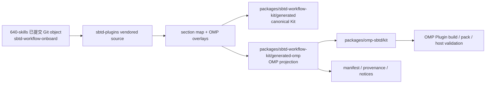

# SBTD Workflow Onboard 到 sbtd-plugins OMP Plugin 的同步与投影手册

## 目的与适用范围

本文说明如何把上游 `640-skills` 仓库中 `sbtd-workflow-onboard/` 的已提交版本，安全、可重建地同步到当前仓库，并通过本仓库 `packages/sbtd-workflow-kit` 投影后嵌入 `packages/omp-sbtd`。

本文适用于以下场景：

- 上游发布了新的 `sbtd-workflow-onboard` tag 或确定的 commit；
- Onboard 的 AGENTS 模板、bundled Skills、external stable Skills、安装脚本、规则或许可证发生变化；
- 需要更新本仓库 vendored source、generated Kit 和 Plugin embedded Kit；
- 需要判断哪些上游规则应复用、排除，或替换为 OMP 专属 adapter。

本文不负责：

- 修改或发布 `@kunolu/omp-sbtd` 的 npm 版本；
- 扩大 OMP host 兼容声明、修改 peer dependency 或执行 host certification；
- 安装 Plugin、修改用户 AGENTS/Profile、同步外部自动化或写入生产凭据；
- 在 sbtd-plugins 中维护第二份上游 Onboard 或 external Skills 事实源。

## 核心结论

同步不是把上游文件直接复制到 `packages/omp-sbtd`，也不是逐文件手工“拆分”。正确路径是：



所有权固定如下：

1. **`640-skills` 是 canonical source。** 通用规则、Onboard runtime、bundled Skills、external stable mirror 及其来源证明由上游拥有。
2. **`packages/sbtd-workflow-kit` 是确定性投影与打包层。** 它固定上游完整 commit，验证来源和 stable manifest，执行 section map 与 OMP overlay，生成内容寻址的 Kit。
3. **`omp-sbtd` 是消费方和 OMP adapter。** 它嵌入生成后的 Kit，提供 OMP runtime、RPC、命令、doctor 和 onboard 行为；它不是第二事实源。
4. **同步与发布分离。** promotion 成功不等于 npm 包可发布，也不等于新 OMP host 已获得支持。

## 同步拓扑与目录职责

| 层 | 路径 | 职责 | 是否可手改 |
|---|---|---|---|
| 上游事实源 | `../640-skills/sbtd-workflow-onboard/**`（相对 sbtd-plugins 仓库根目录） | Onboard 模板、脚本、bundled/external Skills、许可证和稳定来源策略 | 只在上游仓库按其流程修改 |
| sbtd-plugins vendored source | `packages/sbtd-workflow-kit/vendor/sbtd-workflow-kit-upstream/**` | 指定上游 Git object 的完整快照 | 否；仅由 promotion 替换 |
| 上游锁 | `packages/sbtd-workflow-kit/upstream.lock.json` | canonical URI、完整 revision、source tree digest、transform version | 由 promotion 生成 revision/digest |
| 投影规则 | `packages/sbtd-workflow-kit/agents-section-map.yaml` | 对上游 AGENTS section 做严格、穷尽的 `include`、`omit`、`replace-with-overlay` 分类 | 可审查修改；必须有测试 |
| OMP 覆盖层 | `packages/sbtd-workflow-kit/overlays/AGENTS.project-omp.md` | OMP task worker、Channel、runtime marker 和 mode-aware adapter 规则 | 可审查修改；不得复制 Codex runtime 策略 |
| Canonical generated Kit | `packages/sbtd-workflow-kit/generated/**` | 完整 canonical Kit；作为 OMP 投影的受验证输入 | 否；仅由 generator 生成 |
| OMP generated projection | `packages/sbtd-workflow-kit/generated-omp/**` | schema-v2 OMP-only 投影：canonical/projection 双来源、受保留 assets、OMP targets、catalog、许可证与 notices | 否；仅由 generator 生成 |
| Plugin embedded Kit | `packages/omp-sbtd/kit/**` | `generated-omp/**` 的字节一致嵌入副本 | 否；仅由 embed/promotion 生成 |
| Plugin host 代码 | `packages/omp-sbtd/src/**`、`scripts/**`、`test/**` | 加载、交叉验证和使用 embedded Kit；适配 OMP host | 仅在契约变化需要时修改 |

`sync-upstream` 事务直接拥有以下目标：

- Kit：`vendor/sbtd-workflow-kit-upstream`、`upstream.lock.json`、`agents-section-map.yaml`、`overlays`、`generated`、`generated-omp`；
- Plugin：`kit`、`LICENSE`、`THIRD_PARTY_NOTICES.md`。

`package.json`、SBOM、测试和 release metadata 不属于 Apply 的直接替换目标。`packages/sbtd-workflow-kit/LICENSE` 也不在替换清单中；生成器只读取其内容并写入 generated/Plugin 输出。上述文件若因新快照而需要调整，应作为独立、可审查的兼容或发布修改处理。

## 内容如何投影到 OMP Plugin

### 1. AGENTS 规则：严格 section 投影

生成器只从以下两个上游模板读取规则 section：

- `sbtd-workflow-onboard/templates/agents/AGENTS.global.md`
- `sbtd-workflow-onboard/templates/agents/AGENTS.project.md`

然后生成三个目标：

- `AGENTS.global.md`
- `AGENTS.project-root.md`
- `AGENTS.project-omp.md`

`agents-section-map.yaml` 的策略语义：

| 策略 | 含义 | 典型用途 |
|---|---|---|
| `include` | 将上游 section 投影到指定 owner/target | 已审查可复用的规则；正文可能提及 Codex，但必须明确限定 host，不能把 Codex 执行策略当成 OMP 策略 |
| `omit` | 从三个投影目标中排除该 section | 完全不适用于 OMP 投影、且无需保留用于跨 host 隔离的正文 |
| `replace-with-overlay` | 不复制上游正文，改用本仓库 OMP overlay | Trellis dispatch、Channel、OMP adapter 等平台专属策略 |

规则：

- section map v2 必须穷尽；新增或改名 section 未分类时 fail closed；
- `introducedRevision` 是**精确 revision 匹配**，不是“从该版本起生效”的范围。它只用于旧锁与目标锁之间的过渡；同步后续 revision 前必须重新审查、更新或解除所有 revision-bound 条目；
- OMP adapter 进入 overlay，不得伪装成通用上游规则；
- `omit` 或 `replace-with-overlay` 的上游正文不得逐字泄漏到三个投影目标。
- AGENTS section-leakage 检查不得以 `Codex`、`CODEX_HOME` 或 `.codex` 等单个关键词为判据；当前 `include` 的跨 host 边界可以说明 Codex 与 OMP 的差异，真正约束是 OMP 不得继承 Codex-only 的执行决策。
- 这是 AGENTS 语义检查，不是包内容检查。对 `generated-omp/**`、embedded Kit 和 packed tarball 的零 Codex/非 OMP runtime 约束，必须由独立的路径与 payload scanner 执行；不得用 section-leakage 测试替代它。

当前边界是：三个 AGENTS target 受 section map 管理；`AGENTS.project-omp.md` overlay 拥有面向 Agent 的 OMP task-worker、Channel 与 runtime marker 消费策略，Plugin source 则拥有 marker 生成、运行状态计算和命令实现。`generated/**` 可保留完整跨平台 Onboard runtime，包含合法的 `.codex/**`、`$CODEX_HOME`、Codex gitignore 模板及 Trellis/Impeccable 的 Codex 支持路径；它是 canonical 输入，不是 Plugin 载荷。`generated-omp/**` 只能保留 OMP distribution map 明确允许或替换后的资源，并且 `packages/omp-sbtd/kit/**` 必须与其逐字节一致。leakage 测试只应断言被分类为 `omit` 或 `replace-with-overlay` 的**完整上游正文**没有逐字进入三个投影 target，不能断言 canonical Kit 中完全没有 Codex 术语。

### 2. Onboard runtime 和 Skills：canonical 保留，OMP 投影筛选

`sbtd-workflow-onboard/**` 会被打包到 canonical Kit：

```text
packages/sbtd-workflow-kit/generated/onboard/runtime/**
```

生成器随后依据 `omp-distribution-map.yaml` 和 `omp-overlays/**` 生成：

```text
packages/sbtd-workflow-kit/generated-omp/onboard/runtime/**
packages/omp-sbtd/kit/onboard/runtime/**
```

canonical runtime 可以保留 `SKILL.md`、`REFERENCE.md`、`scripts/onboard.py`、跨平台模板、stable assets、catalog 与其他完整运行资产。OMP 投影不得把 Python Onboard bridge、Codex-only runtime/模板或其它未获分配的跨平台资源带入 Plugin；这不是按关键词删减，而是由严格且穷尽的 distribution map、overlay 和 schema-v2 asset digest 验证完成。

Plugin Onboard plan/status 由 TypeScript `createOnboardService` 和已加载的 OMP projection capability inventory 渲染；不执行或输出 Python Onboard bridge。

### 3. Stable external Skills：来源证明随 Kit 传递

上游 stable manifest：

```text
sbtd-workflow-onboard/assets/external-skills/stable/MANIFEST.json
```

是 stable set 的唯一事实源。生成器必须：

- 显式派生 `stableSet` 和 stable manifest SHA-256；
- 显式派生 external repository URL、完整 revision 和许可证；
- 验证每个 Skill tree digest 和 retained license/NOTICE 文件；
- 通过 embedded stable manifest、generated asset digests、notices 和 SBOM 将逐 Skill digest 与 retained path 传递性绑定到候选。

`stableProvenance` 字段本身不展开逐 Skill tree digest 或 retained path；这些明细仍以 embedded `MANIFEST.json` 为事实源。显式 provenance 与传递性绑定共同进入 generated manifest、Plan digest/输出、Plugin embedding 校验、third-party notices 和 SBOM。派生摘要不是第二份可编辑配置，必须能回到 embedded stable manifest 交叉验证。

默认 `auto` 与显式 `stable` 必须从 embedded stable mirror 安装，不调用 Git 或网络；只有显式 `upstream` 才允许访问上游，且失败时不得静默回退。

## 标准同步流程

以下命令均从 sbtd-plugins 仓库根目录执行。`640-skills` 通常为同级目录 `../640-skills`；在本云主机上也可使用绝对路径 `/workspace/640-skills`。命令需要 Bash、Git、`jq`、`shasum`、`cmp`、`diff`、Node.js 与 pnpm。包含 pipeline 的 shell 必须先启用 `set -o pipefail`，避免 `tee` 或 `shasum` 掩盖上游命令失败。示例变量只用于说明，不应把某一 tag 的值写死为永久默认值。

### 阶段 0：建立任务和变更分类

同步前先回答：

1. 上游变更是否只有 runtime/Skills 静态内容？
2. AGENTS 模板是否新增、删除、重命名或移动 section？
3. 是否出现新的 Codex-only runtime 策略，需要 `omit` 或 OMP overlay？
4. stable manifest、external Skills、许可证或来源 revision 是否变化？
5. Plugin 的 manifest/schema/loader 是否需要接受新的 provenance 字段？
6. 变化是否触及用户可见 CLI、Onboard 行为、包内容或 OMP host contract？

若触及用户可见行为，先更新持久 `.feature` 和对应测试。若触及既有生产逻辑，先完成项目要求的 Legacy Change Safety、Refactoring、GitNexus impact 等门禁。纯快照 promotion 不应借机重构 Plugin。

### 阶段 1：固定 canonical tag 和完整 commit

```bash
set -o pipefail

UPSTREAM_REPO="${UPSTREAM_REPO:-../640-skills}"  # cloud host may use /workspace/640-skills
UPSTREAM_ROOT="$(cd "$UPSTREAM_REPO" && pwd -P)"
UPSTREAM_TAG="vX.Y.Z"
REVISION="$(git -C "$UPSTREAM_ROOT" rev-parse "${UPSTREAM_TAG}^{commit}")"

printf 'revision=%s\n' "$REVISION"
test "$(git -C "$UPSTREAM_ROOT" cat-file -t "$REVISION")" = "commit"
git -C "$UPSTREAM_ROOT" remote get-url origin
```

要求：

- `REVISION` 必须是 40 位小写 commit SHA；
- tag/ref 只用于一次性解析身份；promotion 身份是解析后的 SHA，不是可移动的名称，也不能把 tag 名直接交给 promotion；
- `origin` 必须与 `upstream.lock.json#canonicalSourceUri` 指向同一 canonical repository；
- promotion 从 Git object storage 读取，不读取上游工作树内容；
- 上游工作树可以 dirty，但未提交内容绝不能进入候选。

可直接验证目标 Git object 中的 stable manifest：

```bash
set -o pipefail
git -C "$UPSTREAM_ROOT" show \
  "$REVISION:sbtd-workflow-onboard/assets/external-skills/stable/MANIFEST.json" \
  | shasum -a 256
```

同时记录 tag、revision、stable set 和 manifest SHA-256 到当前 Trellis task artifact。

### 阶段 2：审查从当前锁到目标 revision 的差异

读取当前锁：

```bash
jq '{canonicalSourceUri,resolvedRevision,sourceTreeSha256,transformVersion}' \
  packages/sbtd-workflow-kit/upstream.lock.json
```

按 Git object 比较当前 revision 与目标 revision，重点审查：

- `sbtd-workflow-onboard/templates/agents/**`；
- `sbtd-workflow-onboard/templates/skills/**`；
- `sbtd-workflow-onboard/assets/external-skills/stable/**`；
- `sbtd-workflow-onboard/scripts/onboard.py`；
- `SKILL.md`、`REFERENCE.md`、catalog/schema；
- 上游测试和 changelog 中说明的行为变化。

不要通过比较两个工作树来定义候选内容；工作树比较只能用于诊断，最终身份以两个 commit object 为准。

### 阶段 3：先加固映射和消费者契约

如果目标 revision 新增或改变 AGENTS section：

1. 更新 `agents-section-map.yaml`；
2. 对新 section 选择 `include`、`omit` 或 `replace-with-overlay`；
3. 需要 OMP 语义时更新 `overlays/AGENTS.project-omp.md`；
4. 审查所有既有 `introducedRevision`：该字段只在 pinned revision 与其值完全相等时生效。对新的目标 SHA，应明确更新、解除或替换旧 binding，不能把它当成最低版本；
5. 只在过渡期确有必要时，使用完整目标 SHA 添加新的 `introducedRevision`；
6. 添加 strict completeness、leakage 和 overlay 测试。

如果 stable provenance 或 generated manifest schema 变化：

1. 先让 Kit generator 解析并验证新字段；
2. 再让 Plugin embedded Kit reader 接受并交叉验证；
3. 将 provenance 纳入 Plan digest、notices、SBOM 和 package validation；
4. 保持旧快照的受控兼容，直到目标 Apply 落地；不得以可选字段永久绕过验证。

完成这些前置改动后先运行聚焦测试。此阶段不 Apply 新快照。

### 阶段 4：在安全工作树中运行 Plan

`--plan` 是第一个允许执行的 promotion 操作。它会构造、生成并验证临时候选，但不替换目标。

```bash
set -o pipefail
PLAN_FILE="$(mktemp -t sbtd-plugins-plan)"

pnpm --filter @kunolu/sbtd-workflow-kit exec tsx src/sync-upstream.ts \
  --plan \
  --source-root "$UPSTREAM_ROOT" \
  --revision "$REVISION" \
  | tee "$PLAN_FILE"
```

必须审查：

- `status` 为 `planned`；
- `canonicalSourceUri` 和 `resolvedRevision`；
- `sourceTreeSha256`；
- `stableProvenance.stableSet`、`manifestSha256`、repository revisions/licenses；
- `mappingSha256` 和 `overlayDigests`；
- `classifiedSections`；
- `expectedGeneratedSha256`；
- `changedInputPaths`；
- `stagedPluginValidated: true`；
- `dirtyPreflight.dirty` 和 `dirtyPreflight.conflictingPaths`；
- `planDigest`。

提取 digest：

```bash
PLAN_DIGEST="$(jq -r '.planDigest' "$PLAN_FILE")"
test -n "$PLAN_DIGEST"
test "$PLAN_DIGEST" != "null"
```

Plan 可以在 promotion-owned 目标 dirty 时报告候选，但 `dirtyPreflight.dirty=true` 或 `conflictingPaths` 非空表示 **禁止 Apply**。报告中的冲突路径必须是仓库相对路径，不应包含开发者主目录或任意上游内容。`PLAN_FILE` 是本地临时证据；记录到 task artifact 后按项目临时文件策略清理。

### 阶段 5：只在目标清洁且 Plan 已批准后 Apply

Apply 会递归替换 promotion-owned 文件和目录，是破坏性操作。`promotionDirtyPreflight` 基于普通 `git status --porcelain`，不会报告被 Git ignore 的文件；ignored 文件位于 owned directory 时仍可能被替换。优先使用独立 clean worktree，并在 Apply 前额外检查 ignored/untracked 内容：

```bash
git status --porcelain=v1 --ignored -- \
  packages/sbtd-workflow-kit/vendor/sbtd-workflow-kit-upstream \
  packages/sbtd-workflow-kit/upstream.lock.json \
  packages/sbtd-workflow-kit/agents-section-map.yaml \
  packages/sbtd-workflow-kit/overlays \
  packages/sbtd-workflow-kit/generated \
  packages/omp-sbtd/kit \
  packages/omp-sbtd/LICENSE \
  packages/omp-sbtd/THIRD_PARTY_NOTICES.md
```

有任何输出都应先判定所有权；不要靠 `reset`、`clean`、强制覆盖或盲目 stash 消除它。

Apply 要求：

- 同一 canonical source 与同一完整 revision；
- promotion-owned destinations clean，且 owned directories 中没有未审查的 ignored 文件；
- 代码、映射和 overlay 与生成 Plan 时一致；
- 使用刚批准的精确 `planDigest`；
- 操作者明确批准 Apply。

```bash
pnpm --filter @kunolu/sbtd-workflow-kit exec tsx src/sync-upstream.ts \
  --apply \
  --source-root "$UPSTREAM_ROOT" \
  --revision "$REVISION" \
  --plan-digest "$PLAN_DIGEST"
```

Apply 会：

1. 从指定 Git object 创建临时 vendored candidate；
2. 更新候选 lock；
3. 使用当前 section map 和 overlays 生成 Kit；
4. 将 generated Kit 嵌入 staged Plugin；
5. 验证 staged Plugin；
6. 备份并依次替换所有 promotion-owned destinations；
7. 在最终位置再次运行 `check-generated` 和 embed verify；
8. 成功后删除备份；失败时尝试回滚全部已替换目标。

当前实现会在 `finally` 中清理 transaction work root；即使回滚本身失败，也不能依赖其中仍保留可用备份。收到 `TRANSACTION_FAILED` 后必须停止，检查 error details 和最终仓库状态，并从已批准的基线/promotion commit 设计人工恢复；恢复前不得继续生成、打包或发布。

以下是常见 typed errors，并非完整枚举；任何未列出的 `KitError` 也应 fail closed：

| 错误 | 含义 | 处理 |
|---|---|---|
| `KIT_INPUT_INVALID` | 输入、lock、mapping、路径或候选结构无效 | 修正事实源或配置；不得绕过 schema |
| `SOURCE_REVISION_INVALID` | revision 非完整 commit、对象不存在或不可归档 | 修正 tag 解析或取得完整 Git object |
| `SOURCE_REPOSITORY_INVALID` | source root 不是 canonical upstream | 使用正确的 `640-skills` clone |
| `SOURCE_DIGEST_MISMATCH` | vendored tree 与 lock digest 不一致 | 重新从已提交 Git object promotion；不得手改 vendor |
| `STABLE_MANIFEST_INVALID` / `STABLE_INSTALL_POLICY_INVALID` | stable manifest、Skill tree、许可证或 stable-first 策略无效 | 修正上游快照/消费者契约后重新 Plan |
| `SECTION_MAPPING_UNKNOWN` / `SECTION_UNMAPPED` / `SECTION_MAPPING_CONFLICT` | section map 与目标 revision 不一致 | 回到阶段 3，显式分类 |
| `SECTION_OVERLAY_MISSING` / `SECTION_LEAKAGE` | overlay 缺失或被排除正文逐字泄漏 | 修正映射/overlay 和测试 |
| `PROMOTION_DESTINATION_DIRTY` | Apply 将覆盖未提交的 owned path | 不要 reset；等待收束或使用隔离工作树 |
| `STALE_PLAN` | 候选输入相对 Plan 已变化 | 重新 Plan、重新审查和批准 |
| `STAGED_PLUGIN_INVALID` | staged embedded Kit、许可证或 notices 不一致 | 修复消费者/打包契约后重新 Plan |
| `GENERATED_DRIFT` | 当前 generated output 与确定性候选不一致 | 查明输入漂移；不得把手工 generate 当成 Apply |
| `TRANSACTION_FAILED` | 替换或回滚失败 | 停止后续操作，检查 error details 与实际仓库状态 |

### 阶段 6：脏工作树与并行任务的处理

禁止在含有 promotion-owned 未提交修改的工作树里强制 Apply。推荐顺序：

1. 选择已知 clean 的 base commit，或只包含已审查 promotion 前置改动的 commit。不要为了创建基线，把原工作树中无关 dirty 变更打成一个 omnibus commit；
2. 使用唯一 branch 和相邻目录创建独立 worktree，例如：

   ```bash
   PROMOTION_BASE="<approved-clean-commit>"
   PROMOTION_BRANCH="promotion/sbtd-<tag>"
   PROMOTION_WORKTREE="../sbtd-plugins-sbtd-<tag>"
   git worktree add -b "$PROMOTION_BRANCH" "$PROMOTION_WORKTREE" "$PROMOTION_BASE"
   ```

3. 若 promotion 前置改动尚未形成独立 commit，先按正常 review 流程隔离并提交这些 task-owned 变更；不要 reset、盲目 stash 或提交原工作树的并行任务；
4. 在独立 worktree 安装依赖并重新 Plan，确认普通与 ignored 状态均无冲突；
5. 使用该 worktree 新 Plan 的 digest Apply；
6. 完成验证并保留 promotion commit；
7. 如原工作树存在并行任务，使用明确三方协调或经审查的 cherry-pick 合入，而不是直接覆盖；
8. 合入后在最终树重新生成派生产物并验证。

三方协调的角色：

- **Base**：隔离 promotion 的共同基线 commit；
- **Ours**：原工作树中应保留的并行任务改动；
- **Theirs**：已验证的 promotion commit。

合并原则：

- vendored、generated 和 embedded tree 以完整 promotion 单元为准，不手工挑文件；
- package/release metadata 以所属 release task 为准；
- SBOM 是派生产物，完成 package identity 协调后重新构建；
- 测试期望应匹配最终 lock 和 manifest，而不是机械选择 ours/theirs；
- 对每个重叠文件记录三方语义和选择理由；
- 合并后必须重新运行完整的 affected Kit/Plugin 验证；
- 隔离验证不能自动证明合并后的脏工作树仍然有效。

## 验证矩阵

验证命令分为两类：

- **检查型：** Kit test/typecheck/lint/check-generated，Plugin test/typecheck/lint/smoke；正常情况下不重写 promotion-owned tree。
- **写入型：** Kit `generate` 会替换 `generated`；Plugin `build` 会执行 check-generated、重新嵌入 `kit`、编译 `dist` 并重写 SBOM。`embed-kit.mjs` 先在 sibling paths stage 完整 OMP projection、许可证和 notices，验证全部 staged candidate 后，才将既有 owned destination 移至 sibling backups 并 promote replacements；它绝不在 staged validation 前删除 live destination。它们只能在 Apply 后的隔离/已协调工作树中执行，不能代替 Apply，也不能用于“修好”dirty preflight。

同步完成后，从仓库根目录运行：

```bash
KPI_PROMOTION_SOURCE_ROOT="$UPSTREAM_ROOT" \
  pnpm --filter @kunolu/sbtd-workflow-kit test
pnpm --filter @kunolu/sbtd-workflow-kit typecheck
pnpm --filter @kunolu/sbtd-workflow-kit lint
pnpm --filter @kunolu/sbtd-workflow-kit generate
pnpm --filter @kunolu/sbtd-workflow-kit check-generated

pnpm --filter @kunolu/omp-sbtd build
pnpm --filter @kunolu/omp-sbtd test
pnpm --filter @kunolu/omp-sbtd typecheck
pnpm --filter @kunolu/omp-sbtd lint
pnpm --filter @kunolu/omp-sbtd smoke
pnpm --filter @kunolu/omp-sbtd pack --dry-run
```

需要保留测试或 pack 文件副作用作为证据时，使用原生 `pnpm`，不要让输出缓存成为唯一证据。写入型验证后必须复查 diff，确认只刷新预期派生产物。

至少执行以下一致性命令：

```bash
set -o pipefail

# OMP projection manifest 与 embedded manifest 必须字节一致。
cmp \
  packages/sbtd-workflow-kit/generated-omp/manifest.json \
  packages/omp-sbtd/kit/manifest.json

# 完整 OMP projection 与 embedded Plugin Kit 必须一致。
diff -qr \
  packages/sbtd-workflow-kit/generated-omp \
  packages/omp-sbtd/kit

# retained-only stable manifest：OMP projection 与 embedded Plugin 必须字节一致。
cmp \
  packages/sbtd-workflow-kit/generated-omp/onboard/runtime/assets/external-skills/stable/MANIFEST.json \
  packages/omp-sbtd/kit/onboard/runtime/assets/external-skills/stable/MANIFEST.json

# retained-only stable manifest digest 必须绑定两个 schema-v2 manifest。
RETAINED_MANIFEST_SHA="$(shasum -a 256 packages/sbtd-workflow-kit/generated-omp/onboard/runtime/assets/external-skills/stable/MANIFEST.json | cut -d ' ' -f 1)"
test "$RETAINED_MANIFEST_SHA" = "$(jq -r '.retainedProvenance.manifestSha256' packages/sbtd-workflow-kit/generated-omp/manifest.json)"
test "$RETAINED_MANIFEST_SHA" = "$(jq -r '.retainedProvenance.manifestSha256' packages/omp-sbtd/kit/manifest.json)"
```

再验证以下不变量：

| 不变量 | 证明方式 |
|---|---|
| tag、完整 revision、lock 一致 | `rev-parse <tag>^{commit}`、`cat-file -t`、读取 `upstream.lock.json` |
| vendored tree 与 lock digest 一致 | generator/check-generated 与 source tree digest 校验 |
| retained-only stable manifest 字节和 digest 一致 | OMP projection 与 embedded Plugin 的上述 `cmp` 通过；其 SHA-256 分别等于两个 schema-v2 manifest 的 `retainedProvenance.manifestSha256`。canonical/full stable manifest 只与 canonical provenance 交叉验证，不与 retained-only manifest 比较 |
| OMP projection manifest 与 embedded manifest 一致 | 上述 `cmp` 无输出且退出码为 0；两者均为 schema-v2，canonical 与 projection digest 分别可验证 |
| OMP projection 与 Plugin Kit 完整一致 | 上述 `diff -qr` 无输出且退出码为 0 |
| section map 穷尽且替换/排除正文无逐字泄漏 | Kit tests、sync report、三个投影 target 的 scoped 断言 |
| default stable-first 不访问 Git/network | promotion policy test；`auto`/`stable` 使用 embedded stable set |
| explicit upstream 无 silent fallback | stub Git 失败场景返回 typed failure |
| Apply 事务与回滚有效 | dirty preflight、stale digest、induced replacement failure 测试 |
| Plugin 包含许可证、notices、SBOM 和 embedded Kit | build、pack inventory 和 package tests |
| 没有临时 stage/check/previous 残留 | 检查 `packages/.sync-upstream-*` 和 `packages/sbtd-workflow-kit/.*.{stage,check,previous}`；发现后先确认无运行中进程和目录身份，不要通配删除 |

若目标是 npm RC 发布，按 `omp-plugin-host-acceptance.md` 执行精确 tarball 的本地四命令验收、`next` 发布和 Registry 身份复核；若目标是扩大 OMP 支持声明，再执行独立的支持验证。不要把 `check-generated`、Plugin unit test 或 direct-extension smoke 当作已发布 tarball 的本地四命令证据。

## v1.0.6 已验证实例

2026-08-03 的 promotion 使用：

| 项 | 已验证值 |
|---|---|
| 上游 tag | `v1.0.6` |
| tag commit | `1f019e070d1ca41f064572febe055643d8dbc1ce` |
| source tree SHA-256 | `5e2ab43164ac08085d97a10a34b226f1b19dfa26a254adab78a65227a29a23cb` |
| stable set | `2026-08-03.1` |
| canonical/full stable manifest SHA-256 | `8ae1370086d707eb75bcc62a14659b2622e2cba1e7a1f1d8d6243a35a5422cab` |
| OMP retained-only stable manifest SHA-256 | `7e250e2efbd11c4b22894090f337bd1896c6a6a71f79b53524291226bf2f2f13` |
| mapping SHA-256 | `8bf73308e1e63b21a2c86569ca9b89e6a29f9dc645c6e6208e70d28fe51d1deb` |
| OMP overlay SHA-256 | `82e1b95f6534c157cdf40dcb1540750c2e29716c5214240e0752fc0a206d9ff1` |
| canonical Kit SHA-256 | `c0e213172da0d3b74545adcbb897a75d4ddfe81c9bb9b3e8a02c61f2f0af6895` |

该次变更新增了与 Trellis 调度有关的上游 section。处理方式是：

- 跨 host 的 `Trellis 调度边界` 继续 `include`，其中可明确描述 Codex 与 OMP 的隔离规则；
- 项目级 `Trellis 调度层` 使用 `replace-with-overlay`，OMP 不继承 Codex dispatch/Inline fallback 的操作决策；
- `AGENTS.project-omp.md` overlay 拥有面向 Agent 的 OMP task-worker、Channel 与 runtime marker 消费策略；Plugin source 拥有 marker 生成、运行状态计算和命令实现；
- AGENTS leakage 检查只针对三个投影 AGENTS targets 中被替换/排除的完整上游正文；它不代替针对 OMP projection/packed payload 的零 Codex scanner；
- canonical `generated/onboard/runtime` 可保留完整跨平台资产；`generated-omp/onboard/runtime` 与 Plugin `kit/onboard/runtime` 仅保留 distribution map 明确允许或替换后的 OMP 资产；
- stable external Skills 的概要 provenance 显式进入 manifest/Plan，逐 Skill digest 与 retained path 经 retained-only stable manifest、asset digests、notices、SBOM 和 Plugin 校验传递性绑定；
- 生成/嵌入一致性只断言 `generated-omp/**` 与 Plugin `kit/**` 字节一致，绝不要求 canonical `generated/**` 与 Plugin Kit 一致。

由于原工作树存在并行 release/package 修改，最终采用隔离 Apply 后的显式三方协调。重叠项包括 Plugin `package.json`、SBOM 和一处 Kit revision 测试期望：package identity 保留 release task 的值，测试期望更新到新 lock，SBOM 在最终 package identity 下重新生成。合并后 Kit tests 为 25/25，Plugin tests 为 280/280，OMP projection/embedded Kit 字节一致。

这些数值只是该次 promotion 的审计实例。下一次同步必须重新解析目标 tag、审查所有 exact-match `introducedRevision` 条目、重新 Plan 并使用新的 digest，不得复用 v1.0.6 的 revision、mapping 假设或 Plan digest。

## 同步完成检查表

### 来源与计划

- [ ] canonical upstream remote 已核对。
- [ ] tag/ref 只用于解析，promotion 身份已固定为 40 位 commit SHA。
- [ ] 候选来自 Git object，不包含上游 dirty worktree 内容。
- [ ] stable manifest、stable set、repository revisions 和许可证已验证。
- [ ] AGENTS section diff 及所有 exact-match `introducedRevision` 已审查，所有 section 已显式分类。
- [ ] Plan JSON 已保存并人工审查，包括 `conflictingPaths`。
- [ ] Apply 使用当前 Plan 的精确 digest。

### 安全与一致性

- [ ] Apply 前 promotion-owned destinations clean，ignored 内容也已审查。
- [ ] 未 reset、盲目 stash、覆盖、删除或混合提交并行任务改动。
- [ ] `generated-omp` / embedded manifest 与完整 OMP projection tree 一致，且 schema-v2 canonical/projection digest 均可验证。
- [ ] 三个 AGENTS targets 无被 `omit`/`replace-with-overlay` 的完整上游正文泄漏。
- [ ] embedded Onboard runtime 只含 OMP projection 明确保留的资产；canonical runtime 不是 Plugin 载荷。
- [ ] stable-first 默认路径无 Git/network，explicit upstream 无 fallback。
- [ ] notices、许可证与 SBOM 对应最终包身份和 provenance。
- [ ] 无 transaction stage/check/previous 残留。

### 验证与交付

- [ ] Kit test/typecheck/lint/generate/check-generated 通过。
- [ ] Plugin build/test/typecheck/lint/smoke/pack inventory 通过。
- [ ] 三方协调后已重新验证，而非复用隔离结果。
- [ ] GitNexus detect changes 或等价影响复核已记录。
- [ ] Trellis check 与任何独立的流程就绪结论已记录；它们不替代 RC 的本地四命令验收或 Registry 身份复核。
- [ ] promotion、npm publication、Plugin install 和 OMP host support 的状态被明确区分。

## 相关事实源

- `packages/sbtd-workflow-kit/src/sync-upstream.ts`
- `packages/sbtd-workflow-kit/src/index.ts`
- `packages/sbtd-workflow-kit/upstream.lock.json`
- `packages/sbtd-workflow-kit/agents-section-map.yaml`
- `packages/sbtd-workflow-kit/overlays/AGENTS.project-omp.md`
- `packages/sbtd-workflow-kit/generated/manifest.json`
- `packages/sbtd-workflow-kit/generated-omp/manifest.json`
- `packages/sbtd-workflow-kit/generated-omp/projection-report.json`
- `packages/omp-sbtd/scripts/embed-kit.mjs`
- `packages/omp-sbtd/src/kit/index.ts`
- `packages/omp-sbtd/test/kit-embedding.test.ts`
- `packages/omp-sbtd/test/kit-stable-provenance.test.ts`
- `.trellis/tasks/07-29-sbtd-upstream-promotion/`
