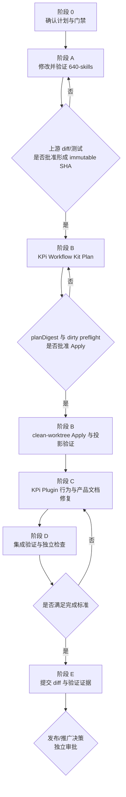

# RC6 Finding 修复与上游同步实施计划

## 1. 文档状态

| 项目 | 当前值 |
|---|---|
| 状态 | **G3 进行中：trellis-implement 执行 Plugin Finding** |
| 日期 | 2026-08-17 |
| 分支 tip | `396122d7d64e3305f6b7af2731e1b51af0fdf517` |
| lock revision | `078267f059a892be3257028891daf5a10c6c3e7c` |
| planDigest | `1e851eac24832a42fcdd43af5b6896ce403189a42298d48bacda23b25aea45c5` |
| Apply 提交 | `396122d fix(kit): apply 078267f evidence v2 promotion` |
| 未做 | Plugin Finding 提交、push、npm 发布 |

本文是按依赖顺序编排的实施与验证计划，不是代码实施、Git commit、push、
`sync-upstream --apply`、npm 发布、dist-tag 变更、部署或公司 enforced 推广授权。
每个显式审批点必须单独通过，后一个审批不能由前一个审批推导。

## 2. 目的与事实源

本计划用于修复 NeoX 对 `@kunolu/omp-sbtd@0.1.0-rc.6` 的历史评审中，经当前
KPi 代码复核后确认需要进入实施范围的八项 Finding：

- P1-01
- P1-02
- P1-04
- P1-06
- P2-01
- P2-02
- P2-03
- P3-01

事实源按优先级如下：

1. 当前 KPi 源码、测试、配置和生成契约；
2. `/Users/lusonglin/Downloads/NeoX_omp-sbtd_0.1.0-rc.6_code_review.md`
   第 11 节复核结论；
3. 当前 Trellis 任务的 `prd.md`、`design.md`、`implement.md`；
4. `docs/assets/sbtd-workflow-onboard-to-omp-plugin-sync.md` 中已经验证的同步、
   promotion、所有权和回滚规则；
5. `docs/assets/omp-plugin-host-acceptance.md` 中的 Plugin host acceptance 约束。

完成这八项只代表修复本计划范围内的问题，不代表原始 NeoX 公司推广 verdict
自动变为通过。

## 3. 核心决策

### 3.1 P1-04 必须先修改上游

当前 validation evidence v1 中：

- `featureSources[]` 描述 repository、path、Feature、Rule、Scenario、Examples、
  source ref 和 source commit；
- `reports[]` 描述 report path、summary、SHA-256、status 和 mode；
- 两个数组之间没有 scenario/source locator 到 report/test case 的显式关系。

因此，场景 A 和无关报告 B 只要位于同一个 envelope，就可能同时通过 v1 的字段
校验。仅在 Plugin 中检查两类对象共存，不能完整修复 P1-04；仅在 Plugin 中新增
私有 mapping 又会产生第二事实源。

此外，JSON Schema 只能验证数据形状，不能单独验证跨数组引用、locator digest、
文件路径安全、revision 一致性、磁盘报告 SHA-256，或 sidecar 声称的 test case
是否真实存在、是否绑定该 source locator。即使 selector 命中了报告内一个真实
passed case，若该 case 没有 validator 可提取的 `sourceLocatorDigest` binding，仍可
选择任意无关 case。因此，完整修复需要同时提供：

1. 上游 v2 schema；
2. 上游 contract 与 Skill 指引；
3. 明确的 machine-readable report format/binding profile allowlist；
4. 能从 SHA-verified report bytes 确定性提取 test case、outcome 和
   `sourceLocatorDigest` binding 的语义 validator；
5. 上游与 Plugin 共同消费的正反例 fixtures；
6. Plugin host-side observer；
7. P1-06 对已验证 evidence 的状态接线。

### 3.2 强制执行顺序



严格顺序为：

1. 上游 `640-skills` contract、validator、fixtures 和 producer 指引；
2. 固定经过审核的上游完整 commit SHA；
3. KPi clean-worktree promotion；
4. KPi Plugin 全部行为和产品文档修改；
5. integrated validation；
6. 单独决定是否 commit、push、publish 或推广。

P1-01、P1-02、P2-01、P2-02、P2-03、P3-01 技术上不依赖 v2，但本计划仍将它们
延后到 promotion 完成后。这样可以让上游 contract、KPi 生成投影和 Plugin consumer
成为三个独立、可审查、可回滚的变更单元，并避免针对临时 contract 返工。

## 4. 范围与所有权

### 4.1 Finding 实施边界

| Finding | 状态 | 实施位置 | 核心结果 |
|---|---|---|---|
| P1-01 | still-valid | Plugin runtime | approval 绑定 risk class、输入 fingerprint、session/turn，并只消费一次 |
| P1-02 | still-valid | Plugin classifier | 修复日文 bug、普通中文修复、大小写 review 和生产路径识别 |
| P1-04 | still-valid | **上游 + Kit promotion + Plugin** | 使用 v2 显式 scenario-report 关联替换 mtime-only BDD 判定 |
| P1-06 | 当前复核新增 P1 | Plugin state/gate | 合法 current evidence 使 `release-readiness ready` 可达，调用者不能自报 verified |
| P2-01 | still-valid | Plugin runtime | 显式 capability registry 替换工具名负面名单 |
| P2-02 | still-valid | Plugin runtime | 扩展 dependency mutation 检测并保留 shell contract 限制 |
| P2-03 | still-valid | Plugin runtime | 扩展高置信 secret inventory 并复用 P1-01 approval |
| P3-01 | partially-valid | Plugin package/docs | 补齐当前仍缺的 metadata、Security、产品 changelog/support/data/rollback 文档 |

### 4.2 上游与 KPi 所有权

| 层 | 路径 | 所有权与修改方式 |
|---|---|---|
| 上游 canonical | `../640-skills/sbtd-workflow-onboard/**` | 在 `640-skills` 独立任务中修改、测试和审核 |
| KPi distribution map | `packages/sbtd-workflow-kit/omp-distribution-map.yaml` | KPi 人工维护，新增资产必须逐项分类并测试 |
| KPi vendored source | `packages/sbtd-workflow-kit/vendor/**` | 只由 promotion 替换，禁止手改 |
| KPi lock | `packages/sbtd-workflow-kit/upstream.lock.json` | 只由 promotion 写入 revision/digest |
| Canonical generated | `packages/sbtd-workflow-kit/generated/**` | 只由 generator/promotion 生成 |
| OMP projection | `packages/sbtd-workflow-kit/generated-omp/**` | 只由 generator/promotion 生成 |
| Plugin embedded Kit | `plugins/omp-sbtd/kit/**` | 只由 embed/promotion 生成，必须与 OMP projection 字节一致 |
| Plugin adapter | `plugins/omp-sbtd/src/**`、`test/**`、`features/**` | KPi Plugin 负责 OMP host/runtime 行为 |
| Plugin product docs | `plugins/omp-sbtd/package.json`、README 和随包文档 | KPi Plugin 产品层拥有 |

## 5. 审批点与停止条件

| Gate | 审批内容 | 通过后允许 | 不包含 |
|---|---|---|---|
| G0 | 本文档及八项范围 | 创建上游任务并开始阶段 A 修改/测试 | commit、push、promotion、Plugin 修改、发布 |
| G1 | 上游 diff、测试、contract v2 和 fixtures | 由用户形成或授权形成 immutable upstream commit SHA | KPi Apply、Plugin 修改、发布 |
| G2 | KPi `--plan` 输出、`planDigest`、dirty preflight | 在同一输入和 clean worktree 执行一次 `--apply` | npm 发布、部署 |
| G3 | promotion 后投影、provenance、embedded Kit 一致性 | 开始阶段 C Plugin 修改 | 发布 |
| G4 | Plugin diff、测试、Trellis check、Release Readiness | 提交最终完成结论和可选 commit 计划 | push、npm publish、推广 |
| G5 | tarball、版本、dist-tag、部署目标 | 仅执行明确批准的发布动作 | 公司 enforced 推广 |

任一阶段出现以下情况必须停止，不得通过放宽校验继续：

- 上游没有可解析的完整 commit SHA；
- v1 被原地改写或无法继续兼容；
- v2 只有 JSON Schema，没有语义 validator 或共享 fixtures；
- `sync-upstream --plan` 报告 dirty/conflicting promotion-owned path；
- Apply 输入相对已批准 Plan 发生变化；
- generated/embedded 文件需要手工修补才能通过；
- Plugin 只能通过 caller-supplied boolean 让 Release Readiness 变为 ready；
- 必需测试或证据无法完成；
- 实际 diff 超出本计划范围。

## 6. 阶段 0：实施前准备

### 6.1 Trellis 任务结构

当前 KPi 任务：

```text
.trellis/tasks/08-14-rc6-review-revalidation/
```

阶段 A 开始前，在 `640-skills` 仓库创建独立 Trellis 任务。两个任务的依赖必须写入
各自 artifact：

- 上游任务记录 KPi/Plugin 是 v2 contract consumer；
- KPi 任务记录其实施阻塞于上游 immutable SHA 和 promotion G2；
- 不以目录位置或口头说明代替依赖记录。

### 6.2 Book Gate Plan

| Gate | 状态 | 执行时机 | 通过标准 |
|---|---|---|---|
| Legacy Change Safety | required | 首次修改既有行为前 | 当前 classifier/approval/BDD/gate 行为已有 characterization safety net |
| Refactoring Review | required | 首次修改既有生产代码前 | 只允许最小 seam；无任务外重构 |
| DDIA Data Design | required | v2 contract 和 Plugin persisted descriptor 稳定前 | v1/v2 兼容、恢复、重放、hash、path、size、stale invalidation 明确 |
| DDD Boundary Review | not-required | 无 | 本任务不引入业务领域模型或 bounded context 变化 |
| Release Readiness | required | 全部项目验证完成后 | 必需验证通过，回滚、包内容和剩余风险明确 |

### 6.3 BDD 与测试先行

所有用户可见行为先更新持久 `.feature`，再增加失败回归测试，最后修改生产代码。
主要资产：

- `plugins/omp-sbtd/features/runtime-workflow-gates.feature`
- `plugins/omp-sbtd/features/publish-package.feature`
- 现有 classifier、extension、state、rules、gates、report 和 package 测试。

### 6.4 GitNexus 条件

当前 GitNexus FTS 索引曾出现不一致。实施前先按项目约定修复或重建索引，再对实际
待改 symbol 运行 impact。若刷新失败：

- GitNexus 结论降级为 advisory；
- 不把过期图结果当作实现依据；
- 使用源码、references、实际 diff 和测试补足；
- 最终报告记录刷新命令、失败原因和替代证据。

## 7. 阶段 A：修改并验证上游 `640-skills`

### A0. 任务与基线

1. 进入 `/Users/lusonglin/github/640-skills`。
2. 读取该仓库自身 workflow、spec、当前任务和更深层规则。
3. 创建独立上游任务并记录 KPi consumer 依赖。
4. 以已提交 object `7a6d4b6468910308274f16c45a6afec30fff9528` 为阶段 A
   唯一允许的 checkout / 新分支起点。不要从 KPi 已锁的
   `5941aaf9b91baeadc54123601af2e65fa603f56f` 再开分支；那会丢掉 lock 之后的
   `f2669aa`（根 CHANGELOG）和 `7a6d4b6`（Trellis 0.6.15 filesystem-safety /
   active-task pointer containment）。
5. 开始前必须：`git rev-parse HEAD` 等于上述起点 SHA，且工作树干净；然后从该
   SHA checkout 或新建主题分支。祖先关系、干净工作树或“HEAD 只比基线新”都
   不足以开工。若 HEAD 已前进，停止阶段 A，先复核 `7a6d4b6..HEAD` 并显式更新
   本文阶段 A 起点 SHA 后再继续。记录 branch、origin 和 v1 文件 SHA-256。
6. 执行上游适用的 DDIA、Legacy/Refactoring gate。
7. 不在本阶段修改 KPi。`5941aaf9…` 只描述当前 Kit/Plugin 已嵌入身份，不是
   阶段 A 的 checkout 目标。

`5941aaf9..7a6d4b6` 未改 `project-validation`、`maestro-mobile-e2e`、
`knowledge-base-integration`、`gherkin-bdd`。v2 contract 仍必须在该起点上新建。

### A1. 保持 v1 不变

必须保留：

```text
sbtd-workflow-onboard/templates/skills/project-validation/
  references/validation-evidence.schema.json
```

要求：

- `$id`、`schemaVersion: 1` 和现有字段语义不变；
- 现有 v1 正例继续通过；
- v1 继续支持历史或通用 report evidence；
- 不根据 `featureSources[]` 与 `reports[]` 共存自动推导 scenario-report link；
- v1 不能满足依赖 BDD scenario traceability 的 P1-04/P1-06 路径。

### A2. 新增 v2 contract

计划新增的 canonical assets：

```text
sbtd-workflow-onboard/templates/skills/project-validation/
  references/validation-evidence.v2.schema.json
  references/validation-evidence-contract.md
  scripts/validate_validation_evidence.py
  SKILL.md

640-skills 仓库测试资产（不进入 Onboard / Kit / Plugin Skill 树）：
  tests/fixtures/validation-evidence/validation-evidence-v2/**
  tests/test_validation_evidence_v2.py
```

v2 至少表达：

- `schemaVersion: 2`；
- repository key、safe repository-relative path；
- Feature、Rule、Scenario 和 Examples fingerprint；
- source ref 与完整 source commit；
- canonical `sourceLocatorDigest`；
- linked `reportSha256`；
- versioned `reportFormat`/binding profile，初始仅允许 `junit-xml-v1` 与
  `playwright-json-v1` 满足 scenario traceability；
- 结构化 `testCaseSelector`，不得使用无约束的自由文本 label；
- report 内与该 test case 同域、可由 validator 提取的 `sourceLocatorDigest`
  binding；
- report path、summary、status 和 mode；
- evidence source、source revision、environment alignment、publication；
- secrets redaction；
- 必要时的 runner/revision set 信息。

禁止要求项目修改 `.feature` 来写入持久 Feature ID 或 Scenario ID。

HTML、TXT、任意 JSON 和其他未支持格式可以继续作为 human-readable/generic formal
report，但不能单独满足 P1-04。若需要参与 v2 link，producer 必须同时生成受支持的
machine-readable report；unsupported format 必须 fail closed。

### A3. 定义 canonical locator

contract 必须定义唯一、跨实现可重建的 canonical serialization，包括：

- 字段集合和固定顺序；
- UTF-8 编码与 Unicode 规范；
- repository-relative POSIX path 规则；
- optional 字段缺失与空字符串的区别；
- Examples fingerprint 的计算输入；
- SHA-256 输出格式；
- source commit 大小写与长度规则。

validator 和 Plugin observer 必须基于共享 fixtures 得出相同 digest。不得由不同实现
自行猜测 canonicalization。

### A4. 实现语义 validator

validator 在 JSON Schema 形状校验之外至少执行：

1. 重算每个 source locator digest；
2. 验证每个 link 指向唯一存在的 source locator；
3. 验证每个 link 指向唯一存在的 report SHA-256；
4. 验证 report 为 `passed`，且 mode/status 满足 route 要求；
5. 按 versioned `reportFormat`/binding profile 解析 SHA-verified report bytes：
   - `junit-xml-v1`：安全解析 XML（禁用 DTD/external entity），按 suite ancestry、
     `classname`、`name` 和规范化 file identity 提取 test case，并要求 matched
     testcase 携带唯一 `sbtd.sourceLocatorDigest` property；
   - `playwright-json-v1`：按 project、规范化 test file 和完整 title path 提取
     test case，并要求 matched test 携带唯一 `sbtd.sourceLocatorDigest`
     annotation；
6. 使用结构化 `testCaseSelector` 精确匹配报告内提取结果；必须恰好匹配一个 passed
   case，零匹配、多匹配、skipped/failed case 均拒绝；
7. 要求 matched case 内提取的 digest 与 link 指向并由 validator 重算的
   `sourceLocatorDigest` 完全相等；不存在、重复、格式错误或不相等均拒绝；
8. 拒绝 HTML、TXT、任意 JSON、未知版本或 parser/binding profile 不支持的 report
   参与 BDD link；
9. 验证 repository/ref/commit 与 envelope/revision set 一致；
10. 拒绝绝对路径、`..`、symlink escape 和仓库外路径；
11. 读取实际报告文件并核对 SHA-256；
12. 对 CI/published evidence 验证 runner attestation 同时绑定 report hash 与 source
    revision；developer-local evidence 不得冒充 CI/published；
13. 拒绝 duplicate、dangling、unrelated 或 ambiguous link；
14. 输出稳定的成功/失败状态和可审计 reason code；
15. 不打印 secret、token、真实账号或敏感报告内容。

### A5. 共享 fixtures

至少覆盖：

#### 正例

- 当前 revision 的 changed scenario + 携带相同 locator digest property 的 JUnit
  passed test case；
- 当前 revision 的 unchanged existing scenario + 携带相同 locator digest
  annotation 的 Playwright JSON passed test case；
- 多个 scenario 关联同一 suite report，但结构化 selector 唯一匹配不同 test case，
  且每个 case 内嵌各自正确 digest；
- human-readable HTML report 与受支持 machine-readable report 同时保留；
- v1 generic report compatibility。

#### 负例

- unrelated scenario/report co-membership；
- dangling source locator digest；
- dangling report SHA；
- duplicate/ambiguous link；
- 错误 locator digest；
- stale source commit；
- dirty evidence 冒充 exact/CI；
- failed、blocked、skipped report 或 selector 指向非 passed case；
- SHA 正确但 selector 声称报告中不存在的 test case；
- selector 命中真实 passed case，但 case 缺少 locator digest binding；
- selector 命中真实但无关的 passed case，其内嵌 digest 指向另一个 scenario；
- case binding digest 重复、格式错误或与重算 locator 不相等；
- selector 零匹配或多匹配；
- unsupported HTML/TXT/arbitrary JSON 被用于 BDD link；
- malformed/XXE JUnit XML 或不符合版本契约的 Playwright JSON；
- tampered report bytes；
- absolute path、`..`、symlink escape；
- directory 名称以 `.feature` 结尾；
- v1 envelope 尝试满足 BDD traceability。

fixtures 既是上游 validator 测试输入，也是阶段 C Plugin observer 的兼容性输入。

### A6. 同步上游 Skills

#### `project-validation`

更新：

- v1/v2 选择规则；
- schema 与 semantic validator 的职责边界；
- scenario-backed evidence 必须使用 v2 和受支持的 machine-readable report/binding
  profile；
- `testCaseSelector` 必须由 validator 在 SHA-verified report bytes 中精确解析匹配，
  且 matched case 内嵌的 `sourceLocatorDigest` 必须与重算 locator 相等；不能只
  信任 sidecar selector 或 label；
- HTML/TXT 等 human-readable report 可以保留，但不能单独满足 BDD traceability；
- report-only generic evidence 可以继续使用 v1；
- evidence 生成、验证、保留和报告路径；
- 禁止 v1 自动升级/伪造 link。

#### `maestro-mobile-e2e`

更新：

- 从 `.feature` scenario 派生的 flow 若作为 scenario execution evidence，必须生成或
  引用 v2；
- Maestro reporter/adapter 只有在生成的 JUnit testcase 内携带可提取且正确的
  `sbtd.sourceLocatorDigest` property 时，才能使用 `junit-xml-v1`；
- 若当前 Maestro 输出或已验证 adapter 无法携带该 binding，继续保留 human-readable
  report，但明确把 v2 scenario execution evidence 标记为 `blocked`，不得伪造 link；
- ordinary local diagnostics 不强制生成 sidecar。

#### `knowledge-base-integration`

保持当前 report-only smoke 使用 v1，并增加断言：

- `schemaVersion: 1` 继续有效；
- `featureSources: []` 不得被解释为 BDD coverage；
- 若未来需要 scenario-backed knowledge evidence，必须另行生成 v2，而不是修改 v1。

#### `gherkin-bdd`

本任务不修改其持久规格语义，不增加 Feature/Scenario ID，不把测试报告写回
`.feature`。

### A7. 上游测试

重点测试文件按上游约定新增或扩展，例如：

```text
tests/test_validation_evidence_v2.py
tests/test_workflow_contracts.py
```

计划验证命令：

```bash
cd /Users/lusonglin/github/640-skills
python3 -m unittest discover -s tests
```

若上游仓库定义更具体的 lint/type/contract 命令，以其事实源为准并补充执行。

### A8. 阶段 A 输出与 G1

提交给用户审核：

- 上游变更文件清单；
- v1 文件未变证明；
- v2 schema/contract/validator diff；
- fixtures 矩阵；
- producer Skill 变更；
- 上游测试命令和结果；
- rollback 说明；
- 建议的 commit subject，但不自动 commit。

用户通过 G1 后，由用户形成或明确授权形成上游 commit。后续只接受解析后的完整
commit SHA，不使用 dirty worktree 或可移动 tag 名作为 promotion identity。

## 8. 阶段 B：将上游变更 promotion 到 KPi

详细安全规则继续以
`docs/assets/sbtd-workflow-onboard-to-omp-plugin-sync.md` 为准；本节记录本任务的
特定步骤。

### B0. 前置条件

- G1 已通过，identity 为已合并 commit
  `078267f059a892be3257028891daf5a10c6c3e7c`；
- 该 SHA 是 `7a6d4b6` 之上的 v2 contract + review 修复，不是当前 KPi lock
  `5941aaf9b91baeadc54123601af2e65fa603f56f`；
- 上游 origin 与 KPi lock 的 canonical source 一致
  （`https://github.com/KunoLu/640-skills`）；
- KPi 使用隔离 clean worktree 做 Apply；`--plan` 零写入；
- promotion-owned paths 没有未审核 dirty、untracked 或 ignored 内容；
- 没有并行任务写入相同 owned paths。

### B1. 更新 distribution map 与测试

在 KPi 人工维护：

```text
packages/sbtd-workflow-kit/omp-distribution-map.yaml
packages/sbtd-workflow-kit/test/omp-projection.test.ts
packages/sbtd-workflow-kit/test/transform.test.ts
```

- 每个进入 `sbtd-workflow-onboard/` 的新增 v2 schema / validator 都有显式
  include：`validation-evidence.v2.schema.json` 与
  `scripts/validate_validation_evidence.py`；
- `640-skills/tests/fixtures/**` 与 `tests/test_validation_evidence_v2.py` 不在
  Onboard 树内，不得写入 `omp-distribution-map.yaml`，也不得拷进 Skill 安装树；
- 在下一次 `--plan` 之前，把 live HEAD 身份从 `5941aaf9…` 重绑到
  `078267f…`：`omp-overlays/AGENTS.project-root.md`、Kit
  `THIRD_PARTY_NOTICES.md`、`features/agents-transformation.feature`、
  `test/transform.test.ts` 的 `HEAD_REVISION`、Plugin
  `extension.test.ts` / `python-runtime.test.ts` 身份断言。这些是 plan 输入，
  不得在 Apply 后再改 overlay；
- 既有 `project-validation`、`maestro-mobile-e2e` 和
  `knowledge-base-integration` 变更沿既有映射投影；
- Plugin 阶段 C 测试不从 embedded Kit 读取 fixtures。
此时不得手改 vendor、generated、generated-omp 或 embedded Kit。

### B2. 固定上游 revision

```bash
set -o pipefail

UPSTREAM_REPO="../640-skills"
UPSTREAM_ROOT="$(cd "$UPSTREAM_REPO" && pwd -P)"
: "${UPSTREAM_REF:?set UPSTREAM_REF to the user-approved upstream ref}"
REVISION="$(git -C "$UPSTREAM_ROOT" rev-parse "${UPSTREAM_REF}^{commit}")"

printf 'revision=%s\n' "$REVISION"
test "$(git -C "$UPSTREAM_ROOT" cat-file -t "$REVISION")" = "commit"
git -C "$UPSTREAM_ROOT" remote get-url origin
```

将 ref、完整 SHA、source tree digest、stable manifest/provenance 记录到 KPi 当前
Trellis task artifact。

### B3. 运行 `--plan`

隔离 clean worktree 在 map 已分类、当前 generated 快照尚未含新资产时，
`pnpm --filter @kunolu/omp-sbtd build` 会在 `check-generated` 以
`PROJECTION_POLICY_INVALID` 失败。这是 Apply 前的预期状态。`--plan` 若要求
`plugins/omp-sbtd/dist`，只允许：

```bash
node plugins/omp-sbtd/scripts/clean-dist.mjs
pnpm --filter @kunolu/omp-sbtd exec tsc -p tsconfig.json
```

不要用主工作树或未提交源码的 `dist` 冒充隔离验证。

```bash
set -o pipefail
PLAN_FILE="$(mktemp -t kpi-sbtd-plan)"

pnpm --filter @kunolu/sbtd-workflow-kit exec tsx src/sync-upstream.ts \
  --plan \
  --source-root "$UPSTREAM_ROOT" \
  --revision "$REVISION" \
  | tee "$PLAN_FILE"
```

必须审查：

- `status: planned`；
- `canonicalSourceUri`、`resolvedRevision`；
- `sourceTreeSha256`；
- stable provenance 与 manifest SHA-256；
- `mappingSha256`、`overlayDigests`；
- `classifiedSections`；
- `expectedGeneratedSha256`；
- `changedInputPaths`；
- `stagedPluginValidated: true`；
- `dirtyPreflight.dirty`；
- `dirtyPreflight.conflictingPaths`；
- `planDigest`。

```bash
PLAN_DIGEST="$(jq -r '.planDigest' "$PLAN_FILE")"
test -n "$PLAN_DIGEST"
test "$PLAN_DIGEST" != "null"
```

`dirtyPreflight.dirty=true` 或 `conflictingPaths` 非空时不得请求 Apply；先判定所有权
和并行任务，不使用 reset、clean、盲目 stash 或强制覆盖。

### B4. G2：Apply 专项审批

向用户提供：

- `REVISION`；
- `sourceTreeSha256`；
- stable provenance；
- mapping/overlay digest；
- changed input/output paths；
- dirty preflight；
- `planDigest`；
- 预期生成物和回滚单元。

只有用户明确批准这个精确 Plan 后才能执行一次 Apply。任何输入变化都使审批失效，
必须重新 Plan、重新审核。

### B5. clean-worktree Apply

Apply 前复查 promotion-owned path，包括 ignored 内容：

```bash
git status --porcelain=v1 --ignored -- \
  packages/sbtd-workflow-kit/vendor/sbtd-workflow-kit-upstream \
  packages/sbtd-workflow-kit/upstream.lock.json \
  packages/sbtd-workflow-kit/agents-section-map.yaml \
  packages/sbtd-workflow-kit/overlays \
  packages/sbtd-workflow-kit/generated \
  packages/sbtd-workflow-kit/generated-omp \
  plugins/omp-sbtd/kit \
  plugins/omp-sbtd/LICENSE \
  plugins/omp-sbtd/THIRD_PARTY_NOTICES.md
```

确认无冲突后：

```bash
pnpm --filter @kunolu/sbtd-workflow-kit exec tsx src/sync-upstream.ts \
  --apply \
  --source-root "$UPSTREAM_ROOT" \
  --revision "$REVISION" \
  --plan-digest "$PLAN_DIGEST"
```

出现 `STALE_PLAN`、`PROMOTION_DESTINATION_DIRTY`、`STAGED_PLUGIN_INVALID`、
`GENERATED_DRIFT`、`TRANSACTION_FAILED` 或其他 `KitError` 时立即停止，不通过手工
生成或修改 owned tree 修复症状。

### B6. promotion 验证

```bash
KPI_PROMOTION_SOURCE_ROOT="$UPSTREAM_ROOT" \
  pnpm --filter @kunolu/sbtd-workflow-kit test
pnpm --filter @kunolu/sbtd-workflow-kit typecheck
pnpm --filter @kunolu/sbtd-workflow-kit lint
pnpm --filter @kunolu/sbtd-workflow-kit generate
pnpm --filter @kunolu/sbtd-workflow-kit check-generated
```

一致性检查：

```bash
cmp \
  packages/sbtd-workflow-kit/generated-omp/manifest.json \
  plugins/omp-sbtd/kit/manifest.json

diff -qr \
  packages/sbtd-workflow-kit/generated-omp \
  plugins/omp-sbtd/kit
```

还必须验证：

- lock revision 与上游完整 SHA 一致；
- vendored tree digest 与 lock 一致；
- v1 schema/contract 与新增 v2 schema/validator 均进入预期投影；
- semantic validator 可从 embedded Kit 的 `project-validation/scripts/` 到达；
- 共享 fixtures 仍只存在于上游 `tests/fixtures/`，不出现在 embedded Skill 树；
- license/notices 完整；
- 没有 stage/check/previous 临时目录残留；
- actual diff 只包含 approved promotion 和人工维护的 map/test 变化。

### B7. 阶段 B 输出与 G3

提交给用户审核：

- approved Plan 与 Apply 结果；
- lock、vendor、generated、generated-omp、embedded Kit 变化摘要；
- manifest/provenance/byte-identity 证明；
- Kit 测试结果；
- dirty path 和临时目录检查；
- promotion rollback 单元。

G3 通过后才开始 Plugin 行为修改。

## 9. 阶段 C：修改 KPi Plugin

### C0. 先锁定可观察行为

更新持久 BDD 场景并增加失败回归测试，至少覆盖：

- exact secret-read approval 只允许一次；
- install approval 与 secret-read approval 不互换；
- deny、replay、changed input、tool result、expired/purged approval 保持阻断；
- safe diagnostics 在 preflight/blocked 状态可用；
- unknown/malformed/remote tool 按契约处理；
- unrelated `.feature` touch 不满足 BDD；
- 未修改 scenario + current bound report 可以满足 v2 traceability；
- specification presence 与 execution evidence 分开报告；
- 日文/中文/英文 classifier 回归；
- tarball 中可到达 P3-01 metadata/docs。

生产代码修改前完成 Legacy Change Safety 和 Refactoring Review。需要测试 seam 时只做
最小 behavior-preserving extraction。

### C1. 建立 Tool Risk seam

从 `plugins/omp-sbtd/src/extension.ts` 抽取一个聚焦、纯函数优先的 Tool Risk 模块：

- 输入：OMP event adapter 提供的 tool name、input、session/turn facts；
- 输出：capability、install/secret facts、normalized fingerprint、approval match；
- runtime-controller event 类型留在 adapter edge；
- 先用 table-driven tests 证明抽取前后 rule-fact seam 等价；
- 不在 seam extraction 中引入新策略。

### C2. P1-01 Typed one-shot approval

实施：

1. 用 pending/approved descriptor 替换仅按 `toolCallId` 的通用 Set；
2. descriptor 绑定 risk class、normalized input fingerprint、session/turn；
3. 首次阻断时记录精确 descriptor；
4. `approvalResolved` 只能批准同 ID 的 pending descriptor；
5. replay 时分别派生 `installApproved` 或 `secretReadApproved`；
6. tool result、deny、fingerprint 变化、turn/session cleanup 或 expiry 后消费/失效；
7. 不允许 approval 跨风险、目标、命令、session 或第二次执行复用。

验收：合法 exact secret read 通过一次；install approval 不能批准 secret read，反之亦然。

### C3. P2-01/P2-02/P2-03 Unified Tool Facts

#### P2-01 Capability registry

至少区分：

- local read；
- external/remote read；
- workspace write；
- external write；
- destructive；
- phase transition；
- coordination/diagnostic；
- unknown/malformed。

当前 OMP extension event 没有公开完整 ToolTier，因此先使用 Plugin-local registry。
SSH/remote `read` 不能冒充 local safe read；unknown/malformed 在现有
preflight-only/blocked 安全语义下 fail closed。

#### P2-02 Dependency mutation

新增高置信识别：

- npm、pnpm、yarn、bun；
- `python -m pip install`；
- npx、bunx；
- PowerShell separators；
- .NET/NuGet/Chocolatey/Winget；
- Composer；
- Go dependency mutation；
- leading whitespace/newline 和 command segment。

保留已经正确识别的 `cd x && npm install`，不把它当作新修复。alias、function、
wrapper 和 dynamic variable 在当前 raw command contract 下保持 unresolved risk，不伪造
complete mediation。

#### P2-03 Secret inventory

扩展高置信 secret access：

- POSIX/Windows secret 路径；
- `.envrc`、`.netrc`、`.git-credentials`；
- npm/pypi/Composer 等 package manager auth；
- Docker、kube、cloud、数据库凭据；
- .NET user-secrets；
- `.p12`、`.pfx`；
- PowerShell `Get-Content`、`type`、`dd`、`base64`、OpenSSL 等读取方式。

public certificate、README/source mention、`appsettings.*.json` 等混合场景必须可配置，
避免仅凭文件名全面阻断。命中后复用 P1-01 exact approval。

### C4. P1-02 Multilingual deterministic classifier

实施：

1. 归一化 prompt，但不丢弃真实 instruction body；
2. 排除 quoted/history/code block 对 action detection 的污染；
3. 增加日文 action/bug/review/production-code/user-visible 词汇；
4. 扩展普通中文“修复……问题”等表达；
5. Latin review detection 改为大小写不敏感；
6. production-path evidence 扩展到仓库支持的 C#、PHP、Go 等扩展名；
7. 保留 changed-path/project facts、visible `reasons` 和 `/sbtd route` override；
8. 模型输出不能成为 enforced hard gate 的唯一事实源；
9. 建立 versioned synthetic/sanitized corpus。

验收：rc.6 六条语料和仓库新增日中英回归符合预期。真实 NeoX 100+ 脱敏语料仍是
推广前 accuracy evidence，不伪造，也不作为代码修复完成前置。

### C5. P1-04 Plugin BDD evidence observer

实施：

1. 删除 `hasFreshBddCoverage()` 的 mtime-only 判定；
2. 从 promoted embedded Kit 读取 v1/v2 schema、contract 和
   `scripts/validate_validation_evidence.py`；
3. v1 只用于 generic/history compatibility；
4. BDD traceability 只接受通过 schema 与语义检查的 v2；
5. 重算 locator digest（与上游相同的 path/commit/`null` 规范化）；
6. 检查 safe path、repository/ref/commit、worktree state；语义 validator 不把
   Git HEAD 当 source of truth，stale tree 由 refresh / publication gate 处理；
7. 核对 report SHA-256 后，按 `junit-xml-v1` 或 `playwright-json-v1` 解析实际
   report bytes；
8. 用结构化 selector 精确匹配唯一 passed test case，并验证 matched case 内提取的
   `sourceLocatorDigest` 与 link 指向且重算后的 locator 完全相等；
9. unsupported format、零/多匹配、缺失 binding 或选择真实但无关 passed case 均
   fail closed；
10. 区分 `specificationTraceable` 与 `executionVerified`；
11. 支持未修改的既有 scenario；
12. 不要求 mtime 变化或持久 Scenario ID；
13. Plugin 测试使用 KPi 自备 fixture 副本，或只读访问上游 clone 的
    `tests/fixtures/validation-evidence/validation-evidence-v2/`；不得把 fixtures
    打进 Plugin Skill 安装树或 embedded Kit。

验收：mtime、v1 co-membership、任意 test-case label、仅 hash 的无关 passed report，
或 selector 命中真实但绑定其他 locator 的 passed case，均不满足 BDD；合法 current
v2 link 必须在 SHA-verified machine-readable report 中唯一解析到 passed test case，
且 report 内 case binding 与重算的 source locator digest 相等；未修改 scenario 也可
按 current locator 关联；specification 与 execution 不互相冒充。

### C6. P1-06 Evidence-gated Release Readiness

实施：

1. 在 `validationReportSchema` 增加 optional、size-bounded、versioned descriptor；
2. descriptor 记录 safe relative sidecar path、sidecar SHA-256、repository/source
   revision identity 和 verified link fingerprints；
3. 保持 `sbtdSessionState.stateVersion = 1`；
4. 旧 report 可恢复，但不能通过依赖 BDD 的 release gate；
5. gate record 前重新观察 sidecar/report/revision，防止 stale descriptor 复用；
6. state service 从持久化、schema-valid 的 descriptor 和 passed report 派生
   `validationVerified`；
7. BDD route 要求 v2 link；generic/non-BDD history 可继续兼容 v1；
8. `recordBookGateReview()` 不接受 caller-supplied verification boolean；
9. command handler 只负责 refresh、reviewer status 和显式 UI confirmation。

验收：missing、blocked、failed、stale、mismatched、tampered、dangling evidence 全部拒绝；
合法 current evidence 使 `release-readiness ready` 可达且不能由调用者自报。

### C7. P3-01 Product metadata 与随包文档

#### Package metadata

在 `plugins/omp-sbtd/package.json` 增加：

- `repository`: `https://github.com/KunoLu/KPi.git`
- `bugs`: `https://github.com/KunoLu/KPi/issues`
- `homepage`: `https://github.com/KunoLu/KPi`

#### Security

新增随包安全报告政策：

- private security reports：`songlin.lu@neox-inc.com`；
- 敏感漏洞不得提交公开 GitHub Issue；
- 邮箱是随包文档，不是 runtime secret；
- npm 版本发布后如需更换邮箱，必须发布新的不可变 Plugin 版本。

#### Product documentation

新增或补齐：

- Plugin-owned changelog；
- migration/upgrade guide；
- RC 无正式 SLA 的明确声明；
- 非敏感支持使用 GitHub Issues；
- telemetry/data-handling 声明，包括未采集 telemetry 时的明确说明；
- 随包 README 中可执行的 uninstall/rollback 摘要；
- 指向 platform support 和 host acceptance 文档的链接。

不得用上游 Workflow Kit changelog 充当 Plugin 产品发布历史。

#### Tarball contract

扩展 package/pack/tarball tests，证明 metadata 和文档从实际生成的 tarball 可达，而
不是只存在于源码仓库。

## 10. 阶段 D：集成验证

### D1. 聚焦 Plugin tests

```bash
pnpm --filter @kunolu/omp-sbtd exec vitest run \
  test/workflow.test.ts \
  test/extension.test.ts \
  test/review-regressions.test.ts \
  test/rules.test.ts \
  test/gates.test.ts \
  test/commands-state.test.ts \
  test/report-command.test.ts \
  test/publish-package.test.ts \
  test/p0-tarball-inspection.test.ts
```

失败修复顺序：失败 case → 受影响子集 → 计划范围全量。fail-fast 后必须继续覆盖尚未
执行的测试。

### D2. 全量 Kit 与 Plugin 验证

```bash
cd /Users/lusonglin/github/640-skills
python3 -m unittest discover -s tests

cd /Users/lusonglin/github/KPi
KPI_PROMOTION_SOURCE_ROOT="../640-skills" \
  pnpm --filter @kunolu/sbtd-workflow-kit test
pnpm --filter @kunolu/sbtd-workflow-kit typecheck
pnpm --filter @kunolu/sbtd-workflow-kit lint
pnpm --filter @kunolu/sbtd-workflow-kit generate
pnpm --filter @kunolu/sbtd-workflow-kit check-generated

pnpm --filter @kunolu/omp-sbtd typecheck
pnpm --filter @kunolu/omp-sbtd lint
pnpm --filter @kunolu/omp-sbtd test
pnpm --filter @kunolu/omp-sbtd build
pnpm --filter @kunolu/omp-sbtd smoke
pnpm --filter @kunolu/omp-sbtd pack --dry-run
```

需要生成或刷新报告、tarball、SBOM、coverage、JUnit、HTML、JSON 或其他文件副作用
时使用原生命令，不把 `rtk` cache/replay 作为唯一证据。写入型验证后复查实际 diff。

### D3. Package 与 host acceptance

对精确生成的 tarball 执行：

- package content allowlist；
- required metadata/docs；
- license、notice、SBOM；
- Plugin embedded Kit provenance；
- host acceptance；
- uninstall/rollback 文档可执行性；
- 不包含测试外泄、token、真实凭据或临时文件。

### D4. GitNexus 与变更范围

1. 刷新/修复 GitNexus；
2. 对每个将修改的 function/class/method 执行 upstream impact；
3. 实施后运行 `detect_changes`；
4. 将 graph 结果与实际 diff、tests、routes 和 state flow 交叉核对；
5. HIGH/CRITICAL 必须在继续前向用户报告；
6. GitNexus 不可用时记录 advisory 降级和替代证据。

### D5. Trellis 与 Release Readiness

按顺序执行：

1. `trellis-check`：PRD、BDD、tests、diff、Kit provenance 和 validation；
2. `book-release-readiness`：生产路径、rollback、package、external contract；
3. 确认必需 gate 为通过状态；
4. 确认 deferred finding 未被误报为解决；
5. 确认没有执行 npm publish、dist-tag、push 或部署。

### D6. 最终验证状态

最终 check summary 至少记录：

- upstream test result；
- Kit test/typecheck/lint/generate/check-generated；
- Plugin focused/full test、typecheck、lint、build、smoke；
- exact tarball inspection；
- `Final Test Report`；
- `Run Summary MD`；
- `Targeted Rerun`；
- `Final Full Rerun`；
- `rtk`: `used` / `skipped-for-report` / `fallback-native`；
- GitNexus status；
- Release Readiness Review；
- skipped/blocked checks 和 residual risk。

本任务不涉及 Web UI、Playwright、Maestro device execution 或 SEO/GEO runtime 验证；
`maestro-mobile-e2e` 只修改 evidence producer 指引和 contract compatibility。

## 11. 阶段 E：交付、提交与发布边界

完成阶段 D 后向用户提交：

1. 上游 diff 与 immutable SHA；
2. KPi promotion Plan/Apply 证据；
3. Kit projection/provenance diff；
4. Plugin source/test/BDD/docs diff；
5. 所有验证命令与结果；
6. 未运行检查及原因；
7. rollback 方案；
8. deferred findings 和剩余风险；
9. 可选 commit 切分建议。

建议的独立变更单元：

1. `640-skills`: validation evidence v2 contract/validator/fixtures/producer guidance；
2. KPi: Workflow Kit distribution map + promotion snapshot；
3. KPi: Plugin behavior specs、tests 与 runtime fixes；
4. KPi: Plugin product metadata/documentation/tarball contract。

未经明确授权，不执行 commit、push、npm publish、dist-tag、部署或公司推广。

## 12. 回滚矩阵

| 变更单元 | 回滚方式 | 禁止事项 |
|---|---|---|
| 上游 v2 | 回滚完整上游审核单元；v1 保持可用 | 不只删除 schema 而保留 producer 指引或 validator |
| KPi promotion | 回滚完整 promotion 单元 | 不逐文件挑选 vendor/generated/embedded 内容 |
| Plugin P1-04/P1-06 | 回滚 Plugin consumer/state 单元，恢复旧行为前必须说明 mtime 风险重新出现 | 不保留 caller bypass 或部分 state schema |
| Tool Risk/P1-01/P2 | 按 seam + policy 单元回滚并重跑 characterization | 不只回滚 tests 或只关闭阻断 |
| Classifier | 回滚 classifier/corpus 单元并保留误判证据 | 不删除失败语料掩盖回归 |
| P3-01 docs | 回滚 product docs/package metadata 单元 | 已发布 npm 版本不可原地替换安全邮箱或文档 |

出现 promotion transaction failure 时，以最后一个已审核基线/promotion commit 设计人工
恢复；不要假设临时 transaction work root 仍包含可用备份。

## 13. Deferred / Out of Scope

本计划不解决：

- P1-03：可审计 CI/build/release provenance；
- P1-05：独立组织 reviewer/QA 身份和不可变审批；
- P2-04：NeoX 专项 .NET/WPF/PHP/OCR/设备 validation route/template；
- P2-05：NeoX 试点 A/B 效率数据；
- P2-06：OMP 支持窗口和自动多版本兼容矩阵；
- P2-07：法务分发结论；
- 真实 NeoX 100+ 日中英脱敏语料的推广准确率结论；
- npm 发布、dist-tag、部署或公司 enforced 推广。

即使八项全部完成，仍不得宣称原始公司推广 verdict 已解除。

## 14. 总体验收标准

- [ ] G0 文档审批完成；
- [ ] 上游独立 Trellis 任务和依赖记录完成；
- [ ] v1 文件与行为保持兼容；
- [ ] v2 schema、contract、supported report/binding parsers、semantic validator
      和共享 fixtures 完整；
- [ ] sidecar selector 必须在 SHA-verified report 中唯一匹配 passed test case，且
      case 内 locator binding 必须等于 validator 重算 digest；
- [ ] `project-validation` 和直接 producer 指引同步；
- [ ] 上游测试通过并固定 immutable commit SHA；
- [ ] KPi distribution map 对全部新增资产分类；
- [ ] `sync-upstream --plan` 已审核且 Apply 获得专项批准；
- [ ] promotion-owned outputs 只由 Apply/generator 产生；
- [ ] canonical/OMP projection、provenance 和 embedded Kit 一致；
- [ ] P1-01/P1-02/P1-04/P1-06/P2-01/P2-02/P2-03/P3-01 分项验收通过；
- [ ] BDD、回归测试、typecheck、lint、full tests、build、smoke、tarball 全部通过；
- [ ] GitNexus/diff、Trellis check 和 Release Readiness 完成；
- [ ] skipped checks、deferred findings、rollback 和 residual risk 已报告；
- [ ] 未执行未获授权的 commit、push、publish、dist-tag、部署或推广。

## 15. 用户确认项

用户确认本文后，仅授权：

1. 在 `640-skills` 创建独立任务；
2. 进入阶段 A；
3. 修改和测试上游 v2 contract/validator/fixtures/producer guidance。

该确认不授权：

- 形成或发布 Git commit；
- push；
- KPi `sync-upstream --apply`；
- Plugin 产品代码修改；
- npm publish、dist-tag、部署或公司推广。

阶段 A 完成后必须回到 G1，再由用户决定是否固定上游 commit SHA 并进入 KPi
promotion。
