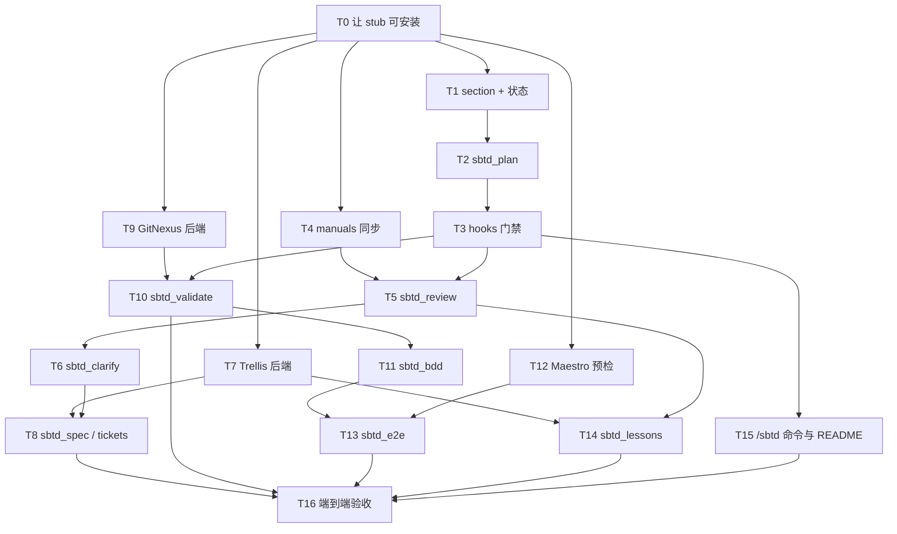

# dsh-sbtd 技术设计与任务拆分

| 项 | 内容 |
|---|---|
| 文档版本 | 1.1 |
| 日期 | 2026-09-02 |
| 状态 | 已定方案，部分落地（T0 stub 已在 sbtd-plugins；T1–T16 未实现） |
| 选定方案 | **方案 2a：外壳插件（shell）**（相对 v1.0 不变） |
| 源工作流基线 | `KunoLu/640-skills` `main`；v1.0 锁 `4222b15`。T4 开工前重锁 SHA |
| 宿主基线 | 实现钉 `@deepseek-ai/dsh@0.1.1-rc.2`（2026-08-21）。不要继续钉 rc.7。alpha `0.1.2-alpha.2` 本迭代不跟 |
| 实现落点 | **`KunoLu/sbtd-plugins` `packages/dsh-sbtd`**（`@kunolu/dsh-sbtd`，Apache-2.0）。不是独立仓。不改 `640-skills` 安装器 |
| 同仓兄弟 | `@kunolu/omp-sbtd` 0.1.0-rc.13（npm `next`；`latest` 仍是 GPL 时代的 0.1.0-rc.2） |
| 许可证 | Apache-2.0 |

本文把已经拍板的结论写成可执行规格：架构、接口、与现有工件的映射，以及按优先级和依赖拆开的任务。每个任务都写清目标、输入、输出、依赖、实现要点和验收。

---

## 0. v1.1 相对 v1.0 必须改的事实（2026-08-31 核对）

本节只纠正 v1.0 已过时的事实。**方案 2a 外壳插件不变**：不改 tools / hooks / Maestro 六步预检，也不改 T1–T16 依赖图（仅 T0 从「建仓」改为「让已有 stub 可安装」）。

### 0.1 仍然成立

- 选定方案仍是 **2a 外壳插件（shell plugin）**。
- 不改 `640-skills` 安装器。
- 不重写 Trellis。
- 不自动 `trellis init`。
- 不静默安装 app / 模拟器。
- 不向 `deepseek-ai/deepseek-harness` 提 PR。
- Maestro 六步预检契约不变。
- T1–T16 依赖图仍然有效。

### 0.2 v1.0 已过时的事实

| v1.0 写法 | 2026-08-31 核对 |
|---|---|
| 独立仓 | 落点是 `KunoLu/sbtd-plugins` 的 `packages/dsh-sbtd`（https://github.com/KunoLu/sbtd-plugins），不是独立仓 |
| 钉 `dsh@0.1.0-rc.7` | 实现对钉 `@deepseek-ai/dsh@0.1.1-rc.2`（2026-08-21）。`0.1.0-rc.8` 破坏了 rc.7 的 peer。alpha `0.1.2-alpha.2`（2026-08-30）移除了 `ApiProxy`；本迭代不跟 alpha |
| T0 尚未开工 | stub 已在：noop `apply`、`cordis.patch.yml` id `sbtd`、`private: true`，从未 `dsh plugin add`。T0 = 让 stub 可安装，不是新建仓库 |
| 包名 `dsh-sbtd` | `@kunolu/dsh-sbtd` |
| Trellis 无 DSH 入口 | Trellis 0.6.15（2026-08-14）已有 `trellis init --dsh`。2a 只组合 Trellis CLI，不要重做 Trellis-on-DSH，不要抄社区 `dsh-trellis` |
| KPi 有 DSH 阶段 | KPi ROADMAP 0.7-draft（2026-07-21）顺序是 OMP → CLI → Core → Pi，没有 DSH 阶段 |
| 许可证含糊 | `KPi/omp-sbtd` latest 仍是 GPL-3.0-only；`sbtd-plugins` 是 Apache-2.0；`omp-sbtd` `next` = 0.1.0-rc.13 |
| 源 SHA `4222b15` 永久有效 | `640-skills` SHA `4222b15` 可能已过时（有 2026-08-28 的 push）；T4 开工前重锁 |
| dsh-sbtd 已有 CI | 仓里拷了五份 omp 的 GHA workflow；没有 dsh-sbtd 专用 GHA；自动 PR check 只有 `omp-runtime-linux-probe` |

### 0.3 alpha 会破的东西（本迭代不跟）

`0.1.2-alpha.2` 相对 rc.2 的破坏性变更，实现时不要按 alpha 文档写：

- `ApiProxy` → `Remote`
- `?token=` 鉴权形态变化
- `client-runtime` → `client-modules`
- `dsh-hooks-claude-code` / `dsh-hooks-codex` **不是** SBTD hooks

签名一律按 **0.1.1-rc.2** 官方文档钉死。

### 0.4 在 `sbtd-plugins` 里用 SBTD 工作流开发

- 仓内已有 `.trellis/`（2026-09-02 核对）。
- 不要自动 `trellis init`。
- 经人工确认后，可用 omp-sbtd 的 `/sbtd onboard` 或 `trellis init`。
- 若仓库已连接到 Cursor，cloud agent / coding bot 可以改代码。
- fork 会撞上 omp CI 的 repo-name guard，CI 会失败。
- Research desk 不写代码。
- 在 T1–T16 落地之前，`dsh-sbtd` 不能当 SBTD 运行时用。

### 0.5 2026-09-02 核对

- **T16 验收仓**：默认用本仓 `sbtd-plugins` 做真实仓库 e2e（仓内已有 `.trellis/`）。不要优先用 KunoLu/KPi（该仓现为 private）。onboard / `trellis init` 前必须人类确认；不要未提示代跑。不要改 `640-skills`。
- **T0 发布**：`@kunolu/dsh-sbtd` 尚未发布到 registry（尚无 `next` dist-tag；同仓 `@kunolu/omp-sbtd` 的 `next` 已发布）。现场验收用本地 path 或 GitHub URL，不要 `dsh plugin add @kunolu/dsh-sbtd` / `@kunolu/dsh-sbtd@next`。

---

## 1. 结论（先读这段）

`sbtd-workflow-onboard` 不是一份提示词，而是一套**安装器 + 运行时契约**：

- 把全局 / 项目 `AGENTS.md` 写到磁盘，作为常驻路由。
- 把 15 个 bundled skill + 14 个 external skill 装到全局 skill 根目录。
- 用 Trellis 管任务状态，用 GitNexus 做影响分析，用 Playwright / Maestro 做端到端验证。

在 DSH 上有两条路：

| 方案 | 做法 | 结果 | 本次 |
|---|---|---|---|
| 1. 安装器移植 | 给 onboard 加 `platform=dsh`，继续写 `~/.dsh/AGENTS.md` 和 `~/.dsh/skills/` | DSH 能吃这套文件，零件都还在 | 否 |
| **2a. 外壳插件** | 一个 Cordis bundle，对外只暴露 `sbtd_*` tool + hook + section；Trellis / GitNexus / Maestro 留在插件内部 | 用户和模型不再区分 skill / AGENTS.md / Trellis | **是** |
| 2b. 全量重写 | 连 `.trellis/` 状态机也用 DSH goal / workflow 重做 | 最干净，但不能吃现有 Trellis 项目 | 否 |

2a 的边界：

- **做**：把「对模型可见的工作流」收成一个 DSH 插件。
- **不做**：改 `640-skills` 安装器；重写 Trellis；在用户电脑上静默装 app / 建模拟器。
- **并存**：`640-skills` 继续服务 Codex / Claude / OMP；`dsh-sbtd` 只服务 DSH。

---

## 2. 范围与非目标

### 2.1 范围内

- 包 `@kunolu/dsh-sbtd`，路径 `sbtd-plugins/packages/dsh-sbtd`：可 `dsh plugin --profile web add` 安装（对照 dsh 0.1.1-rc.2）。
- 常驻规则：`ctx.systemPrompt.section`，不依赖 `AGENTS.md` 是否存在。
- 手续：一组 `sbtd_*` model-facing tools。
- 硬门禁：`agent/pre-step`、`tools/pre-execute`。
- 任务状态：DSH goal / todo 作为会话视图；有 `.trellis/` 时内部调用 Trellis CLI。
- 分析 / 验证：内部调用 GitNexus MCP、项目测试、Playwright、Maestro。
- Maestro 移动端：复用现有「提醒 + 引导 + 缺前置则 blocked」契约，含本机 app 与虚拟设备。

### 2.2 非目标

- 不修改 `640-skills` 的 `install.sh` / `onboard.py` / `catalog.json` / AGENTS 模板。
- 不把 Cursor / Codex skill 目录当作 DSH 插件。
- 不实现方案 2b（用 DSH 重写 Trellis）。
- 不在 `apply()` 里偷偷写项目 `AGENTS.md` 或全局 skill 目录。
- 不自动 `trellis init`、不自动装付费 React Bits、不打印 license key。
- 不向 `deepseek-ai/deepseek-harness` 提 PR（官方不收外部 PR）。

---

## 3. 现状：源工作流在干什么

基线 skill 路径：`640-skills/sbtd-workflow-onboard/`。

### 3.1 它是安装器，不是运行时

`SKILL.md` 明确：`npx skills add` 只拷这个目录，**不执行** `onboard.py`，不写 AGENTS，不装其他 skill。真正干活的是 `scripts/onboard.py` + 根目录 `install.sh` / `install.ps1`。

当前平台枚举：`codex` | `claude` | `kimi` | `oh-my-pi` / `omp`。**没有 `dsh`。**  
全局 AGENTS 默认写到 `$CODEX_HOME/AGENTS.md` / `~/.codex/AGENTS.md`，与平台无关。

### 3.2 四层机制

```text
路由层    AGENTS.global.md / AGENTS.project.md
          Book Gate Plan、skill 路由表、验证/报告契约、rtk/caveman

手续层    15 bundled + 14 external SKILL.md
          可延迟加载的操作说明，AGENTS 只负责「何时调用」

状态层    Trellis CLI + <project>/.trellis/
          phase、prd/design/implement、channel、lessons

分析层    GitNexus CLI + gitnexus-mcp
          改前 impact、改后 detect_changes；无索引则跳过
```

### 3.3 必须装的 skill 清单（手续层原料）

Bundled（`templates/skills/**`，随 catalog 安装）：

1. `sbtd-workflow-onboard`
2. `trellis-workflow`
3. `trellis-channel`
4. `project-validation`
5. `web-ui-autotest-generator`
6. `gherkin-bdd`
7. `knowledge-base-integration`
8. `maestro-mobile-e2e`
9. `lessons-record`
10. `book-refactoring-pass`
11. `book-legacy-change-safety`
12. `book-ddd-distilled-modeling`
13. `book-ddia-data-design`
14. `book-release-readiness`
15. `seo-geo`

External（默认从 `assets/external-skills/stable/` 校验安装，不改上游正文）：

- mattpocock/skills：`diagnosing-bugs`、`tdd`、`grill-me`、`grill-with-docs`、`grilling`、`domain-modeling`、`codebase-design`、`handoff`、`writing-for-agents`、`to-spec`、`to-tickets`
- 其他：`impeccable`、`ui-ux-pro-max`、`shadcn`

2a **不把这些目录暴露给 DSH catalog**。它们变成 `dsh-sbtd/manuals/` 里的内部说明书，由对应 `sbtd_*` tool 读取。

### 3.4 运行时门禁（必须迁到 hook / tool）

进入开发任务先出 `Book Gate Plan`，五项 book-derived skill 标 `required` / `on-demand`，状态机：

`planned → running → passed | blocked`；未选中为 `not-required`。

| 触发事实 | 强制调用 | 通过态 |
|---|---|---|
| 完整执行 `grill-with-docs` 之后 | DDD 二次审核 | `confirmed` |
| 持久化 / 共享数据 / cache / 异步或跨服务数据流等 | `book-ddia-data-design` | `confirmed` |
| 修既有行为 bug，或弱测试 / 行为不清 / 隐藏依赖 / 高回归 | `book-legacy-change-safety` | `characterized`（`seam-required` 走受控回路） |
| 将修改既有生产代码 | `book-refactoring-pass` | `proceed`（`refactor-first` 须先重构） |
| 生产路径 service / API / job / deploy 等 | `book-release-readiness`（所有适用测试门禁之后） | `ready` |

同时命中 legacy + refactoring：先 legacy 后 refactoring。例外：`seam-required` → `safety-seam-only` → legacy `characterized` → 常规 refactoring。

### 3.5 Maestro 现有契约（必须原样迁进 `sbtd_e2e`）

来源：`templates/skills/maestro-mobile-e2e/SKILL.md` + 全局 AGENTS「Web / Mobile 验证工具」。

跑之前必须确认：

1. Java 17+（`java --version`，失败再 `java -version`）
2. Maestro CLI
3. 目标设备 / 模拟器（iOS Simulator、Android Emulator、真机或 cloud）
4. **使用者电脑上的 app 包或已安装 app**（`.app` / `.ipa` / `.apk` / simulator build）
5. bundle id / application id
6. 测试账号、数据、环境隔离
7. **app 内要进入的测试 / 虚拟环境**（base URL、launch arguments、feature flags、起始屏）

缺任一项：`Maestro Flow Assets: blocked`，列出缺失事实，**不生成脆弱 flow**，不把 mock 报成 full-stack。

Onboard 侧：Java / Maestro CLI 是本机前置，**先说明再询问，用户确认才装**。不静默安装。

---

## 4. DSH 侧约束（实现必须遵守）

### 4.1 词汇

| 词 | DSH 含义 | 2a 用法 |
|---|---|---|
| Plugin / Bundle | Cordis 模块 + `package.json` 的 `dsh.bundle` | `dsh-sbtd` 本体 |
| Skill | 一层目录的 `SKILL.md`，catalog + 按需 `skill` tool | **不作为对外面** |
| AGENTS.md | `@deepseek-ai/dsh-agent-instructions` 注入的常驻说明 | **不作为依赖**；可选兼容写入是另议 |
| Hook | `agent/pre-step`、`tools/pre-execute` 等 | 硬门禁 |
| Tool | `ctx.tools` 上模型可调用的函数 | `sbtd_*` |
| Workflow | `ctx.workflowEngine` 的编排脚本 | 本阶段不用；门禁用 hook |
| Goal | 会话级完成目标 | 承载 Book Gate Plan |

### 4.2 必须避开的坑

1. **Web 组合**：host 上的 `skill-filesystem` / `agent-instructions` 是关掉的，真正实例在 agent preset 里。不要用 `~/.dsh/cordis.patch.yml` 去改这两行。
2. **host 平面注册**：`ctx.skills.registerProvider` 和 `ctx.systemPrompt.section` 对所有 preset 可见。2a 用后者，不用前者做对外 catalog。
3. **没有官方「首次运行撒文件」hook**。`dsh plugin add` 只装 bundle。
4. **指令预算**：默认 `maxBytes: 65536`。section 必须短。现有两份 AGENTS 合计可能超预算，这是方案 1 的坑，2a 用短 section 避开。
5. **Skill 发现只一层**。即使将来要暴露 manuals，也必须 flatten。
6. **钉版本**：实现对照 `@deepseek-ai/dsh@0.1.1-rc.2`。preview，API 会破。本迭代不跟 0.1.2-alpha，也不要假装 rc.7 仍是最新。
7. **MCP 子进程不在 sandbox 里**。GitNexus / Maestro MCP 按可信代码对待。

### 4.3 推荐的 DSH 原语映射

| 源概念 | 2a 落点 |
|---|---|
| 全局 AGENTS 路由 | `systemPrompt.section({ name: 'sbtd', order: 50 })` |
| Book Gate Plan | session 状态 + `sbtd_plan` + `agent/pre-step` |
| 强制 book gate | `tools/pre-execute` deny/ask |
| 各 SKILL.md 手续 | `sbtd_*` tool；正文进 `manuals/` |
| Trellis phase / artifacts | tool 内部 `bash trellis ...`；有 `.trellis/` 才用 |
| Trellis Channel | 本阶段不做；需要时再映射 DSH subagent |
| GitNexus | tool 内部 MCP / CLI；不可用则跳过 |
| Maestro / Playwright | `sbtd_e2e` 预检 + 引导 + 执行 |
| `/sbtd-workflow-onboard` | `ctx.commands` 的 `/sbtd`（人类命令，不是模型 tool） |

---

## 5. 目标架构

### 5.1 对外只剩一个插件

```text
用户 / 模型
    │
    ▼
┌─────────────────────────────────────┐
│ dsh-sbtd                            │
│  section: 短规则                    │
│  tools:   sbtd_*                    │
│  hooks:   plan / gate               │
│  command: /sbtd                     │
└──────────────┬──────────────────────┘
               │ 仅插件内部
     ┌─────────┼──────────┬────────────┐
     ▼         ▼          ▼            ▼
  Trellis   GitNexus   Playwright   Maestro
  CLI       MCP/CLI    项目测试      CLI + 设备/app
```

模型不再「调用 `grill-with-docs` skill」或「先读 AGENTS.md」。它只调用 `sbtd_clarify`、`sbtd_review` 等。

### 5.2 目录

```text
sbtd-plugins/packages/dsh-sbtd/
├── package.json                 # name: @kunolu/dsh-sbtd；dsh.bundle.patch
├── cordis.patch.yml             # insert 插件行；可选 MCP 行
├── README.md
├── src/
│   ├── index.ts                 # apply(ctx)
│   ├── config.ts                # 插件 Config
│   ├── state.ts                 # Book Gate Plan / gate 状态
│   ├── section.ts               # 短常驻规则文本
│   ├── hooks.ts                 # pre-step / pre-execute
│   ├── backends/
│   │   ├── trellis.ts
│   │   ├── gitnexus.ts
│   │   └── maestro.ts           # 预检 + 引导文案
│   └── tools/
│       ├── plan.ts
│       ├── clarify.ts
│       ├── spec.ts
│       ├── tickets.ts
│       ├── review.ts
│       ├── validate.ts
│       ├── bdd.ts
│       ├── e2e.ts
│       └── lessons.ts
├── manuals/                     # 从 640-skills 只读同步，不改上游
│   ├── bundled/
│   └── external/
└── scripts/
    └── sync-manuals.sh
```

`package.json` 要点：

```json
{
  "name": "@kunolu/dsh-sbtd",
  "version": "0.1.0",
  "type": "module",
  "main": "dist/index.js",
  "dsh": { "bundle": { "patch": "./cordis.patch.yml" } }
}
```

`cordis.patch.yml` 要点：

```yaml
- insert:
    - id: sbtd
      name: dsh-sbtd
      # config: { ... }
```

MCP 行（GitNexus 等）可以同文件后插，但必须可关。默认建议：插件能跑，MCP 缺省时降级，不 `failOnStartupError: true`。

### 5.3 `apply(ctx)` 职责

```ts
export const name = 'dsh-sbtd'
export const inject = ['tools', 'systemPrompt', 'agents']

export function apply(ctx: Context) {
  registerSection(ctx)      // 短规则
  registerTools(ctx)        // sbtd_*
  registerHooks(ctx)        // 门禁
  registerCommand(ctx)      // /sbtd 人类命令
  // 禁止：在这里写 ~/.dsh/AGENTS.md 或项目文件
}
```

---

## 6. 对外接口规格

### 6.1 常驻 section（短，必须短）

只放模型每轮都要知道的硬规则，不复制 AGENTS 全文：

- 开发任务先 `sbtd_plan`，未出计划不准改生产代码。
- 澄清走 `sbtd_clarify`，完整澄清后必须有 DDD 复审通过态。
- 改代码前 / 后的分析、验证走 `sbtd_validate` / `sbtd_e2e`，不要直接裸调 MCP 名称。
- 命中 book gate 必须 `sbtd_review` 到通过态。
- 最终输出要带结论、文件、验证、跳过原因、风险。
- Maestro：缺 Java / CLI / 设备 / 已装 app / app 内测试环境时 blocked，先引导用户。

长流程、命令参数、检查清单全部留在 tool 内部 manuals。

### 6.2 Tools

| Tool | 取代 | 输入（摘要） | 副作用 |
|---|---|---|---|
| `sbtd_plan` | Book Gate Plan 段落 | `task_summary`，可选触发事实 | 写 session 状态 |
| `sbtd_clarify` | grill-with-docs + grilling + domain-modeling + 强制 DDD | `mode: docs\|generic`，当前问题 | 对话；结束后强制跑 DDD review |
| `sbtd_spec` | to-spec | 需求摘要 | 有 Trellis 则写 `prd.md`，否则返回草稿 |
| `sbtd_tickets` | to-tickets | spec 路径 | 有 Trellis 则写 parent/child artifacts |
| `sbtd_review` | 5 个 book-* | `kind: legacy\|refactor\|ddd\|ddia\|release` | 更新 gate 状态；输出规定标题的 Review |
| `sbtd_validate` | project-validation + GitNexus 辅助 | `phase: pre\|post` | 内部 GitNexus / 项目测试；不阻塞若 GitNexus 不可用 |
| `sbtd_bdd` | gherkin-bdd | `intent: write\|sync\|read` | `.feature`；read 不改工作树 |
| `sbtd_e2e` | maestro-mobile-e2e + web-ui-autotest-generator + Playwright | `surface: web\|mobile\|hybrid`，`action: preflight\|generate\|run` | 预检 / 引导 / 跑测试 / 写报告 |
| `sbtd_lessons` | lessons-record | 事件类型 | `.trellis/lessons` 或 `docs/lessons.md` |

UI 相关（`ui-ux-pro-max` / `impeccable` / `shadcn` / `seo-geo`）本阶段不单独做 tool，需要时作为 `sbtd_validate` / 后续迭代。`diagnosing-bugs` / `tdd` / `handoff` 同理，P2 可并入 `sbtd_validate` 或后补 `sbtd_debug`。

### 6.3 Session 状态（`state.ts`）

存在当前 DSH session，不写项目文件。

```ts
type GateState = 'planned' | 'running' | 'passed' | 'blocked' | 'not-required'

interface BookGatePlan {
  taskId: string
  summary: string
  gates: Record<'ddd' | 'ddia' | 'legacy' | 'refactor' | 'release', {
    requirement: 'required' | 'on-demand'
    state: GateState
    fact?: string
    reviewStatus?: string
  }>
  taskAutoExit?: boolean
}

interface SbtdSessionState {
  plan?: BookGatePlan
  validate: { pre?: 'done' | 'skipped'; post?: 'done' | 'blocked' }
  maestro?: {
    java?: string
    cli?: string
    device?: string
    appInstalled?: boolean
    appEnv?: string
    lastPreflight?: 'ok' | 'blocked'
    missing: string[]
  }
}
```

context compaction / handoff 时必须能序列化进交接摘要（至少 plan 与 maestro.missing）。

### 6.4 Hooks

**`agent/pre-step`**

- 当前 goal / 用户意图被判定为「开发任务」，且没有 `plan`：注入提醒，要求先 `sbtd_plan`。
- 不在这里 deny（还没有 tool call）。

**`tools/pre-execute`**

拦截对象：模型面向的 `write` / `edit` / `str_replace_editor`，以及明显改生产代码的 `bash`（启发式：`git commit` 不拦；`rm` 生产路径、包管理器改业务代码要 ask）。

规则：

1. 无 `plan` 且目标在项目源码下 → `{ kind: 'ask' }`，说明先 `sbtd_plan`。
2. `legacy` 为 `required` 且未 `passed`，首次行为修改 → deny，提示 `sbtd_review kind=legacy`。
3. `refactor` 为 `required` 且未 `passed`，首次实现编辑 → deny。
4. `ddia` 为 `required` 且未 `passed`，改 schema / 数据路径 → deny。
5. `release` 为 `required` 且未 `passed`，不拦编辑，拦「声称完成 / 发布」类收尾（若有对应 tool；否则在 `sbtd_validate phase=post` 内强制）。

Hook 不得替代 tool 的 Review 正文。它只拦，不生成审核。

### 6.5 Maestro 预检（`backends/maestro.ts` + `sbtd_e2e`）

`action=preflight` 必须按顺序检查并**对人引导**，不得静默安装：

| 步 | 检查 | 失败时 |
|---|---|---|
| 1 | Java 17+ | 说明 Maestro 需要 JDK 17+，建议 Temurin 21；问是否协助装 |
| 2 | `maestro --version` | 说明 CLI 是本机前置，问是否协助装 |
| 3 | 设备 / 模拟器列表 | 说明要在本机准备 iOS Simulator 或 Android Emulator（或接真机 / 用 cloud）；给启动命令，不代建 AVD |
| 4 | 目标 app 是否已安装到该环境 | 说明需要把对应 `.app` / `.apk` 装进模拟器或真机；给 `xcrun simctl install` / `adb install` 示例；**不代装** |
| 5 | app 内测试 / 虚拟环境 | 确认 base URL、launch arguments、feature flag、起始屏；没有就 blocked，引导用户在 app 里切到测试环境或提供 launch args |
| 6 | bundle id / app id、测试账号 | 缺则 blocked |

只有 `preflight=ok` 才允许 `generate` / `run`。  
`run` 正式报告必须用原生命令 `maestro test --format ... --output ...`，默认不加 `rtk`。

引导话术原则（与现网 AGENTS 一致）：

- 先说明「这是本机环境，不是项目依赖」。
- 再问「要不要我协助」，用户确认才给安装命令或代跑安装。
- 用户拒绝：标记 `skipped-by-user` / `blocked`，继续其他非移动工作，不假装 E2E 已跑。

### 6.6 Trellis / GitNexus 后端

**Trellis**

- 探测：`<cwd>/.trellis/` 或 `.trellis/workflow.md`。
- 有：`sbtd_spec` / `sbtd_tickets` / `sbtd_lessons` 往 `.trellis/tasks/<task>/` 与 `.trellis/lessons/` 写。
- 无：tool 仍可用，产物当对话草稿返回；提示「当前项目未 `trellis init`」，**默认不代执行** `trellis init`。
- 不在 2a 实现 Channel runtime。

**GitNexus**

- 同时满足 MCP 可见 + 项目有索引才调用。
- `sbtd_validate phase=pre` → impact；`phase=post` → detect_changes。
- stale / 失败：降级 advisory，最终输出说明替代检查。
- 不新增 git hook，不改 MCP transport。

---

## 7. 与源 skill 的映射表

| 源 | 2a |
|---|---|
| `AGENTS.global.md` 路由 / 门禁 | 短 section + hooks + `sbtd_plan` / `sbtd_review` |
| `AGENTS.project.md` 项目路径 | tool 内约定（`features/`、`maestro/flow/`、报告目录），不写项目 AGENTS |
| `trellis-workflow` | `backends/trellis.ts` + spec/tickets |
| `trellis-channel` | 本阶段不做 |
| `project-validation` | `sbtd_validate` |
| `gherkin-bdd` | `sbtd_bdd` |
| `knowledge-base-integration` | `sbtd_bdd intent=read` 的后续迭代 |
| `maestro-mobile-e2e` | `sbtd_e2e surface=mobile\|hybrid` |
| `web-ui-autotest-generator` | `sbtd_e2e surface=web` |
| `lessons-record` | `sbtd_lessons` |
| 5 × `book-*` | `sbtd_review` |
| `grill-with-docs` / `grill-me` / `grilling` / `domain-modeling` | `sbtd_clarify` |
| `to-spec` / `to-tickets` | `sbtd_spec` / `sbtd_tickets` |
| `seo-geo` / UI skills / `tdd` / `diagnosing-bugs` | P3 |
| `onboard.py` 安装行为 | **不移植** |

---

## 8. 任务拆分

原则：先让插件能装、能拦住「没计划就改代码」，再填手续 tool，最后接移动端预检和 MCP。每个任务可独立验收。

### 8.1 依赖关系



### 8.2 优先级

| 优先级 | 任务 | 为什么在这一档 |
|---|---|---|
| P0 | T0 T1 T2 T3 | 没有骨架和硬门禁，后面都是空转 |
| P1 | T4 T5 T6 T7 T8 | 核心开发闭环：计划 → 澄清 → 审核 → 写 PRD/tickets |
| P2 | T9 T10 T11 T12 T13 T14 | 验证与移动端；Maestro 引导在 T12，必须先于 T13 |
| P3 | T15 T16 | 人类入口和整包验收 |

---

## 9. 任务说明书

### T0 — 让已有 stub 可安装（P0）

**状态**：stub 已存在于 `sbtd-plugins/packages/dsh-sbtd`（noop `apply`、`cordis.patch.yml` id `sbtd`、`private: true`，从未执行 `dsh plugin add`）。**不要新建仓库。**

**目标**：让该 stub 能安装到 DSH `0.1.1-rc.2` 上；`apply()` 只 `console` / 注册空 section，不写用户磁盘。

**依赖**：无。  
**输入**：官方插件文档 https://deepseek-harness.github.io/deepseek-harness/en/develop/basic/ 。  
**输出**：可安装的 `@kunolu/dsh-sbtd`（路径 `sbtd-plugins/packages/dsh-sbtd`）、peer / README 钉 `@deepseek-ai/dsh@0.1.1-rc.2`、`cordis.patch.yml`、`src/index.ts`、最小 build。

**实现要点**：

- `export const name = 'dsh-sbtd'`，`inject = ['tools', 'systemPrompt']`。
- `files` 含 `dist/`、`cordis.patch.yml`、`manuals/`。
- peer / README 钉 `@deepseek-ai/dsh@0.1.1-rc.2`。
- 不调用 `trellis init --dsh`。
- 不把包发到官方仓。
- `@kunolu/dsh-sbtd` 尚未发布到 registry（尚无 `next` dist-tag）；现场验收用本地 path 或 GitHub URL，不要用 registry 包名或 `@next` 安装。

**验收**：

```bash
dsh plugin --profile web add <local-path-or-github-url>
dsh --profile web --dump-config   # 能看到 id: sbtd
dsh web                           # 进程能起来，无 failOnStartupError
```

registry 包未发布，尚无 `next` dist-tag。现场验收必须用**本地 path 或 GitHub URL** 安装，不要 `dsh plugin add @kunolu/dsh-sbtd` 或 `@kunolu/dsh-sbtd@next`。

---

### T1 — 短 section + session 状态（P0）

**目标**：每条 DSH 会话带上 `sbtd` section；状态模块可读写 Book Gate Plan。

**依赖**：T0。  
**输出**：`src/section.ts`、`src/state.ts`、section 单测（纯文本快照）。

**实现要点**：

- section `order: 50`，正文 ≤ 2KB，中文。
- 状态按 session id 隔离；进程内 Map 即可，接口留 `serialize()` 给后续 handoff。
- 不读、不写 `AGENTS.md`。

**验收**：新开 DSH 会话，system / reminder 中可见 `sbtd` 短规则；重启插件后状态接口仍可单测。

---

### T2 — `sbtd_plan`（P0）

**目标**：模型能登记一份 Book Gate Plan。

**依赖**：T1。  
**输出**：`src/tools/plan.ts`。

**实现要点**：

- 入参：`task_summary: string`，可选 `facts: string[]`（调用方也可只给摘要，由 tool 按 3.4 规则推断 required）。
- 推断规则必须是**客观谓词**，禁止「我觉得高风险」这类主观降级。
- 返回：完整 plan JSON + 给人看的 Markdown 表。
- 同一主要目标重复调用：更新 facts，合法状态转换，不重置已 `passed` 除非触发事实消失并写明原因。

**验收**：调用后 `state.plan` 存在；五项 gate 都有 `requirement` 和 `state`。

---

### T3 — hooks 门禁（P0）

**目标**：没计划 / 没过强制 gate，就不能改生产代码。

**依赖**：T2。  
**输出**：`src/hooks.ts`。

**实现要点**：

- 监听 `tools/pre-execute`，按 6.4 返回 `allow` / `deny` / `ask`。
- 路径启发式：`<cwd>` 下 `src/`、`app/`、`packages/`、非 `*.md` 的实现文件视为生产代码；`*.test.*`、`features/`、`maestro/flow/`、`.trellis/` 文档不走 legacy/refactor 硬拦（仍可 ask）。
- deny 消息必须指出下一步调用哪个 `sbtd_*`。
- `agent/pre-step` 只注入「尚未 `sbtd_plan`」提醒。

**验收**：无 plan 时对 `src/foo.ts` 的 write 被 ask/deny；先 `sbtd_plan` 且 required gate 未过，同样被拦；对 README 的编辑放行。

---

### T4 — manuals 同步（P1）

**目标**：把 640-skills 的 skill 正文只读同步进 `manuals/`，供 tool 加载。

**依赖**：T0。不依赖 T3。  
**输入**：本地 `~/github/640-skills` 或指定 revision `4222b15`。  
**输出**：`scripts/sync-manuals.sh`、`manuals/**`、`manuals/MANIFEST.json`（源 path + sha256）。

**实现要点**：

- 只拷 SKILL.md 及该 skill 自己的 `references/`（maestro lessons-index 等按需）。
- 不拷 `onboard.py`、`assets/external-skills` 的 git 历史、安装器。
- 同步脚本失败要非 0；禁止手改 manuals 正文（README 写明）。

**验收**：manifest 与源文件 checksum 一致；`dsh-sbtd` 仓不包含 `install.sh`。

---

### T5 — `sbtd_review`（P1）

**目标**：五项 book gate 有统一入口，输出规定标题的 Review，并推进 gate 状态。

**依赖**：T3、T4。  
**输出**：`src/tools/review.ts`。

**实现要点**：

- `kind` 枚举固定，禁止别名。
- 加载对应 manuals，按源 skill 的状态枚举输出（见 3.4）。
- `needs-*` / `seam-required` / `refactor-first` → gate 保持 `running`。
- 通过态 → `passed`；`blocked` → gate `blocked`。
- 不替代项目规范 / 测试；结论可写入返回值，由后续 spec tool 决定是否落盘。

**验收**：`legacy` 未通过时，T3 仍然拦住生产代码 write；通过后放行。

---

### T6 — `sbtd_clarify`（P1）

**目标**：澄清闭环，结束时强制 DDD 复审。

**依赖**：T5（复用 `sbtd_review kind=ddd`）。  
**输出**：`src/tools/clarify.ts`。

**实现要点**：

- `mode=docs`：先读项目文档 / 代码，能从项目事实回答的不反问；对应 grill-with-docs。
- `mode=generic`：对应 grill-me。
- 每轮只问前置已满足的一个问题（grilling frontier）。
- 工具返回值必须区分：`partial`（还在问）vs `complete`。
- `complete` 时**内部调用** DDD review，未 `confirmed` 不得在返回值里建议进入 PRD / 实现。
- 透明度：只读了 manuals ≠ 完整澄清；返回里写明 `clarifyStatus`。

**验收**：`complete` 且 DDD 非 `confirmed` 时，返回明确 blocked；T3 仍拦实现编辑。

---

### T7 — Trellis 后端（P1）

**目标**：探测并安全调用 Trellis CLI，不封装 Channel。

**依赖**：T0。  
**输出**：`src/backends/trellis.ts`。

**实现要点**：

- `detect(cwd)`：`.trellis/` 是否存在、`trellis` 是否在 PATH。
- `readWorkflow(cwd)`、`currentTask(cwd)`、`writeArtifact(cwd, task, name, body)`。
- 不跑 `trellis init`，除非未来单独加「用户明确确认」的 command。
- 所有会改指针 / 删路径的命令先不包；2a 只包读 + 写 artifacts。

**验收**：无 `.trellis/` 时 `detect.exists=false` 且不抛；有则能读到 `workflow.md`。

---

### T8 — `sbtd_spec` / `sbtd_tickets`（P1）

**目标**：澄清通过后能落 PRD 和切片。

**依赖**：T6、T7。  
**输出**：`src/tools/spec.ts`、`tickets.ts`。

**实现要点**：

- 有 Trellis：写入 `.trellis/tasks/<task>/prd.md` 等；未确定 task 路径则返回草稿并说明。
- 无 Trellis：只返回 Markdown，不在 `docs/` 落最终 ticket。
- 不发布 GitHub / Linear issue。
- DDD 未 `confirmed` 时这两个 tool 应 ask/拒绝。

**验收**：在已有 Trellis 的样例仓，能看到新 artifacts；无 Trellis 仓不落盘。

---

### T9 — GitNexus 后端（P2）

**目标**：可选的影响分析，失败不阻塞。

**依赖**：T0。  
**输出**：`src/backends/gitnexus.ts`。

**实现要点**：

- 探测 MCP 工具名（`mcp__gitnexus__*` 或配置的 serverName）和 `.gitnexus/`。
- `impact()` / `detectChanges()`；stale 时尝试项目约定的 refresh，失败则 `advisory: true`。
- 不改用户 MCP 配置。

**验收**：无 GitNexus 时返回 `skipped`；有则返回可打印摘要。

---

### T10 — `sbtd_validate`（P2）

**目标**：改前 / 改后验证策略，接上 GitNexus 与项目脚本。

**依赖**：T3、T9。  
**输出**：`src/tools/validate.ts`。

**实现要点**：

- 读 manuals/project-validation 的策略优先级：项目 AGENTS / README / package scripts / 本 tool 默认。
- `phase=pre`：GitNexus impact（可 skip）。
- `phase=post`：跑项目测试命令；报告型测试默认不用 `rtk`。
- 返回状态枚举与源 AGENTS 对齐（能对齐的项都对齐，对不齐的显式标 `not-applicable`）。

**验收**：无测试脚本时说明原因和剩余风险，不假装 passed。

---

### T11 — `sbtd_bdd`（P2）

**目标**：用户可见行为有持久 `.feature`。

**依赖**：T10（验证策略知道 feature 路径即可并行，但建议在 validate 之后做以免路径契约冲突）。  
**输出**：`src/tools/bdd.ts`。

**实现要点**：

- 默认路径见源项目 AGENTS：单应用 `features/<slug>.feature`，中文步骤 + 英文关键词。
- `intent=sync` / `read` 按源 skill 语义；`read` 不得改工作树。
- 缺跨仓 contract 时 blocked，不把猜测写成 source of truth。

**验收**：对「新增登录」能给出/写入 feature；`read` 后 git status 干净。

---

### T12 — Maestro 预检与引导（P2）

**目标**：在跑任何 Maestro 命令之前，把本机 app / 虚拟设备 / app 内环境讲清楚并拦住。

**依赖**：T0。  
**输出**：`src/backends/maestro.ts`。

**实现要点**（对应 6.5，不可删减）：

1. Java 17+  
2. Maestro CLI  
3. 设备或模拟器（虚拟环境 = iOS Simulator / Android Emulator / 已接真机 / cloud）  
4. **目标 app 已安装到该环境**  
5. **app 内测试环境**（URL / launch args / flags / 起始屏）  
6. 身份与账号  

引导必须：

- 用人话说明「要在你这台电脑上准备模拟器和对应 app，并在 app 里进入测试环境」。
- 给出可复制命令，不代执行安装，除非用户在 DSH approval 里明确同意。
- 失败返回 `lastPreflight=blocked` + `missing[]`。

**验收**：拔掉模拟器或未装 app 时，预检 blocked 且文案提到 app 与虚拟设备；不调用 `maestro test`。

---

### T13 — `sbtd_e2e`（P2）

**目标**：Web / Mobile / Hybrid 的生成与执行，强制走 T12。

**依赖**：T11、T12。  
**输出**：`src/tools/e2e.ts`。

**实现要点**：

- `surface=mobile|hybrid` 的 `generate`/`run` 入口第一行调用 T12；非 `ok` 直接返回 blocked。
- flow 落 `maestro/flow/`，报告落 `.maestro/reports/maestro-report-{flow}-{branch_slug}-{stamp}.*`，中文 `.md` 汇总。
- Web：Playwright 正式报告契约沿用源 AGENTS（`tests/e2e/reports/html/` 等）。
- 同一浏览器上下文同一时间一个 controller。
- mock / contract-backed 不得报 full-stack。

**验收**：预检失败时无 `maestro test` 进程；预检成功后能跑一个最小 smoke（可用 fixture 项目）。

---

### T14 — `sbtd_lessons`（P2）

**目标**：在规定场景记 lesson，不滥写。

**依赖**：T5、T7。  
**输出**：`src/tools/lessons.ts`。

**实现要点**：

- 有 Trellis：短入口 `.trellis/spec/lessons.md`，正文 `.trellis/lessons/`。
- 无 Trellis：`docs/lessons.md`。
- 触发：bug 修复、回滚、工具误判、验证失败、GitNexus 不匹配。普通任务不写。

**验收**：无 Trellis 样例写入 `docs/lessons.md`；有 Trellis 不在仓库根新建 `lessons.md`。

---

### T15 — `/sbtd` 人类命令与 README（P3）

**目标**：人可以在 DSH UI 里敲 `/sbtd` 看状态、跑预检，而不靠模型。

**依赖**：T3（至少 plan 状态能读）。最好在 T12 之后，以便 `/sbtd maestro` 跑预检。  
**输出**：command 注册、`README.md`（安装、与 640-skills 的关系、非目标）。

**实现要点**：

- `/sbtd`：打印 plan + maestro missing。
- `/sbtd plan` / `/sbtd maestro`：触发对应内部函数。
- README 写明：不改 640-skills；钉 `@deepseek-ai/dsh@0.1.1-rc.2`；MCP 可选。

**验收**：文档按本文件第 5、6、8 节能独立装起来。

---

### T16 — 端到端验收（P3）

**目标**：用一个**已有** `.trellis/` 的真实仓库证明闭环。

**依赖**：T8、T10、T13、T14、T15。  
**输出**：验收记录（可附在 README 或 `docs/acceptance.md`）。

**验收仓**：默认用本仓 `sbtd-plugins` 做真实仓库 e2e（仓内已有 `.trellis/`）。不要优先用 KunoLu/KPi（该仓现为 private）。onboard / `trellis init` 前必须人类确认；不要未提示代跑。不要改 `640-skills`。

**场景**：

1. 本机 DSH 确认为 `@deepseek-ai/dsh@0.1.1-rc.2`。  
2. 安装 bundle，开 `dsh web`，section 可见。  
3. 直接改 `src/` → 被 hook 拦住。  
4. `sbtd_plan` → `sbtd_clarify` → DDD → `sbtd_spec` / `sbtd_tickets` 落入 `.trellis/tasks/`。  
5. required review 通过后才能改代码。  
6. `sbtd_validate` 在无 GitNexus 时 skip 并说明。  
7. `sbtd_e2e surface=mobile action=preflight`：在未装 app 的机器上 blocked，文案含虚拟设备与 app。  
8. `640-skills` git status 保持干净（本方案不改它）。

---

## 10. 建议排期（可压缩，不可打乱 P0）

按一个人全职、已熟悉两边代码估算：

| 阶段 | 任务 | 大致量 |
|---|---|---|
| 第 1 段 | T0–T3 | 1–2 天 |
| 第 2 段 | T4–T8 | 2–4 天 |
| 第 3 段 | T9–T14 | 2–4 天（T12/T13 受真机/模拟器环境影响） |
| 第 4 段 | T15–T16 | 1 天 |

T12 的环境引导是明确需求，不能为赶工改成「假设设备已就绪」。

---

## 11. 风险

| 风险 | 影响 | 处理 |
|---|---|---|
| DSH preview API 变更 | bundle 装不上 / hook 签名变 | 钉 `@deepseek-ai/dsh@0.1.1-rc.2`；`apply` 只走文档化 extension point；本迭代不跟 0.1.2-alpha |
| Web 里 home patch 无效 | 误配 skill-filesystem | 只用 host `apply()` 注册 section/tools/hooks |
| 现有 AGENTS 过长 | 若有人走方案 1 会被 64KB 裁掉 | 2a 不依赖文件 AGENTS |
| Hook 误伤测试 / docs | 开发体验差 | 6.4 路径白名单；先 ask 再 deny |
| Maestro 本机环境差异大 | T13 难自动验收 | T12 单独验收；T16 允许 preflight-blocked 为通过条件 |
| manuals 漂移 | tool 行为过时 | T4 checksum；升级 640-skills 时再 sync |
| 与 Codex 双轨 | 两套规则逐渐分叉 | 2a 不改 640-skills；共享规则以 manuals 为桥 |
| 误跟 `trellis init --dsh` 或社区 `dsh-trellis` | 把 2a 做成 Trellis-on-DSH 重写，偏离外壳插件 | 2a 只组合 Trellis CLI；不重实现、不抄社区插件 |
| 在 KPi GPL 树里写 dsh-sbtd | 许可证污染（KPi/omp-sbtd latest 仍 GPL-3.0-only） | 只在 `sbtd-plugins/packages/dsh-sbtd`（Apache-2.0）落地 |

---

## 12. 明确不写进本迭代的东西

- `platform=dsh` 的 onboard.py 改造（方案 1）。
- 把 skill 目录 flatten 后 `registerProvider` 暴露给 `/skill-name`（和 2a「不再区分 skill」冲突）。
- Trellis Channel / 多 writer。
- caveman 自动压缩状态机。
- React Bits 付费 registry。
- 知识库 P2 发布。
- 向 deepseek-harness 提 PR。

---

## 13. 参考

- 源 skill：`640-skills/sbtd-workflow-onboard/SKILL.md`、`REFERENCE.md`、`catalog.json`
- 源模板：`templates/agents/AGENTS.global.md`、`AGENTS.project.md`
- 源 Maestro：`templates/skills/maestro-mobile-e2e/SKILL.md`
- DSH：<https://github.com/deepseek-ai/deepseek-harness> `dsh-v0.1.1-rc.2`（实现对钉；不要跟 0.1.2-alpha）
- 官方插件文档：https://deepseek-harness.github.io/deepseek-harness/en/develop/basic/
- 插件发布：`docs/user/develop/basic/publish.md`
- 指令加载：`packages/context/agent-instructions`
- 扩展菜谱：`docs/cookbook/extension-cookbook.md`
- Web 组合限制：Discussion #519
- 实现落点：`KunoLu/sbtd-plugins` `packages/dsh-sbtd`（https://github.com/KunoLu/sbtd-plugins）
- Trellis v0.6.15 changelog（含 `trellis init --dsh`，2026-08-14）
- `@kunolu/omp-sbtd` 0.1.0-rc.13（npm `next`；`latest` 仍是 GPL 时代的 0.1.0-rc.2）

---

## 14. 一句话

**在 `sbtd-plugins/packages/dsh-sbtd` 做一个钉 DSH `0.1.1-rc.2` 的外壳插件，把 SBTD 工作流的路由和手续收成 tool 与 hook；Trellis、GitNexus、Maestro 留在插件里面当后端；不要重实现 `trellis init --dsh`；Maestro 必须先引导用户准备本机虚拟设备和已安装的测试 app，缺了就停，不装、不装、不装。**
