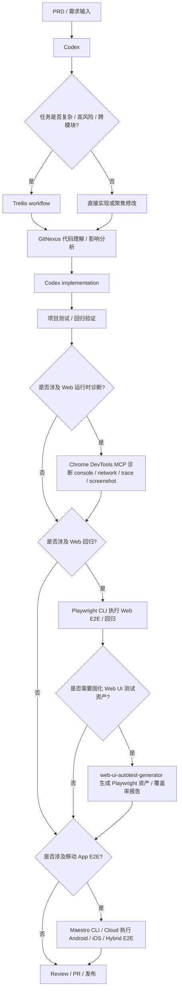

# AI Tools 项目工具流程精简概要

> 本文件记录个人 Codex Agent Harness 的模板化工具定位、版本监控基线和 Skill 编排规则。
> 当前主流程已收敛为 `Codex + GitNexus + Trellis + Chrome DevTools MCP + Playwright + Maestro`。
> Chrome DevTools MCP 负责 Web 运行时诊断，Playwright CLI 负责 Web 可重复回归，Maestro 负责移动 App E2E 和可选跨端 smoke。
> `web-ui-autotest-generator` 作为 Web UI Playwright 测试资产生成、选择器审计和覆盖率报告的可选专项分支。
> `shadcn Skill` 作为 shadcn/ui 项目组件、registry、preset 和 CLI 工作流的可选辅助，必须先确认项目存在 `components.json`、使用或准备初始化 shadcn/ui，或任务明确涉及 shadcn registry / preset / CLI。
> `React Bits Pro Skill` 仅作为 React / shadcn UI 项目的可选前端组件与 blocks 集成辅助，必须先确认技术栈、项目内 Skill 安装状态和可读取的 license key。
> `ponytail` / `ponytail-review` / `ponytail-audit` / `ponytail-debt` 作为 required external Skills 由 Onboard stable set 统一安装和管理：缺失即补装、失败即阻断；官方 Ponytail plugin 与 Onboard stable provider 不得同时启用，检测到已启用 plugin 时 check / init / reset 阻断并交由人工处理。Ponytail 版本基线只以 `assets/external-skills/stable/MANIFEST.json` 为事实源，不纳入下方版本监控表。
> 本仓库当前可复用模板和本地安装 / 重置自动化集中在 `sbtd-workflow-onboard/`，旧 `agents/` 和 `skills/` 顶层目录已移除。

## 0. 版本监控配置

> 自动化任务优先读取本章节。后续如需新增指定工具，在下表继续追加即可。

| 工具 | GitHub 仓库 | 当前使用版本 | 版本通道策略 | 是否启用监控 | 备注 |
|---|---|---:|---|---|---|
| Codex | openai/codex | v0.151.0 | stable-only | 是 | 核心 Coding Agent |
| Trellis | mindfold-ai/trellis | v0.6.16 | stable-only | 是 | 复杂任务编排 / TDD workflow |
| GitNexus | abhigyanpatwari/GitNexus | v1.6.10 | stable-only | 是 | 代码理解、依赖关系、影响分析 |
| Chrome DevTools MCP | ChromeDevTools/chrome-devtools-mcp | latest | stable-only | 否 | Web 运行时诊断 / MCP 浏览器检查 |
| Playwright | microsoft/playwright | v1.62.1 | stable-only | 是 | Web E2E / 回归测试 / Playwright MCP |
| Maestro | mobile-dev-inc/Maestro | cli-2.10.0 | stable-only | 是 | Android / iOS / Hybrid App E2E |
| web-ui-autotest-generator | KunoLu/640-skills | bundled | repository-controlled | 否 | 内置 Web UI Playwright 测试资产生成 Skill |
| React Bits Pro Skill | pro.reactbits.dev | manual | manual | 否 | React / shadcn UI 组件与 blocks 集成辅助 |
| 待添加 | owner/repo | 未明确 | stable-only | 否 | 后续需要监控的新工具在此补充 |

---

## 0.1 本仓库模板源路径

模板和 bundled Skill 的当前源路径以 `sbtd-workflow-onboard/` 为唯一承载目录；定时任务 prompt 单独版本化在 `prompts/automations/`：

| 内容 | 当前源路径 | 用途 |
|---|---|---|
| Codex 全局规则模板 | `sbtd-workflow-onboard/templates/agents/AGENTS.global.md` | `同步` / `sync` 时写入 `/Users/lusonglin/.codex/AGENTS.md`，也可由 onboard Skill 安装 |
| 项目级规则模板 | `sbtd-workflow-onboard/templates/agents/AGENTS.project.md` | 由具体项目手动落地，或通过 onboard Skill 在确认项目根目录后安装 |
| 全局 Skill 模板 | `sbtd-workflow-onboard/templates/skills/*/SKILL.md` | `同步` / `sync` 时写入 `/Users/lusonglin/.agent/skills/<skill>/SKILL.md`，目标路径保持不变 |
| Onboard Skill | `sbtd-workflow-onboard/` | 初始化或重置本地 Codex 全局 AGENTS、项目 AGENTS 和 SBTD workflow skills |
| Agent platform selector | 根安装器 `--platform` / `-Platform` | 只选择 Agent CLI 与 MCP adapter；默认全局 AGENTS 仍写入 Codex 路径，只有显式 global AGENTS path 才覆盖，project-only 不写全局 AGENTS |
| Onboard 机器目录 | `sbtd-workflow-onboard/catalog.json`、`catalog.schema.json` | 统一描述 bundled Skill、external Skill 上游源与模板源路径，并提供 Draft 2020-12 校验契约 |
| Orca 版本检查 prompt | `prompts/automations/sbtd-workflow-tools-version-check.md` | 同步更新 `SBTD Workflow Tools Version Check` live automation，并作为后续审计和恢复来源 |

公开仓库也可通过官方 `npx skills add` 只 bootstrap 自包含的 `sbtd-workflow-onboard` 到用户级全局目录；这不是完整 onboarding，不自动执行 `scripts/onboard.py`、安装其余 Skills / Trellis / GitNexus、写入 AGENTS 或初始化项目。安装后由 Agent 调用该 Skill，再执行 `plan` / `init` / `reset`。全局 Skill 目录按显式参数、`$AGENT_SKILLS_DIR`、已安装 Onboard Skill 的受信父目录、平台默认值依次解析，JSON 结果暴露 `globalSkillsDirSource`。

定时版本检查自动化评估规则影响时，应扫描版本化 automation prompt 和 `sbtd-workflow-onboard/` 下的 Skill 入口、参考文档、安装脚本与 bundled templates；本机若存在根 `AGENTS.md` 则一并扫描，缺失时跳过，不得把它的存在当作 Gate。不要再扫描已删除的旧 `agents/` 或 `skills/` 顶层目录。

---

## 1. 当前核心 Agent Harness Workflow

### 1.1 主流程



### 1.2 工具定位

| 工具 | 当前定位 | 是否进入主流程 | 使用边界 |
|---|---|---:|---|
| Codex | 主 coding agent | 是 | 默认执行代码理解、修改、调试、测试、文档生成等任务 |
| GitNexus | 代码理解 / 影响分析 / debug / refactor 辅助 | 是 | 代码结构、影响范围、Bug 根因或重构风险不清时调用 |
| Trellis | 复杂任务编排 / 多阶段任务 / TDD workflow | 按场景启用 | 中大型任务、高风险任务、跨模块任务、长期任务启用；小任务不强制使用 |
| Chrome DevTools MCP | Web 运行时诊断 / 浏览器现场证据 | 按场景启用 | 页面白屏、console error、network、cookie、storage、性能 trace、截图或临时复现需要真实 Chrome 检查时启用；不替代 Playwright 测试 |
| Playwright CLI | Web E2E / Web 回归 / CI gate | Web 测试阶段启用 | Web UI、路由、表单、权限、跨页面流程、API 集成或浏览器兼容需要可重复验证时启用；项目内未安装时先询问用户 |
| Playwright MCP | Agentic Web 探索 / locator 辅助 | 可选启用 | 需要 agent 通过可访问性快照探索页面、辅助生成 locator 或临时检查时启用；不替代项目内 `playwright test` |
| Maestro | Android / iOS / RN / Flutter / Hybrid App E2E | 移动测试阶段启用 | 移动 App 用户旅程、权限、系统弹窗、深链、跨 App、设备能力或可选跨端 smoke；Web 只做 Chromium smoke，不做 Web 回归主责 |
| web-ui-autotest-generator | Web UI Playwright 测试资产生成 / 覆盖率审计 | 按需启用 | 需要把 Web UI/E2E 回归用例固化到项目仓库时启用；以 Playwright CLI 作为执行底座 |
| shadcn Skill | shadcn/ui 组件、registry、preset、CLI、docs / diff 和组件组合规则 | 按需启用 | 仅在项目存在 `components.json`、使用 / 初始化 shadcn/ui，或任务涉及 shadcn CLI、registry、preset、组件安装 / 更新 / diff、表单、图标、Tailwind token、Base / Radix 差异或 chat primitives 时启用；不替代通用 UI/UX 判断或 React Bits Pro license / tier 判定 |
| React Bits Pro Skill | React Bits Pro 组件 / blocks / landing page section 集成辅助 | 按需启用 | 仅在前端 UI 开发、项目为 React 技术栈（如 Next.js、Vite React、Remix、TanStack Start React、TanStack Router React 应用）+ shadcn/ui，且项目环境已安装对应 React Bits Pro Skill 并能读取 `REACTBITS_LICENSE_KEY` 时启用 |

---

## 2. mattpocock/skills 接入规则

仅接入外部评估表格中“是否建议接入”为“是”的官方 Skill，并保持官方文件原样。Onboard 内部维护带精确 commit、checksum 和许可证的原样 stable 镜像；普通安装默认使用该镜像，只有显式 `--source upstream` 才直接获取当前上游用于评估或升级验证。本配置沿用既有 canonical 基线；需特别区分：`diagnose`、`write-a-skill` 与 `zoom-out` 属于较早的迁移 / 移除项，而 `to-prd` → `to-spec`、`to-plan` / `to-issues` → `to-tickets` 是 mattpocock/skills v1.1.0 的后续变更。当前只安装最终 canonical Skill：

```text
diagnosing-bugs
tdd
grill-me
grill-with-docs
grilling
domain-modeling
codebase-design
handoff
writing-great-skills
to-spec
to-tickets
```

### 2.1 使用边界

| Skill | 使用场景 | 本地适配 |
|---|---|---|
| `diagnosing-bugs` | bug、测试失败、运行时错误、性能回归、线上问题、日志异常、数据不一致 | 结合 GitNexus debugging / impact-analysis；修复后补充回归测试 |
| `tdd` | bug 修复、核心业务逻辑、算法行为、数据转换、导入 / 导出 / 同步逻辑、高风险修改 | 依赖 `codebase-design`；不强制用于简单文案、样式、配置说明或一次性脚本 |
| `grill-me` | 通用需求澄清、方案质询、计划压力测试 | 依赖 `grilling`；一次问一个关键问题；能通过读项目文件回答时先读文件 |
| `grill-with-docs` | 项目内需求澄清、术语对齐、CONTEXT.md / ADR 沉淀 | 依赖 `grilling` 和 `domain-modeling`；不把 CONTEXT.md 写成临时规格书；未调用时说明原因，仅在调用与跳过存在实质决策权衡时询问 |
| `grilling` | 可复用逐问题访谈循环 | 作为 `grill-me` / `grill-with-docs` 的底层依赖，不作为默认独立入口 |
| `domain-modeling` | 项目语言、glossary、CONTEXT.md / ADR 建模辅助 | 遵守本地 `docs/CONTEXT.md`、`docs/adr/*.md` 路径约束 |
| `codebase-design` | 模块、接口、seam、adapter 和测试面设计 | 作为 `tdd`、陌生模块理解和结构性修改前的设计辅助 |
| `handoff` | 长会话切换、`/clear`、新会话、Trellis 暂停或多会话交接 | 输出目标、已完成工作、决策、文件、命令、开放问题、下一步和脱敏说明 |
| `writing-great-skills` | 创建或维护自定义 Skill 的质量规则 | `SKILL.md` 做入口；长内容拆 reference；确定性操作优先脚本化 |
| `to-spec` | 将当前对话和代码库理解整理为 spec / PRD | 默认输出 Markdown spec / PRD；不自动发布到 issue tracker |
| `to-tickets` | 将 PRD、plan 或 spec 拆成实现任务 | 默认输出 Trellis-ready Markdown vertical slices；不自动发布到 issue tracker |

### 2.2 推荐编排

小型代码修改：

```text
Codex
  → 修改
  → 项目测试
```

普通 Bug 修复：

```text
diagnosing-bugs
  → GitNexus debugging（根因不清时）
  → Codex fix
  → tdd / codebase-design（需要回归测试或测试面设计时）
  → 项目测试
```

线上问题 / 客户反馈 / 日志异常：

```text
diagnosing-bugs
  → 时间线 / 事实 / 假设 / 排除项
  → GitNexus debugging（涉及代码根因时）
  → Codex fix or mitigation
  → tdd regression test
  → Chrome DevTools MCP（需要 Web 运行时诊断时）
  → Playwright CLI（涉及 Web 回归时）
  → Maestro（涉及移动 App E2E 时）
  → web-ui-autotest-generator（需要固化 Web UI Playwright 用例时）
```

中大型功能开发：

```text
grill-me / grill-with-docs（内部使用 grilling，涉及项目语言时使用 domain-modeling）
  → to-spec
  → to-tickets as Trellis-ready Markdown tasks
  → Trellis workflow（默认 native）
  → GitNexus impact-analysis
  → ponytail（首次实现编辑前选择最小正确实现）
  → Codex implementation
  → tdd / codebase-design（行为风险需要回归测试或测试面设计时）
  → 定点 smoke / targeted tests
  → ponytail-review（非平凡 diff 的删繁 findings，经 Code Readability 裁决）
  → Code Readability Review（有修改则重跑受影响验证）
  → project tests
  → Chrome DevTools MCP（需要 Web 运行时诊断时）
  → Playwright CLI（涉及 Web 回归时）
  → Maestro（涉及移动 App E2E 时）
  → web-ui-autotest-generator（需要固化 Web UI Playwright 用例时）
  → shadcn Skill（shadcn/ui 组件、registry、preset 或 CLI 工作流需要时）
  → React Bits Pro Skill（React / shadcn UI、项目内 Skill 与 license key 前提都满足时）
```

高风险后端逻辑 / 算法 / 权限 / 计费 / 状态机 / 数据同步：

```text
grill-with-docs
  → domain-modeling
  → to-spec
  → to-tickets as Trellis-ready Markdown tasks
  → Trellis TDD workflow
  → tdd / codebase-design
  → GitNexus impact-analysis
  → Codex implementation
  → regression tests
```

陌生模块理解 / 修改前理解上下文：

```text
代码阅读 / codebase-design
  → GitNexus exploring
  → GitNexus impact-analysis
  → Codex implementation
```

长任务切换 / 上下文压缩：

```text
handoff
  → new session / Codex / Trellis continuation
```

---

## 3. Trellis 当前使用要点

| 项目 | 当前结论 |
|---|---|
| 当前关注版本 | v0.6.16 |
| 当前定位 | 复杂任务编排 / 多阶段任务 / TDD workflow |
| 启用条件 | 存在 Trellis 强证据，或任务复杂度需要 Trellis |
| Native Workflow | 普通功能开发、文档修改、小型 bug 修复、工具配置调整 |
| TDD Workflow | 后端算法逻辑、数据处理逻辑、高风险改动、回归敏感模块 |
| Channel | 仅用户明确要求多 Agent、多模型、worker、forum、thread、并行评审或外部 orchestrator 时启用 |
| Platform identity | `.trellis/**` 只定义共享 workflow gate；当前 host 与其 `.codex/**` / `.omp/**` 生成资产决定本次执行。二者共存时按当前 host 选择；仅静态文件不足时标记 unknown |
| Codex phase dispatch | 仅当前 host 为 Codex 且 `.codex/**` 集成可用时：以有效 `codex.dispatch_mode` 为准；`auto` 由主会话协调、按职责调度 role subagent；`inline` 可显式选择，也可作为非法显式值的 fail-closed fallback |
| OMP phase dispatch | 仅当前 host 为 OMP 且 `.omp/**` 集成可用时：使用 OMP `task` worker 与生成的 agent 定义；不适用 `codex.dispatch_mode` 或 Codex Inline fallback |
| Channel 边界 | 独立的持久协作 runtime；单个 platform role subagent 不触发 Channel。每项变更职责只允许一个写入执行者；用户请求的独立只读复核可并行 |


---

## 4. GitNexus 当前使用要点

| 项目 | 当前结论 |
|---|---|
| 当前定位 | 代码结构理解、影响分析、调试辅助、重构辅助 |
| 使用方式 | 优先使用全局 gitnexus-mcp |
| Skills 处理 | `gitnexus_impact_analysis` 和 `gitnexus_detect_changes` 不再作为自定义 Skills 维护 |
| 常见命令 | `gitnexus analyze --force`、`gitnexus analyze --embeddings` |
| 使用条件 | GitNexus MCP 可用，且当前项目已建立索引 |
| 不可用时 | 跳过 GitNexus，不阻塞任务 |

---

## 5. Chrome DevTools MCP 当前使用要点

| 项目 | 当前结论 |
|---|---|
| 当前定位 | Web 运行时诊断、真实 Chrome 检查、console / network / performance / screenshot 证据 |
| 启用条件 | 页面白屏、runtime error、network / cookie / storage / CORS、布局错位、性能 trace、临时复现或浏览器现场证据需要真实 Chrome 时 |
| 与 Playwright 关系 | DevTools MCP 用于诊断和探索；Playwright CLI 用于可重复测试和 CI gate |
| MCP 边界 | 属于 manual setup check；模板不复制 MCP 配置，不声称自动完成 MCP 安装 |
| 控制边界 | 同一浏览器上下文同一时间只允许一个 controller，避免与 Playwright MCP / Playwright CLI 互相污染状态 |
| 凭据安全 | 不把真实账号、密钥、PII、生产数据写入日志、截图、trace、测试代码或报告 |

---

## 6. Playwright 当前使用要点

| 项目 | 当前结论 |
|---|---|
| 当前定位 | Web E2E、Web 回归、CI gate、浏览器报告和 trace |
| CLI 定位 | `@playwright/test` / Playwright CLI 是项目内 Web 测试执行器；需要可重复 Web 回归时必须项目级安装 |
| MCP 定位 | Playwright MCP 是 agentic Web 探索、可访问性快照和 locator 辅助；不替代 `playwright test` |
| 检测顺序 | 先检查 `package.json`、`playwright.config.*`、package scripts 和既有测试目录；缺失时询问是否安装到项目 devDependency |
| 安装边界 | 用户确认后按项目包管理器安装；会修改 `package.json` 和 lockfile，不做静默安装 |
| 缺失 fallback | 用户拒绝安装时，`Playwright CLI` 标记 `skipped-by-user`，`Playwright Web Tests` 标记 `blocked`；可使用 Chrome DevTools MCP / Playwright MCP 做诊断但不算 E2E 通过 |
| 默认状态 | `Playwright CLI`: `available` / `installed` / `missing` / `skipped-by-user` / `blocked`；`Playwright Web Tests`: `run` / `failed` / `blocked` / `skipped` |

---

## 7. Maestro 当前使用要点

| 项目 | 当前结论 |
|---|---|
| 当前定位 | Android / iOS / React Native / Flutter / Hybrid App E2E；Web 仅作为可选 Chromium smoke |
| Java 前提 | Maestro CLI 前必须检查 Java 17+；缺失或版本低于 17 时先询问是否安装 JDK |
| 默认 JDK | 默认安装 OpenJDK Temurin 21 最新 JDK；用户指定版本时只接受 Java 17+，拒绝任何低于 17 的版本 |
| CLI 定位 | Maestro CLI 是执行 `.maestro/*.yaml` flow、输出 JUnit / HTML / artifacts 的必需执行器 |
| MCP 定位 | Maestro MCP 依赖 `maestro mcp`，是 agent 交互式检查设备、view hierarchy、截图和辅助 flow 的增强入口；不单独安装 |
| 检测顺序 | Java Gate → Maestro CLI Gate → Maestro MCP Gate → Device / Simulator / Emulator Gate → app binary / appId / bundleId / flow Gate |
| 缺失 fallback | CLI 缺失且用户拒绝安装时，`Maestro Mobile` 标记 `blocked`；MCP 缺失但 CLI 可用时继续用 `maestro test` 跑 flow |
| 默认状态 | `Maestro CLI`: `available` / `installed` / `missing` / `skipped-by-user` / `blocked`；`Maestro MCP`: `available` / `configured` / `unavailable` / `blocked` / `skipped` |

---

## 8. web-ui-autotest-generator 当前使用要点

| 项目 | 当前结论 |
|---|---|
| 当前定位 | Web UI Playwright 测试资产生成、选择器审计和覆盖率报告 |
| 内置模板 | `sbtd-workflow-onboard/templates/skills/web-ui-autotest-generator/` |
| 启用条件 | 用户明确要求生成 Web UI 自动化测试、Playwright / E2E suite，或需要把关键 Web UI 回归路径固化到项目仓库 |
| 默认产物 | `tests/e2e/`、`playwright.config.ts`、`ui-test-manifest.json`、`ui-selector-audit.json`、`ui-test-coverage.json`、中文测试报告 |
| 与 Playwright 关系 | 本 Skill 生成和审计 Playwright 测试资产；执行底座仍是项目内 Playwright CLI |
| 使用原则 | 优先沿用项目已有 Playwright / Cypress 体系；脚本扫描结果必须复核；不要自动写入真实账号、密钥或生产数据 |
| 提交策略 | 测试代码和必要配置可按项目策略入库；HTML report、trace、video、screenshot、一次性 repair plan 默认不入库 |
| 同步策略 | 已纳入本仓库 `同步` 目标，整体复制到用户级全局 Skill 目录 |

---

## 9. React Bits Pro Skill 当前使用要点

| 项目 | 当前结论 |
|---|---|
| 当前定位 | React / shadcn UI 项目的 React Bits Pro 组件、blocks 和 landing page section 集成辅助 |
| 官方配置入口 | `https://pro.reactbits.dev/docs/skills`、`https://pro.reactbits.dev/docs/installation` |
| Skill 安装方式 | 在项目根目录运行 `npx shadcn@latest add @reactbits-starter/skill`，将 React Bits Pro `SKILL.md` 安装到当前项目；这是项目级安装，不是全局安装 |
| 技术栈前提 | React 项目，包括 Next.js、Vite React、Remix、TanStack Start React、使用 TanStack Router 的 React 应用等；已初始化 shadcn/ui；Node.js 18+；项目根目录存在 `components.json` |
| Registry 前提 | `components.json` 中存在 React Bits Pro registries：`@reactbits-starter` 用于 components，`@reactbits-pro` 用于 Pro / Ultimate blocks |
| 凭据前提 | 执行 `shadcn` 或 Agent 的当前环境必须能读取到 `REACTBITS_LICENSE_KEY` 的值；Agent 不打印、不输出、不提交 license key |
| Skill 可用性前提 | 项目中已存在由官方 shadcn registry 安装的 React Bits Pro `SKILL.md`；如果其他前提都满足但项目未安装该 Skill，先在项目根目录执行安装命令，安装成功且 key 可读后才使用 |
| 启用条件 | 前端 UI 开发任务需要接入 React Bits Pro components / blocks / templates，且技术栈、registry、项目内 Skill、可读取 license key 条件同时满足 |
| 跳过条件 | 非 React 前端、TanStack 的 Vue / Solid / Svelte 等非 React adapter、未使用 shadcn/ui、项目内 Skill 未安装且无法安装或安装失败、无法读取 `REACTBITS_LICENSE_KEY`、缺少 registry、普通业务逻辑修改、纯后端 / 测试 / 文档任务 |
| 使用原则 | 优先读项目内已安装的 React Bits Pro Skill；沿用项目组件路径、别名、Tailwind / CSS 变体和设计系统；不把 React Bits Pro 作为默认 UI 方案强推 |
| 同步策略 | 当前不把 React Bits Pro Skill 纳入本仓库 `同步` 目标；其 `SKILL.md` 属于授权内容，应由具体项目自行安装 |

---

## 10. 当前版本汇总

| 类别 | 工具 | 当前版本记录 |
|---|---|---:|
| Coding Agent | Codex | v0.151.0 |
| Agent Harness | Trellis | v0.6.16 |
| 代码理解 | GitNexus | v1.6.10 |
| Web 诊断 | Chrome DevTools MCP | latest |
| Web 回归测试 | Playwright | v1.62.1 |
| 移动 E2E | Maestro | cli-2.10.0 |
| Web UI 测试资产 | web-ui-autotest-generator | bundled |
| 前端 UI 组件辅助 | React Bits Pro Skill | manual |

---

## 11. 精简结论

当前 AI Tools 的主线调整为：

```text
Codex 作为核心开发入口
GitNexus 负责当前代码理解和影响分析
Trellis 负责复杂任务编排和 TDD workflow
Chrome DevTools MCP 负责 Web 运行时诊断和现场证据
Playwright CLI 负责 Web E2E / 回归 / CI gate
Playwright MCP 负责 agentic Web 探索和 locator 辅助
Maestro 负责移动 App E2E 和可选跨端 smoke
web-ui-autotest-generator 仅在需要固化 Web UI Playwright 测试资产时启用，执行底座为 Playwright CLI
React Bits Pro Skill 仅在 React / shadcn UI、项目内 Skill 已安装且 license key 可读取时辅助接入组件和 blocks
```

辅助策略：

```text
mattpocock/skills = official skills unchanged + AGENTS usage boundaries
```
