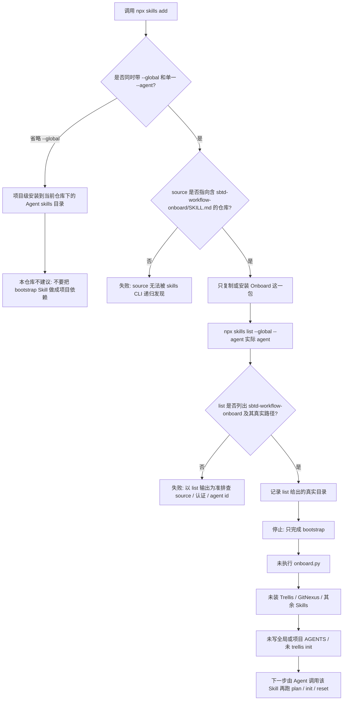

# npx skills 全局安装 Onboard Skill

本图只覆盖官方 `skills` CLI 的 bootstrap。它**不会**执行 `scripts/onboard.py`，也不会安装 Trellis、GitNexus、其余 bundled / external Skills、写入 AGENTS 或初始化项目。

推荐命令：

```bash
npx --yes skills@latest add \
  KunoLu/640-skills@sbtd-workflow-onboard \
  --global \
  --agent <唯一 Agent id> \
  --yes \
  --copy
```

本仓库文档示例常用 `--agent codex`。固定版本时把 Git tag 放在仓库 shorthand 与 `@skill` 之间，例如 `KunoLu/640-skills#v1.0.0@sbtd-workflow-onboard`。私有仓库用本机已认证的 `git+ssh://` source。

实际安装路径**不能预先写死**。本仓库 README 把 `$HOME/.agents/skills/sbtd-workflow-onboard` 标为示例，并要求用 `npx skills list --global --agent <id>` 与 Skill 检测结果确认。Onboard 之后解析全局 Skills 根的顺序见下表。



## 路径如何确认

| 步骤 | 做什么 | 不要假设 |
|---|---|---|
| 安装前 | 指定 `--global` 和**一个** `--agent` | 不要省略 `--global`；不要一次当作「装到所有 Agent」 |
| 安装后 | 跑 `npx skills list --global --agent <id>` | 不要把任何家目录路径当成必然落点 |
| 之后跑 Onboard | 读 `plan --json` 的 `globalSkillsDir` 与 `globalSkillsDirSource` | 不要把 bootstrap 目录直接当成全部 Skills 的安装根 |

Onboard 自己解析全局 Skills 根的顺序（与 `npx skills add` 落点是两件事）：

1. `--global-skills-dir`
2. `$AGENT_SKILLS_DIR`
3. 已安装 `sbtd-workflow-onboard` 的受信父目录：`~/.agents/skills`、`~/.agent/skills`、`~/.codex/skills`、`~/.claude/skills`、`~/.pi/agent/skills`、`$CODEX_HOME/skills`
4. 平台默认：`$CODEX_HOME/skills`，否则 `~/.codex/skills`

本仓库维护者 `sync` / `同步` 写到 `/Users/lusonglin/.agent/skills/`。那是另一条显式同步路径，不是 `npx skills add` 的结果。
