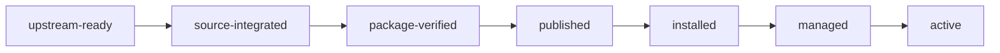

# OMP SBTD 上游同步、发布与用户生效运行手册

## 1. 文档状态与使用范围

| 项目 | 内容 |
|---|---|
| 状态 | 已实现并通过 KPi 本地验证；尚未发布 npm 包 |
| 编写日期 | 2026-07-29 |
| 上游源 | `/Users/lusonglin/github/640-skills/sbtd-workflow-onboard` |
| KPi Kit | `/Users/lusonglin/github/KPi/packages/sbtd-workflow-kit` |
| KPi Plugin | `/Users/lusonglin/github/KPi/plugins/omp-sbtd` |
| 配套 PRD | [OMP SBTD 上游提升与平台适配改造 PRD](../prd/omp-sbtd-upstream-promotion-prd.md) |

本文描述配套 PRD 完成后，维护者如何把 `640-skills/sbtd-workflow-onboard` 的已提交更新同步到 KPi、嵌入 `plugins/omp-sbtd`、发布 npm 包并让用户环境最终生效。

> 重要：只通过 `sync-upstream --plan` 和匹配的 `--apply <plan-digest>` 提升上游。Plan 必须使用 canonical local repository 中的已提交完整 SHA；Apply 会重新计算输入、分阶段验证，并在替换失败时回滚已替换的目标。不得手工复制 vendor、lock 或 `plugins/omp-sbtd/kit` 来模拟成功。

---

## 2. “落地”包含五个独立状态

| 状态 | 定义 | 不代表什么 |
|---|---|---|
| `upstream-ready` | `640-skills` 修改已提交为完整 SHA，源工作树 clean | 不代表 KPi 已更新 |
| `source-integrated` | KPi vendor、lock、generated 和 Plugin kit 指向同一 SHA | 不代表 npm 已发布 |
| `published` | 新 Plugin version 已发布到目标 npm dist-tag | 不代表用户已升级 |
| `installed` | 用户 OMP 已安装新 Plugin version | 不代表 Managed AGENTS 已更新 |
| `active` | 新 Plugin、最新 Managed AGENTS 和新 Session 全部生效 | 最终完成状态 |

必须分别报告，不得把前一个状态提升为后一个状态。



---

## 3. 当前能力与上游提升能力

### 3.1 当前已存在

| 能力/命令 | 当前状态 |
|---|---|
| `pnpm --filter @kunolu/sbtd-workflow-kit generate` | 已存在 |
| `pnpm --filter @kunolu/sbtd-workflow-kit check-generated` | 已存在 |
| Kit test/typecheck/lint | 已存在 |
| `pnpm --filter @kunolu/omp-sbtd test/typecheck/lint/build/smoke` | 已存在 |
| Plugin build 内 `embed-kit.mjs` | 已存在 |
| npm publish helper `docs/deploy/publish-omp-sbtd.sh` | 已存在 |
| `omp plugin install @kunolu/omp-sbtd@<version>` | Plugin README 已记录 |
| `/sbtd doctor`、`/sbtd onboard plan/init`、`/sbtd on` | 当前 Plugin 运行时路径 |

### 3.2 已实现的上游提升能力

| 能力/命令 | 当前状态 |
|---|---|
| `sync-upstream --plan` | 已实现；零写入并输出 machine-readable candidate 与 plan digest |
| `sync-upstream --apply <plan-digest>` | 已实现；重算输入、要求匹配 digest，并执行 staged validation |
| committed tracked export | 已实现；只读取 canonical local repository 的显式 committed full SHA |
| mapping schema v2 的 include/omit/replace-with-overlay | 已实现；未知或未映射 section fail closed |
| promotion file/section diff report | 已实现；Plan JSON 输出 revision、mapping/overlay digest、expected generated digest 与 changed paths |
| vendor + lock + Plugin kit promotion/recovery | 已实现；顺序替换、阶段验证、失败回滚已替换目标；不承诺跨进程崩溃恢复或单一原子文件系统操作 |

---

## 4. 角色与职责

| 角色 | 职责 |
|---|---|
| 上游维护者 | 完成并提交 `640-skills` 修改，提供完整 SHA |
| KPi Kit 维护者 | Plan、mapping/overlay 审核、Apply、generate 和 conformance |
| KPi Plugin 维护者 | runtime contract 对齐、测试、build、smoke、pack |
| 发布者 | 版本提升、tarball 验收、npm publish、dist-tag 验证 |
| 用户/环境维护者 | Plugin upgrade、Onboard Apply、新 Session 验证 |

同一人可以承担多个角色，但每个阶段证据和状态必须独立。

---

## 5. 开始前检查

### 5.1 工具

- Git；
- Node.js 与 KPi `package.json` 要求兼容；
- pnpm 使用 KPi 声明版本；
- Python 3，满足 bundled Onboard 的兼容范围；
- OMP host 与 Plugin peer dependency 兼容；
- 只有发布阶段才需要 npm 发布权限。

### 5.2 仓库

```text
/Users/lusonglin/github/640-skills
/Users/lusonglin/github/KPi
```

要求：

- 两个路径均为预期仓库；
- 上游修改已提交；
- KPi 中不存在未知的冲突修改；
- KPi 实现工作遵守 KPi `.trellis/workflow.md` 和当前 task artifacts；
- 不把 secret、真实账号、PII 或生产数据写入命令、日志、报告或文档。

### 5.3 需要记录的变量

```bash
SOURCE_ROOT=/Users/lusonglin/github/640-skills
KPI_ROOT=/Users/lusonglin/github/KPi
SOURCE_REVISION=<640_SKILLS_FULL_40_CHAR_SHA>
PLUGIN_VERSION=<NEW_UNPUBLISHED_VERSION>
DIST_TAG=<next_or_approved_stable_tag>
```

`SOURCE_REVISION` 不能使用 branch name、short SHA、dirty tree digest 或“当前工作树”描述。

---

## 6. 完整运行流程

### Stage 0：准备并固定上游 commit

#### 操作

1. 在 `640-skills` 完成 `sbtd-workflow-onboard` 修改和仓库要求的验证；
2. 评估并按仓库规则更新 README、README.html、版本化 automation prompt 和 CHANGELOG；
3. 提交准备进入 KPi 的全部 tracked source；
4. 记录完整 SHA；
5. 确认工作树 clean。

可用于核验事实的 Git 命令：

```bash
git -C "$SOURCE_ROOT" rev-parse HEAD
git -C "$SOURCE_ROOT" status --porcelain
```

验收：

```text
rev-parse HEAD == SOURCE_REVISION
status --porcelain == empty
```

#### 失败处理

| 条件 | 结果 |
|---|---|
| SHA 不是 40 位 | blocked |
| HEAD 与指定 SHA 不同 | blocked |
| working tree dirty | blocked |
| 修改未提交但希望正式同步 | blocked；先提交，不允许复制工作树绕过 |

---

### Stage 1：运行 Upstream Plan

> 本阶段命令在配套 PRD 实现后才存在。

#### 操作

```bash
cd "$KPI_ROOT"

pnpm --filter @kunolu/sbtd-workflow-kit sync-upstream -- \
  --source-root "$SOURCE_ROOT" \
  --revision "$SOURCE_REVISION" \
  --plan
```

Plan 必须完成：

1. source root 和 revision 校验；
2. clean source 校验；
3. tracked export；
4. candidate source digest；
5. vendor file diff；
6. section diff；
7. mapping/overlay 预检；
8. candidate generation；
9. manifest/license 预检；
10. 输出 `planDigest`。

#### 记录

```text
sourceRevision
previousRevision
sourceTreeSha256
file changes
section changes
unmapped/omitted/replaced sections
candidate generatedSha256
planDigest
status
```

#### 验收

- Plan 对 KPi 零写入；
- 相同输入重复 Plan 得到相同 digest；
- status 是 `ready` 或 `noop` 才可进入后续阶段；
- `mapping-required` 必须先处理 Stage 2；
- `blocked` 不得进入 Apply。

---

### Stage 2：处理 section mapping 和 OMP overlay

#### 触发条件

Plan 报告以下任一变化：

- 新 section；
- section 删除或重命名；
- mixed Codex/OMP 内容；
- 原 owner 不再正确；
- overlay 内容不再匹配 source semantics。

当前已知必须关注的上游 section：

```text
AGENTS.global.md
  > 工具可用性判断
  > Trellis 调度边界

AGENTS.project.md
  > Trellis 调度层
```

#### 决策表

| 内容类型 | action |
|---|---|
| 完全平台无关 | `include` |
| OMP 可直接使用 | `include` 到 `global` / `project-omp` |
| 完全 Codex-only | `omit` 并记录 reason |
| 同时含平台无关和 Codex/OMP 细节 | `replace-with-overlay`，输出审查后的 OMP 文本 |
| 不能确定语义 | blocked，回到设计确认 |

#### OMP Trellis 适配最低要求

必须保留：

- 项目 `.trellis/config.yaml`、`.trellis/workflow.md`、task artifacts 决定有效 workflow；
- OMP 使用 `task` worker 和生成的 Trellis agent；
- OMP 不读取、写入或推断 `codex.dispatch_mode`；
- Codex Inline fallback 不适用于 OMP；
- Channel 是独立的持久协作 runtime；
- Channel runtime 需要明确请求或 preflight 后确认；
- 同一职责只有一个执行者。

不得留下可执行的 Codex 指令：

- 在 OMP 中配置 `dispatch_mode=auto|inline`；
- 在 OMP 中调用 Codex role subagent；
- 把 Codex invalid config fallback 当成 OMP 行为。

#### 处理后动作

修改 KPi mapping/overlay 后重新运行 Stage 1 Plan。旧 plan digest 已失效，禁止继续 Apply。

---

### Stage 3：应用 Upstream Plan

> 本阶段命令在配套 PRD 实现后才存在。

#### 操作

```bash
pnpm --filter @kunolu/sbtd-workflow-kit sync-upstream -- \
  --source-root "$SOURCE_ROOT" \
  --revision "$SOURCE_REVISION" \
  --apply <PLAN_DIGEST>
```

Apply 必须重新校验：

- source revision；
- source clean state；
- tracked export digest；
- mapping digest；
- overlay digests；
- plan digest；
- candidate generation 和 license material。

#### 成功写入

```text
packages/sbtd-workflow-kit/vendor/sbtd-workflow-kit-upstream/**
packages/sbtd-workflow-kit/upstream.lock.json
```

#### 验收

```text
upstream.lock.resolvedRevision == SOURCE_REVISION
upstream.lock.sourceTreeSha256 == candidate source digest
vendor tree digest == upstream.lock.sourceTreeSha256
Apply report == applied 或 noop
```

#### 失败处理

- 任何输入变化：`PLAN_DIGEST_MISMATCH`，重新 Plan；
- 已替换目标后的阶段失败：按完成的替换顺序回滚 vendor、lock、Kit 生成输出与 Plugin `kit/`；恢复不完整时保留 backup path。
- 不得继续 generation、build 或 publish。

---

### Stage 4：生成并验证 Kit

#### 操作

```bash
pnpm --filter @kunolu/sbtd-workflow-kit generate
pnpm --filter @kunolu/sbtd-workflow-kit check-generated
pnpm --filter @kunolu/sbtd-workflow-kit test
pnpm --filter @kunolu/sbtd-workflow-kit typecheck
pnpm --filter @kunolu/sbtd-workflow-kit lint
```

#### 审核生成物

```text
packages/sbtd-workflow-kit/generated/AGENTS.global.md
packages/sbtd-workflow-kit/generated/AGENTS.project-root.md
packages/sbtd-workflow-kit/generated/AGENTS.project-omp.md
packages/sbtd-workflow-kit/generated/catalog.json
packages/sbtd-workflow-kit/generated/manifest.json
packages/sbtd-workflow-kit/generated/sync-report.json
packages/sbtd-workflow-kit/generated/onboard/**
packages/sbtd-workflow-kit/generated/third-party/**
```

#### 必须证明

```text
manifest.resolvedRevision == SOURCE_REVISION
manifest.sourceTreeSha256 == upstream.lock.sourceTreeSha256
manifest.generatedSha256 可由 assets + overlays 重算
manifest.targets 与三个 AGENTS assets 一致
manifest.profileCatalogSha256 与 catalog.json 一致
sync-report.unmapped == []
```

#### 内容审核

1. `AGENTS.global.md` 没有会触发 Codex dispatch 的 OMP 指令；
2. `AGENTS.project-root.md` 只包含共享项目事实；
3. `AGENTS.project-omp.md` 保留 `@../AGENTS.md` 并只增加 OMP adapter；
4. OMP worker、主会话和 Channel worker 不会双重执行同一职责；
5. bundled Onboard/Skills 路径完整；
6. license 和 NOTICE 与新 source revision 对齐。

---

### Stage 5：判断 Plugin runtime 是否需要修改

不能因为 Kit generation 成功就默认 Plugin runtime 契约兼容。

#### 变更分类

| 上游变化 | 处理 |
|---|---|
| 只改说明文字/reference，接口不变 | 通常只需 generated/embed 验证 |
| `onboard.py plan --json` 字段或状态改变 | 修改 `src/onboard/python-bridge.ts` schema/tests |
| `onboard.py` 新增 Agent platform 参数 | bridge 显式传 OMP platform，并更新 schema/tests |
| Skill 新增/删除/改名/required 改变 | 更新 capability/environment observation |
| Workflow route/Book Gate 改变 | 更新 workflow/gates/rules/state 和 tests |
| Trellis OMP worker/Channel 语义改变 | 更新 classification、runtime gate、BDD |
| Managed AGENTS target/profile 改变 | 更新 Onboard plan/apply/doctor contracts |
| license/external assets 改变 | 更新 embed、NOTICE、SBOM 和 pack tests |

#### Python bridge 不变量

当前 bridge 必须继续：

```text
运行 onboard.py plan --json
使用 scratch AGENTS/Skills 目标
--skip-project-agents
--skip-trellis-init
--skip-trellis-bootstrap
不运行 Python Apply
```

真正的 OMP Managed AGENTS Apply 仍由 TypeScript Onboard service 管理。

---

### Stage 6：构建并嵌入 Plugin Kit

#### 操作

```bash
pnpm --filter @kunolu/omp-sbtd test
pnpm --filter @kunolu/omp-sbtd typecheck
pnpm --filter @kunolu/omp-sbtd lint
pnpm --filter @kunolu/omp-sbtd build
```

当前 `build` 会执行：

```text
Kit check-generated
  -> scripts/embed-kit.mjs
  -> TypeScript compile
  -> SBOM generation
```

`embed-kit.mjs` 会删除现有 `plugins/omp-sbtd/kit`，从 exported generated Manifest 所在目录重新复制并校验。因此：

- 不手工复制 generated 到 Plugin；
- 不手改 `plugins/omp-sbtd/kit`；
- 不从 vendor 或 Kit source 直接构建 Plugin runtime。

#### 一致性检查

```bash
diff -qr \
  packages/sbtd-workflow-kit/generated \
  plugins/omp-sbtd/kit
```

验收：无输出，exit code 0。

#### Smoke

```bash
pnpm --filter @kunolu/omp-sbtd smoke
```

至少覆盖：

- extension 加载；
- `/sbtd help/status/doctor`；
- `preflight-only`；
- Onboard Plan/确认/取消/Apply；
- reload/re-observation；
- `active`；
- workflow classification；
- tool gate；
- session stop delivery gate；
- OMP worker 与 Channel 单执行者规则。

---

### Stage 7：运行 KPi 全仓验证

#### 操作

```bash
pnpm lint
pnpm typecheck
pnpm test
pnpm build
```

如果 KPi Trellis task 规定了更具体命令，以 task artifacts 和 `.trellis/workflow.md` 为准。

#### 通过条件

- focused Kit/Plugin checks 全绿；
- 全仓 validation 全绿；
- 没有被 fail-fast 跳过的测试；
- required report 已实际生成并有本轮证据；
- Book Gate 达到允许发布的状态；
- 不存在未解释的 generated drift 或 runtime contract residual。

---

### Stage 8：提升 Plugin 版本并打包

#### 版本

修改：

```text
plugins/omp-sbtd/package.json
```

使用新、未发布过的版本：

```text
0.1.0-rc.N -> 0.1.0-rc.N+1
```

或按已确认的 semver 发布策略提升。不得复用已发布 npm version。

#### Pack

```bash
pnpm --filter @kunolu/omp-sbtd pack \
  --pack-destination <ABSOLUTE_RELEASE_DIRECTORY>
```

#### tarball 必含

```text
package/dist/extension.js
package/kit/manifest.json
package/kit/onboard/runtime/scripts/onboard.py
package/LICENSE
package/THIRD_PARTY_NOTICES.md
package/SBOM.spdx.json
```

#### tarball 证据

记录：

```text
Plugin version
SOURCE_REVISION
kit generatedSha256
tarball SHA-256
tarball file list
peer dependency
build/test/smoke result
```

---

### Stage 9：隔离 OMP acceptance

在不污染真实用户配置的隔离环境验证：

1. 隔离 project root；
2. 隔离 OMP agent/config directory；
3. 加载刚打包的 Plugin；
4. 使用可验证的 OMP host 版本；
5. contract-backed smoke 与 authenticated real-host acceptance 分开报告。

状态链必须实际观察：

```text
plugin loaded
  -> preflight-only
  -> /sbtd onboard plan
  -> user-confirmed apply
  -> reload
  -> managed
  -> /sbtd on
  -> active
```

不得因为 mock-backed/contract-backed smoke 通过就声称 authenticated real-host 已通过。

---

### Stage 10：发布 npm

#### 发布前检查

- Plugin version 未发布；
- tarball 是 Stage 8 验收的同一文件；
- tarball digest 未变化；
- npm 权限和目标 dist-tag 已确认；
- 没有 secret 出现在参数、日志或 tarball；
- release readiness 已通过。

#### 当前发布 helper

```bash
docs/deploy/publish-omp-sbtd.sh \
  /absolute/path/kunolu-omp-sbtd-<PLUGIN_VERSION>.tgz \
  --tag <DIST_TAG>
```

RC 默认使用已批准的 prerelease tag；稳定发布使用明确批准的 stable tag。helper 只发布已经构建的 tarball，不负责 build、test 或 version bump。

#### 发布后验证

- npm registry 可查询到 `<PLUGIN_VERSION>`；
- dist-tag 指向预期版本；
- registry tarball digest 与本地 tarball 一致；
- package metadata 和 peer dependency 正确；
- 此时状态只能报告 `published`，不能报告用户 `installed` 或 `active`。

---

### Stage 11：用户升级 Plugin

推荐固定版本以保证可复现：

```bash
omp plugin install @kunolu/omp-sbtd@<PLUGIN_VERSION>
```

若当前 OMP CLI 对已安装 Plugin 要求显式 upgrade 或 force，以当前 `omp plugin --help` 的实际接口为准；不要假设安装命令会静默覆盖。

升级后：

```bash
omp plugin list
omp plugin doctor
```

然后开启新的 OMP Session。

验收：

```text
loaded Plugin version == PLUGIN_VERSION
embedded manifest.resolvedRevision == SOURCE_REVISION
```

此时状态是 `installed`，Managed AGENTS 仍可能是旧 revision。

---

### Stage 12：更新 Managed AGENTS

在新 OMP Session 中：

```text
/sbtd doctor
/sbtd onboard plan
```

Plan 应展示：

```text
sourceId=sbtd-workflow-kit-upstream
kitRevision=SOURCE_REVISION
当前 Managed Block 状态
目标 global/project-root/project-omp paths
plan digest / provenance inventory
```

用户确认后：

```text
/sbtd onboard init
```

要求：

- Apply 有确认门；
- 备份/journal 记录完整；
- 一个项目失败不回滚另一个已成功项目；
- 失败项目报告 `failed` / `blocked` / `needs-user` / `bootstrap-required`；
- 重复相同 Apply 幂等；
- Python Onboard 未 Apply AGENTS。

Apply 成功后再次开启新 Session。

---

### Stage 13：最终 Active 验收

在第二个新 Session 中运行：

```text
/sbtd doctor
/sbtd status
/sbtd on
```

最终通过条件：

```text
Plugin version == PLUGIN_VERSION
Kit revision == SOURCE_REVISION
global AGENTS == exact
project-root AGENTS == exact
project-omp AGENTS == exact
required Skills/capabilities == available
runtime classification == current
/sbtd on -> active
```

再执行一个代表性任务，验证：

- 自动 workflow classification；
- OMP `task` worker 路径；
- 不读取或推断 `codex.dispatch_mode`；
- 单个 role worker 不启动 Channel；
- Channel 仍需明确用户请求或确认；
- tool/delivery gate 与最新 AGENTS/Skills 一致。

到此才可报告“最终同步并落地”。

---

### Stage 14：条件性 Trellis 项目刷新

如果此次上游变化依赖新的 Trellis CLI 模板、生成 agent、filesystem-safety guard 或 Channel runtime asset，则在目标项目中另外执行：

```bash
trellis update
```

然后审核 `.trellis/` 生成差异。

该操作与 Plugin/Managed AGENTS 更新不同：

- Plugin update 不自动更新 `.trellis/`；
- `trellis update` 不替代 Plugin upgrade；
- `trellis update` 不替代 `/sbtd onboard init`；
- 三者均需要各自证据。

---

## 7. 变更类型到最短路径

| 上游变化 | 仍必须经过的阶段 | 可能无需修改的代码 |
|---|---|---|
| 纯 Skill reference 文案 | 0,1,3,4,6-13 | Plugin runtime source 可能不改 |
| AGENTS 平台无关规则 | 0-13 | Python bridge 可能不改 |
| AGENTS 混合 Codex/OMP 调度内容 | 0-13，Stage 2 必做 | 不一定修改上游 source |
| `onboard.py` 内部实现但 JSON contract 不变 | 0-13 | bridge 可能只需回归测试 |
| `onboard.py` JSON/参数变化 | 0-13，Stage 5 必改 | 无 |
| Skill 名称/required status 变化 | 0-13，Stage 5 必查 registry | 无 |
| Workflow/Book Gate/runtime rule 变化 | 0-13，Stage 5 必改 | 无 |
| license/external asset 变化 | 0-13，Stage 4/6/8 重点验证 | workflow 可能不改 |

即使代码不改，promotion、generation、embed、pack、publish 和用户生效状态仍必须完整验证。

---

## 8. 失败分支

| 阶段 | 信号 | 处理 | 禁止 |
|---|---|---|---|
| 0 | source dirty | 提交或清理后重试 | 复制 dirty tree |
| 1 | source root/revision 不匹配 | 修正输入 | 改 lock 欺骗校验 |
| 1/2 | `SECTION_UNMAPPED` | mapping/overlay 审核 | 把全部 section 默认 include |
| 2 | overlay 缺失/路径逃逸 | 修复受控路径 | 绝对路径或 `..` |
| 3 | plan digest mismatch | 重新 Plan | 强制 Apply 旧 Plan |
| 3 | recovery incomplete | 保留 backup 并人工处理 | finally 删除 backup |
| 4 | source digest mismatch | 回到 promotion | 手改 digest |
| 4 | generated drift | 受控 regenerate、审核 diff | 直接接受旧 generated |
| 5 | Python/runtime contract mismatch | 修改 Plugin 和 tests | 只更新文档 |
| 6 | embed digest mismatch | 停止 build | 手改 Plugin kit |
| 7 | tests/validation failed | 修复、定点重跑、全量重跑 | 跳过后发布 |
| 8 | tarball 缺文件 | 重建新 tarball | 手工补 tarball 内容 |
| 9 | real-host acceptance blocked | 记录 blocked，解决环境 | 报告为 passed |
| 10 | npm publish failed | 修复认证/version/tag | 报告 published |
| 11 | 用户仍加载旧版本 | 按当前 CLI 升级并重开 Session | 只看 npm registry |
| 12 | Managed AGENTS drifted | Plan/确认/Apply | 直接覆盖用户文件 |
| 13 | `/sbtd on` 仍 preflight-only | `/sbtd doctor` 定位缺口 | 报告 active |

---

## 9. 回滚手册

### 9.1 npm 发布前

- 停止流程；
- 恢复 KPi 任务范围内的 vendor/lock/mapping/generated/Plugin 修改；
- 不触碰已安装用户 Plugin；
- 保留失败报告和需要的 recovery backup；
- 修复后从 Stage 1 重新开始。

### 9.2 npm 已发布但 dist-tag 未切换

- 不覆盖或重发同一 version；
- 修复后发布新 patch/RC；
- 保持旧 dist-tag，直到新版本验收通过。

### 9.3 dist-tag 已指向有缺陷版本

- 将 dist-tag 恢复到前一已验证版本；
- 发布修复版本；
- 记录受影响版本、时间和用户恢复步骤；
- 不依赖 npm unpublish 作为常规回滚。

### 9.4 用户已升级

1. 安装前一已验证的明确 Plugin version；
2. 开启新 Session；
3. 运行 `/sbtd onboard plan`；
4. 用户确认后 Apply 前一 Kit 的 Managed AGENTS；
5. 再开启新 Session；
6. `/sbtd doctor` 和 `/sbtd on` 验证恢复。

必须保留 Onboard journal/backup；不得手工删改 Managed Block 来伪造恢复。

---

## 10. 证据清单

每次正式 promotion/release 至少保存或在 release summary 中记录：

| 证据 | 必填内容 |
|---|---|
| Upstream identity | canonical URI、full SHA、clean state |
| Promotion Plan | plan digest、file/section changes、status |
| Apply result | applied/noop、new lock、backup/recovery status |
| Kit manifest | source digest、generated digest、target/assets digest |
| Mapping review | include/omit/replace decisions 及 reason |
| Kit validation | generate/check/test/typecheck/lint |
| Plugin alignment | bridge/workflow/gates/rules impact decision |
| Plugin validation | test/typecheck/lint/build/smoke |
| Package | Plugin version、tarball path、tarball SHA-256、file list |
| Host acceptance | contract-backed 与 authenticated real-host 分开 |
| npm release | version、dist-tag、registry digest |
| User install | installed Plugin version、new Session |
| Managed AGENTS | Onboard Plan/Apply、target states、journal |
| Final state | `/sbtd doctor`、`/sbtd status`、`/sbtd on -> active` |
| Trellis | 是否需要并完成 `trellis update` |

---

## 11. 最终报告模板

```markdown
## OMP SBTD Upstream Promotion Result

- Upstream source: https://github.com/KunoLu/640-skills
- Upstream revision: <full-sha>
- Source tree digest: <sha256>
- Promotion status: applied | noop | blocked
- Mapping: <included/omitted/replaced/unmapped counts>
- Generated digest: <sha256>
- Plugin version: <version>
- Package validation: passed | failed | blocked
- Real-host acceptance: passed | blocked | not-run
- npm publication: published | not-published | failed
- npm dist-tag: <tag-or-not-applicable>
- User installation: installed | not-installed | blocked
- Managed AGENTS: exact | drifted | blocked | not-applied
- Trellis update: run | not-needed | blocked
- Final SBTD state: active | preflight-only | disabled | blocked
- Residual risks: <none-or-list>
```

只有最后一项为 `active`，且前置必需状态均有证据时，结论才可写“最终同步并落地完成”。

---

## 12. 一行版 SOP

```text
提交 640-skills 并固定 full SHA
-> sync-upstream Plan
-> 审核/修复 mapping 与 OMP overlay
-> sync-upstream Apply
-> Kit generate/check/test
-> 对齐 Plugin runtime contract
-> Plugin test/build/embed/smoke
-> KPi 全仓验证
-> version bump + pack + isolated OMP acceptance
-> 人工 npm publish
-> 用户安装/升级明确 Plugin version
-> 新 Session /sbtd onboard plan + init
-> 再开新 Session /sbtd doctor + /sbtd on
-> active
```

三个永久禁止项：

1. 不同步 dirty `640-skills` 工作树；
2. 不直接修改 `plugins/omp-sbtd/kit`；
3. 不把 source-integrated 或 published 误报为用户 active。
