# --init-projects 只初始化项目

project-only 模式。与普通 `--projects-root` + `--action init|reset` 互斥。不检测、不安装、不更新、不配置任何全局 Agent CLI、runtime、Tools、Skills、全局 AGENTS 或 MCP。

`python scripts/onboard.py init-projects` 接受可选 `--platform`。project-only 不跑 Agent CLI gate，但 `--platform codex|claude|kimi` 在未给 `--trellis-platform` 时作为 Trellis 默认 flag；显式 `--trellis-platform` 覆盖该默认。`oh-my-pi` 必须显式 `omp` 和/或 `pi`。空 flag 不会交给 `trellis init --yes`。

`install.sh --platform ... --init-projects` 仍跳过 Agent CLI gate，但会把 `--platform` 传给 `onboard.py`。

`onboard.py` 的 `check-projects` 出现在写入和 Trellis setup **之后**，是收尾汇报，不是写入前门。`install.sh` 可在写入前另跑一次项目检查，只为询问 Playwright / React Bits。

```mermaid
flowchart TD
  start[调用 init-projects] --> entry{入口?}
  entry -->|onboard.py 子命令| pyStart[可解析 --platform 作为 Trellis 默认]
  entry -->|install.sh 包装器| shStart[跳过 Agent CLI gate, 仍转发 --platform]
  shStart --> shSkip[跳过 Agent CLI / npm / Skills / 全局 AGENTS / MCP]
  shSkip --> shOpt[可选: 写入前 check-projects 仅用于询问 Playwright / React Bits]
  shOpt --> common
  pyStart --> common[解析 --projects-root]
  common --> mode{是否同时给了 --action?}
  mode -->|是| reject[拒绝: init-projects 与 action 互斥]
  mode -->|否| roots{每个路径都是已存在的绝对目录?}
  roots -->|否| badPath[拒绝相对路径 / 空路径 / 不存在目录]
  roots -->|是| q4{用户是否明确同意安装项目 AGENTS.md?}
  q4 -->|未表态| askAgents[停下来问 Q4]
  q4 -->|明确跳过| skipAgents[带 --skip-project-agents]
  q4 -->|明确安装| planAgents[计划写入项目 AGENTS.md]
  askAgents --> stopAsk[等待用户]
  skipAgents --> plan
  planAgents --> plan[输出 plan: 仅项目 AGENTS 与 gitignore]
  plan --> confirm{确认 --yes?}
  confirm -->|否| abort[不写文件]
  confirm -->|是| writes[先写入项目文件]

  writes --> gi{项目 gitignore 已含模板全部非空行?}
  gi -->|从未安装或有缺行| appendGi[只追加缺行]
  gi -->|已安装且行齐全| skipGi[skipped-already-present]
  appendGi --> pAgents
  skipGi --> pAgents{本轮是否写项目 AGENTS.md?}
  pAgents -->|否| trellis[然后 Trellis setup]
  pAgents -->|是且文件不存在| copyProj[复制项目模板]
  pAgents -->|是且文件已存在| bakProj[备份后覆盖]
  copyProj --> trellis
  bakProj --> trellis
  trellis --> tExist{项目已有 .trellis/?}
  tExist -->|是| tSkip[skipped-existing]
  tExist -->|否| tCli{本机已有可用的全局 trellis CLI?}
  tCli -->|否| tBlock[blocked-missing-cli: 本模式不安装 Trellis]
  tCli -->|是且有 username 和已解析平台 flag| tInit[trellis init 带至少一个平台 flag --yes --skip-existing]
  tCli -->|是但无 username 或无平台 flag| tNeed[needs-user]
  tSkip --> post
  tInit --> post
  tBlock --> post
  tNeed --> post
  post[写入后再跑 check-projects 做收尾汇报]
  post --> pw{项目已有 Playwright 适用标记?}
  pw -->|否| skipPw[Playwright: not-needed]
  pw -->|是且未装| notePw[仅汇报; 安装要另走 install-playwright-cli]
  pw -->|是且已装| keepPw[already-installed]
  skipPw --> rb
  notePw --> rb
  keepPw --> rb[React Bits 判定]
  rb --> rbApp{React 项目且存在 components.json?}
  rbApp -->|否| skipRb[React Bits: 不问]
  rbApp -->|是| noteRb[仅汇报适用性; 不在 onboard.py 里改 tier]
  skipRb --> boot
  noteRb --> boot[检查 bootstrap task]
  boot --> bootTask{存在 00-bootstrap-guidelines?}
  bootTask -->|是| bootReq[bootstrap-required]
  bootTask -->|否| done[只汇总项目 AGENTS / gitignore / Trellis]
```



## 从未初始化 vs 项目已有配置后再跑

| 对象 | 项目从未初始化 | 项目已有文件后再跑 |
|---|---|---|
| 全局任何东西 | 不检查、不安装 | 仍然不碰 |
| Agent `--platform` | 无 `.trellis/` 时 `codex|claude|kimi` 作默认 Trellis flag；`oh-my-pi` 须显式 omp/pi | `.trellis/` 已存在则 skipped-existing，不要求 flag |
| 项目 `AGENTS.md` | Q4 同意才复制 | Q4 同意则备份后覆盖 |
| `.gitignore` | 追加缺行 | 行齐全则 skip |
| `.trellis/` | 有全局 Trellis CLI 才 init | `skipped-existing` |
| Trellis CLI 缺失 | `blocked`，不安装 CLI | 同样不安装 |
| Playwright / React Bits | `onboard.py` 只在写入后汇报 | `install.sh` 才可能在写入前询问并另装 |

入口示例：

```bash
# 直接子命令: --platform 作为 Trellis 默认
python scripts/onboard.py init-projects \
  --platform codex \
  --projects-root /abs/project-one \
  --trellis-user your-name \
  --yes

# 根安装器包装: 跳过 Agent CLI gate, 仍转发 --platform
bash install.sh --platform codex --init-projects /abs/project-one --yes
```
