# Onboard Skill 执行 init

普通 `init`，不是 `--init-projects`。目标 Agent 平台在 Skill 里是**单数**：只选 `codex` / `claude` / `kimi` / `oh-my-pi|omp` 之一。平台只决定 CLI 与 MCP adapter，不决定全局 AGENTS 落点。

`plan --json` 含 `mode`、OS、`skillDir`、`globalSkillsDir`、`globalSkillsDirSource`、`operations[]`、migration 和 `trellisInit`（含 `trellisInit.command`）。它**不含** CLI 检查或 Required Questions。

Required Question 4「要不要安装项目 `AGENTS.md`」必须单独确认。「逐项目汇总 AGENTS」只是汇报，不是同意写入。

```mermaid
flowchart TD
  start[Agent 调用 sbtd-workflow-onboard 执行 init] --> q[解析 Required Questions]
  q --> plat{目标 Agent 平台是否已给出且为单数?}
  plat -->|否或给了多个| askPlat[停下来问唯一平台]
  plat -->|是| q4{用户是否明确同意安装项目 AGENTS.md?}
  q4 -->|未表态| askAgents[停下来问 Q4]
  q4 -->|明确跳过| skipProjAgents[带 --skip-project-agents]
  q4 -->|明确安装| wantProjAgents[计划写入项目 AGENTS.md]
  askPlat --> stopAsk[等待用户]
  askAgents --> stopAsk
  skipProjAgents --> cliGate
  wantProjAgents --> cliGate
  cliGate["check-agent-cli --platform 唯一平台"] --> cliOk{该平台 version 命令通过?}
  cliOk -->|是| skipCli[already-installed: 不重装]
  cliOk -->|否| npmForCli{npm 可用?}
  npmForCli -->|否| ensureNpm[ensure-npm 后再装 Agent CLI]
  npmForCli -->|是| installCli[按平台安装官方全局包并复验]
  skipCli --> preflight
  ensureNpm --> installCli
  installCli --> preflight[check: npm / node / trellis / gitnexus / Skills]
  preflight --> toolsOk{npm 与 trellis 与 gitnexus version 都通过?}
  toolsOk -->|是| plan
  toolsOk -->|否| npmForTools{npm 可用?}
  npmForTools -->|否| ensureNpmTools[ensure-npm]
  ensureNpmTools --> npmReady{npm 复验通过?}
  npmReady -->|否| blockTools[阻断: 无法安装强制全局 CLI]
  npmReady -->|是| installTools
  npmForTools -->|是| installTools[安装缺失的 trellis / gitnexus 并复验]
  installTools --> toolsRecheck{npm 与 trellis 与 gitnexus 复验都通过?}
  toolsRecheck -->|否| blockTools
  toolsRecheck -->|是| plan[输出 plan --json 后需用户确认]
  plan --> confirm{确认执行 init --yes?}
  confirm -->|否| abort[不写文件]
  confirm -->|是| provider{官方 Ponytail plugin 已启用?}
  provider -->|是| providerBlock["阻断: provider=conflict, 人工禁用或移除 plugin 后重跑"]
  provider -->|否或无法检测| identity{legacy Skill 身份冲突?}
  identity -->|是| failClosed[fail-closed: 不改任何目标]
  identity -->|否| extMiss{缺失的 18 个 required external Skills?}
  extMiss -->|有| installExt[只安装缺失项, 不询问]
  extMiss -->|无| skipExt[已合法: 不重装]
  installExt --> writes[按 operations 写入]
  skipExt --> writes

  writes --> gAgents{全局 AGENTS 目标已存在?}
  gAgents -->|从未安装| copyGlobal[复制到解析后的 Codex 全局 AGENTS 路径]
  gAgents -->|已安装| bakGlobal[先备份再覆盖]
  copyGlobal --> bundled[bundled Skills]
  bakGlobal --> bundled
  bundled --> bExist{bundled Skill 壳合法?}
  bExist -->|缺失或身份无效| copyBundled[复制到本次解析的全局 Skills 根]
  bExist -->|已合法| skipBundled[跳过, 不覆盖]
  copyBundled --> gitignore[项目 gitignore]
  skipBundled --> gitignore

  gitignore --> gi{项目 gitignore 已含模板全部非空行?}
  gi -->|从未安装或有缺行| appendGi[只追加缺行]
  gi -->|已安装且行齐全| skipGi[skipped-already-present]
  appendGi --> pAgents
  skipGi --> pAgents{本轮是否写入项目 AGENTS.md?}
  pAgents -->|否| trellis
  pAgents -->|是且文件不存在| copyProj[复制项目模板]
  pAgents -->|是且文件已存在| bakProj[备份后覆盖]
  copyProj --> trellis[Trellis setup]
  bakProj --> trellis
  trellis --> tExist{项目已有 .trellis/?}
  tExist -->|从未安装| tCli{全局 trellis CLI 可用?}
  tCli -->|否| tBlock[blocked-missing-cli]
  tCli -->|是且有 username 和已解析平台 flag| tInit[trellis init 带 username 和至少一个平台 flag]
  tExist -->|已安装| tSkip[skipped-existing: 不按新平台重跑]
  tInit --> boot[检查 bootstrap task]
  tSkip --> boot
  boot --> bootTask{存在 00-bootstrap-guidelines?}
  bootTask -->|是| bootReq[bootstrap-required: 转 trellis-workflow]
  bootTask -->|否| done[逐项目汇总 AGENTS / gitignore / Trellis]
  tBlock --> done
```

## 从未安装 vs 已安装后再 init

| 对象 | 从未安装 | 已安装后再 init |
|---|---|---|
| 唯一平台 Agent CLI | 校验失败才安装官方全局包 | version 通过则 `already-installed`，不升级 |
| npm / node | 缺 npm 才 `ensure-npm` | 已在 PATH 则跳过 |
| trellis / gitnexus CLI | 强制全局安装 | 已验证则跳过，不升到 `@latest` |
| rtk / caveman / Java / Maestro | 询问后才装 | 已验证则跳过 |
| 18 个 external Skills（含 4 个 Ponytail） | 只装缺失且身份合法的项；官方 Ponytail plugin 启用时先阻断 | 已合法则跳过；不每轮重克隆 |
| 15 个 bundled Skills | 复制到本次解析的全局 Skills 根 | 壳合法（目录 + `SKILL.md` + frontmatter `name`）则跳过；缺失或身份无效才复制 |
| 全局 `AGENTS.md` | 复制到 `$CODEX_HOME/AGENTS.md` 或 `~/.codex/AGENTS.md`；若 `~/.omp` 已存在，另备份后覆盖 `~/.omp/agent/AGENTS.md`（Windows 为 `%USERPROFILE%\.omp\agent\AGENTS.md`） | **备份后覆盖**；`~/.omp` 不存在则跳过且不创建 |
| 项目 `AGENTS.md` | 仅当 Q4 同意时复制 | 同意写入则备份后覆盖 |
| 项目 `.gitignore` | 追加模板缺行 | 行齐全则 skip |
| `.trellis/` | `trellis init` | `skipped-existing` |
| MCP | 交互配置；提示词没提则不要静默写 | 已有配置不自动改 |
| Playwright / React Bits | 仅项目适用时询问 | 仍是条件项，不是全量重装 |

`onboard.py init` 本身不装缺失的 Agent CLI / Trellis / GitNexus；那是 Skill / `install.sh` 的 preflight。按 Skill 执行时必须先做这些检查。<!---->
