# Onboard Skill 执行 reset

`reset` 与 `init` 共用同一套 `onboard.py` 写入管线：`check` → `plan` → 从 stable 强制覆盖全部 required external Skills → 写全局 / 项目模板 → Trellis setup。它**不是**卸载重装，也不是删除全局工具。

相对 `init` 的语义差：

- 用户意图是更新 / 重置已有配置，而不是第一次 bootstrap。
- React Bits：检测到既有 Free / Starter / Pro / Ultimate 时必须保留，不得默认改成免费版。
- 仍遵守 containment、canonical 身份、事务 rollback、legacy migration、Trellis filesystem-safety 和用户确认。

目标 Agent 平台仍是单数。Q4 项目 `AGENTS.md` 仍须单独确认。

```mermaid
flowchart TD
  start[Agent 调用 sbtd-workflow-onboard 执行 reset] --> q[解析 Required Questions]
  q --> plat{目标 Agent 平台是否已给出且为单数?}
  plat -->|否或给了多个| askPlat[停下来问唯一平台]
  plat -->|是| q4{用户是否明确同意重写项目 AGENTS.md?}
  q4 -->|未表态| askAgents[停下来问 Q4]
  q4 -->|明确跳过| skipProjAgents[带 --skip-project-agents]
  q4 -->|明确安装或重置| wantProjAgents[计划备份后覆盖项目 AGENTS.md]
  askPlat --> stopAsk[等待用户]
  askAgents --> stopAsk
  skipProjAgents --> cliGate
  wantProjAgents --> cliGate
  cliGate["check-agent-cli --platform 唯一平台"] --> cliOk{该平台 version 命令通过?}
  cliOk -->|是| skipCli[already-installed: 不重装]
  cliOk -->|否| repairCli[只修复缺失或校验失败的 CLI]
  skipCli --> preflight
  repairCli --> preflight[check 全局 runtime / tools / Skills]
  preflight --> toolsOk{npm 与 trellis 与 gitnexus version 都通过?}
  toolsOk -->|是| preserve
  toolsOk -->|否| npmForTools{npm 可用?}
  npmForTools -->|否| ensureNpmTools[ensure-npm]
  ensureNpmTools --> npmReady{npm 复验通过?}
  npmReady -->|否| blockTools[阻断: 无法安装强制全局 CLI]
  npmReady -->|是| installTools
  npmForTools -->|是| installTools[安装缺失的 trellis / gitnexus 并复验]
  installTools --> toolsRecheck{npm 与 trellis 与 gitnexus 复验都通过?}
  toolsRecheck -->|否| blockTools
  toolsRecheck -->|是| preserve{React Bits 已检测到 tier?}
  preserve -->|是| keepTier[保留已检测 tier 和 registry]
  preserve -->|否或不适用| noRb[不询问也不安装 React Bits]
  keepTier --> plan
  noRb --> plan[输出 plan --json]
  plan --> confirm{确认执行 reset --yes?}
  confirm -->|否| abort[不写文件]
  confirm -->|是| provider{官方 Ponytail plugin 已启用?}
  provider -->|是| providerBlock["阻断: provider=conflict, 人工禁用或移除 plugin 后重跑"]
  provider -->|否或无法检测| identity{legacy Skill 身份冲突?}
  identity -->|是| failClosed[fail-closed: 原目录不动]
  identity -->|否| installExt[从 stable 强制覆盖全部 18 个 required external Skills]
  installExt --> migrate[只迁身份匹配的 legacy 目录]

  migrate --> writes[同一套 operations 回写]
  writes --> gAgents{全局 AGENTS 目标已存在?}
  gAgents -->|从未写过| copyGlobal[复制到解析后的 Codex 全局 AGENTS 路径]
  gAgents -->|已存在| bakGlobal[备份后覆盖当前模板]
  copyGlobal --> bundled[bundled Skills]
  bakGlobal --> bundled
  bundled --> bExist{bundled Skill 目录已存在?}
  bExist -->|从未安装| copyBundled[复制]
  bExist -->|已安装| owBundled[无备份整目录覆盖为当前模板]
  copyBundled --> gitignore[项目 gitignore]
  owBundled --> gitignore
  gitignore --> gi{项目 gitignore 行齐全?}
  gi -->|否| appendGi[只追加缺行]
  gi -->|是| skipGi[skipped-already-present]
  appendGi --> pAgents
  skipGi --> pAgents{本轮是否重写项目 AGENTS.md?}
  pAgents -->|否| trellis[Trellis setup]
  pAgents -->|是且不存在| copyProj[复制模板]
  pAgents -->|是且已存在| bakProj[备份后覆盖]
  copyProj --> trellis
  bakProj --> trellis
  trellis --> tExist{项目已有 .trellis/?}
  tExist -->|否| tInit[与 init 相同: 有 CLI 和 username 才 trellis init]
  tExist -->|是| tSkip[skipped-existing: 不重建 .trellis]
  tInit --> boot[检查 bootstrap task]
  tSkip --> boot
  boot --> bootTask{存在 bootstrap guidelines?}
  bootTask -->|是| bootReq[bootstrap-required]
  bootTask -->|否| done[汇总已覆盖项 / 跳过项 / 备份路径]
```

## 从未安装 vs 已安装后再 reset

| 对象 | 环境从未装过就直接 reset | 已装过再 reset |
|---|---|---|
| 行为本质 | 与 `init` 相同的补齐 + 写入 | 检查后把模板回写到已有目标 |
| Agent CLI / npm / trellis / gitnexus | 缺失才安装 | 已验证则跳过，不强制升级 |
| 18 个 external Skills（含 4 个 Ponytail） | 从 stable 事务安装或覆盖全部 required 项；官方 Ponytail plugin 启用时先阻断 | **强制覆盖** 为当前 stable 快照 |
| bundled Skills | 复制 | **无备份覆盖** 为当前 Onboard 模板 |
| 全局 `AGENTS.md` | 复制 Codex 目标；若 `~/.omp` 已存在则另写 `~/.omp/agent/AGENTS.md` | **备份后覆盖**；不创建缺失的 `~/.omp` |
| 项目 `AGENTS.md` | 仅 Q4 同意时复制 | 同意则备份后覆盖 |
| `.gitignore` | 追加缺行 | 行齐全则 skip |
| `.trellis/` | 缺失才 `trellis init` | **不删不重建** |
| React Bits | 不适用则不问 | **保留已检测 tier** |
| 全局工具卸载 | 不做 | 不做 |

若目标是「只改项目、不动全局」，应改用 `init-projects`，不要用 `reset`。
