# SBTD 支持的工作路径

SBTD 是 SDD + BDD + TDD + DDD 的协作框架，不是单独工具。下图是任务进入后的路径判定；每个节点的前置 Skill / CLI / MCP 见文后表格。缺前置时标记 `blocked` / `skipped` / `not-needed`，不得声称已通过。

```mermaid
flowchart TD
  start[读取 docs/lessons.md 短入口] --> classify{任务类型}

  classify -->|环境未 onboard| onboard[sbtd-workflow-onboard: plan 后 init 或 reset 或 init-projects]
  classify -->|只读 read 且无变更意图| ingest[knowledge-base-integration + gherkin-bdd 只读摄取]
  classify -->|需求 / 领域 / 长期规则| grillPath[需求澄清路径]
  classify -->|根因不清的失败| diagnosePath[排障路径]
  classify -->|已确认的实现或修改| devPath[开发路径]
  classify -->|公开站点搜索可见性| seoPath[seo-geo]
  classify -->|纯文档 / 配置说明 / 无语义 polish| lightPath[最小修改: 不强制 Trellis / BDD / TDD]

  grillPath --> grillWhich{涉及项目文档或领域术语?}
  grillWhich -->|是| grillDocs[完整调用 grill-with-docs]
  grillWhich -->|否| grillMe[grill-me]
  grillDocs --> ddd[强制 book-ddd-distilled-modeling]
  ddd --> dddOk{DDD Boundary Review 是否 confirmed?}
  dddOk -->|否| grillDocs
  dddOk -->|是| sdd[to-spec 写 PRD 后 to-tickets 拆任务]
  grillMe --> sdd
  sdd --> trellisNeed{复杂 / 高风险 / 跨模块?}
  trellisNeed -->|否| devPath
  trellisNeed -->|是且无 .trellis| tellInit[提示用户自行 trellis init 或走 Onboard]
  trellisNeed -->|是且已有 .trellis| trellis[trellis-workflow 按 workflow.md 推进]

  diagnosePath --> diag[diagnosing-bugs]
  diag --> gnBug{GitNexus MCP 且索引有效?}
  gnBug -->|是| gnTrace[GitNexus debugging / impact]
  gnBug -->|否| skipGn[跳过 GitNexus 不阻塞]
  gnTrace --> devPath
  skipGn --> devPath

  trellis --> beforeDev["$trellis-before-dev 前先过 BDD 与 Book Gate"]
  beforeDev --> devPath
  tellInit --> stopInit[不得在普通任务里代跑 trellis init]

  devPath --> bookPlan[输出 Book Gate Plan]
  bookPlan --> dataHit{持久化或跨服务数据变化?}
  dataHit -->|是| ddia[book-ddia-data-design 须 confirmed]
  dataHit -->|否| legacyHit
  ddia --> legacyHit{既有行为 bug 或弱测试高风险?}
  legacyHit -->|是| legacy[book-legacy-change-safety 须 characterized]
  legacyHit -->|否| refHit
  legacy --> seam{是否 seam-required?}
  seam -->|是| seamOnly[book-refactoring-pass safety-seam-only]
  seamOnly --> legacy
  seam -->|否| refHit
  refHit{修改既有生产代码?}
  refHit -->|是| refactor[book-refactoring-pass 须 proceed]
  refHit -->|否| bddHit
  refactor --> bddHit{用户可见行为变化?}
  bddHit -->|是| bdd[gherkin-bdd 先写或更新场景]
  bddHit -->|否| tddHit
  bdd --> tddHit{高风险行为需要测试先行?}
  tddHit -->|是| tdd[tdd + codebase-design]
  tddHit -->|否| ponyImpl
  tdd --> ponyImpl[ponytail: 首次实现编辑前选最小正确实现]
  ponyImpl --> impl[实现: 当前 host 的 Trellis 调度或主会话]

  impl --> uiHit{UI / 组件 / 视觉?}
  uiHit -->|是| ui[ui-ux-pro-max 初稿]
  ui --> shadcnHit{存在 components.json 或要走 shadcn?}
  shadcnHit -->|是| shadcn[shadcn]
  shadcnHit -->|否| targetedSmoke
  shadcn --> rbHit{React + shadcn 且用户要 React Bits?}
  rbHit -->|是| rb[项目级 React Bits: 须确认]
  rbHit -->|否| polish
  rb --> polish[可选 impeccable audit / polish]
  polish --> targetedSmoke
  uiHit -->|否| targetedSmoke[定点 smoke / targeted tests]
  targetedSmoke --> ponyReview{非平凡生产 diff?}
  ponyReview -->|是| prReview[ponytail-review: findings 经 Code Readability 裁决]
  ponyReview -->|否| readability
  prReview --> readability[Code Readability Review: 有修改则重跑受影响验证]
  readability --> implVerify[项目验证]

  implVerify --> webRt{需要真实 Chrome 诊断?}
  webRt -->|是| cdt[Chrome DevTools MCP]
  webRt -->|否| webReg
  cdt --> webReg{需要可重复 Web 回归?}
  webReg -->|是| pw[Playwright CLI]
  webReg -->|否| mobile
  pw --> assets{需要入库 UI 测试资产?}
  assets -->|是| gen[web-ui-autotest-generator]
  assets -->|否| mobile
  gen --> mobile{需要 Mobile 或 Hybrid E2E?}
  mobile -->|是| maestro[maestro-mobile-e2e 生成 flow 后 Maestro CLI 执行]
  mobile -->|否| releaseHit
  maestro --> releaseHit{生产路径变化?}
  releaseHit -->|是| release[book-release-readiness 须 ready]
  releaseHit -->|否| channelHit
  release --> channelHit{高风险 review 或用户要 Channel?}
  channelHit -->|是| chPre[trellis-channel preflight]
  chPre --> chAsk{用户确认启动 Channel?}
  chAsk -->|否| finish
  chAsk -->|是| chRun[Channel 只读复核]
  channelHit -->|否| finish
  chRun --> finish["$trellis-check 后 $trellis-finish-work"]
  seoPath --> finish
  ingest --> finish
  lightPath --> finish
  onboard --> finish
  finish --> lesson{bug / 回滚 / 工具误判 / 验证失败?}
  lesson -->|是| rec[lessons-record]
  lesson -->|否| report[最终报告: 状态 / 跳过原因 / 剩余风险]
  rec --> report
```

## 步骤前置依赖

| 步骤 | 前置 Skill | CLI | MCP | 缺了怎么办 |
|---|---|---|---|---|
| Onboard | `sbtd-workflow-onboard` | 目标 Agent CLI、npm、Python 3；普通 init/reset 还要全局 `trellis` / `gitnexus` | 可选；交互配置 | Skill 不可用则改用已克隆仓库的 `install.sh` |
| 只读 Knowledge Ingest | `gherkin-bdd`、`knowledge-base-integration` | 知识库脚本 / Git | 无 | 缺配置则 `Knowledge Ingest: blocked`，`Mutation: none` |
| `grill-with-docs` | `grill-with-docs`、`grilling`、`domain-modeling` | 无 | 无 | 未完整调用必须说明原因；不得假装已调用 |
| DDD 二次审核 | `book-ddd-distilled-modeling` | 无 | 无 | 强制门禁：缺 Skill 则 `blocked`，不得进 PRD / 实现 |
| SDD | `to-spec`、`to-tickets` | Trellis 项目还要 `trellis` | 无 | 无 Trellis 时只保留对话草稿或用户指定文件 |
| Trellis 生命周期 | `trellis-workflow` | `trellis` | 无 | 无 `.trellis/` 只提示，不代 init |
| 排障 | `diagnosing-bugs` | 项目测试命令 | 可选 GitNexus | GitNexus 无索引则跳过 |
| GitNexus | 无独立 Skill | `gitnexus` | GitNexus MCP | MCP 或索引无效则跳过，不阻塞 |
| Book Gate Plan | 5 个 `book-*` | 无 | 无 | 命中强制触发而 Skill 缺失 → 该 Gate `blocked` |
| BDD | `gherkin-bdd` | 无 | 无 | 缺 contract / 环境事实 → `@todo` 或 blocked，不写猜测场景 |
| TDD | `tdd`、`codebase-design` | 项目测试 runner | 无 | 评估后跳过须说明原因 |
| Ponytail 实现与审查 | `ponytail`、`ponytail-review`（`ponytail-audit` / `ponytail-debt` 仅条件触发） | 无 | 无 | required external Skill；缺失由 Onboard 从 stable 补装；官方 plugin 启用时 `provider=conflict` 阻断 |
| Code Readability Review | 全局 `AGENTS.md` Code Readability 规则 | 受影响验证命令 | 无 | 大范围重构回到 `book-refactoring-pass`，不在收尾静默扩大任务 |
| UI 初稿 | `ui-ux-pro-max` | 无 | 无 | 按项目设计系统继续 |
| shadcn | `shadcn` | 项目包管理器 + `shadcn` CLI | 可选 shadcn MCP | 无 `components.json` 且用户未要求则跳过 |
| React Bits | 项目内 React Bits Pro Skill | `npx shadcn` | 无 | 无确认 / 无 key / 非 React+shadcn 则跳过 |
| 视觉打磨 | `impeccable` | 其脚本 | 可选浏览器 | Skill 不可用则跳过，不阻塞 |
| 项目验证 | `project-validation` | 项目 README / scripts / Makefile / CI | 无 | 无法验证须写尝试命令和剩余风险 |
| Web 诊断 | 无 | 无 | Chrome DevTools MCP | `blocked` / `skipped`；不能当 CI 通过 |
| Web 探索 | 无 | 无 | Playwright MCP | 不替代 `playwright test` |
| Web 回归 | `web-ui-autotest-generator` 仅在需要资产时 | 项目 Playwright CLI | 不同时与上述 MCP 抢同一浏览器 | 用户拒装 CLI → Web Tests `blocked` |
| Mobile / Hybrid | `maestro-mobile-e2e` | Java 17+、Maestro CLI | 可选 Maestro MCP | CLI 缺失则 Mobile `blocked`；MCP 缺失仍可用 CLI |
| SEO/GEO | `seo-geo` | 无 | 无 | 无公网 URL 只能 `static-only` 或 `blocked` |
| Channel | `trellis-channel` | `trellis` | 无 | preflight 不等于启动；未确认不得 spawn |
| 发布审核 | `book-release-readiness` | 已完成的验证命令 | 无 | 必需验证缺失只能 `blocked` |
| 压缩层 | 可选 `caveman` | 可选 `rtk` | 无 | 缺失先说明再询问；不改变工作流判定 |
| Lessons | `lessons-record` | 无 | 无 | Trellis 项目写入 `.trellis/lessons/**` |

调度边界：`.trellis/**` 不标识平台。当前 host 为 Codex 且存在 `.codex/**` 时用 Codex role dispatch；当前 host 为 OMP 且存在 `.omp/**` 时用 OMP `task` worker。二者共存时不得靠静态文件选一个。Channel 与 platform role 都不是默认可叠加的第二个写入者。
