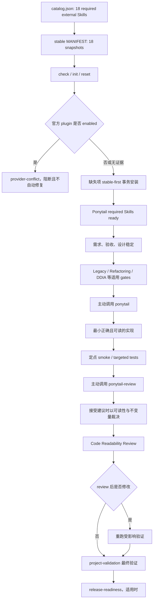

# SBTD Workflow 纳入 Ponytail 最终整改方案（PRD）

## 1. 文档状态

| 项目 | 内容 |
|---|---|
| 文档类型 | 最终整改方案 / 实施 PRD |
| 版本 | v2.0 |
| 状态 | 已按用户最终决策修订，待用户确认后实施 |
| 日期 | 2026-08-26 |
| 原始输入 | `~/Downloads/sbtd-workflow-ponytail-接入方案.md` v1.0（2026-08-24） |
| 当前仓库 | `KunoLu/640-skills`，重点范围为 `sbtd-workflow-onboard/` 及其规则、安装器、模板、stable mirror、文档和测试契约 |
| Ponytail 最新发布基线 | `v4.9.0`，commit `0a4dd63ad4541f4f655c4108a295916f3c1d8fda` |
| 当前 Onboard stable 基线 | stable set `2026-08-11.1`，含 14 个 required external Skills |
| 目标 Onboard stable 基线 | 初始目标 `2026-08-26.1`，含 18 个 required external Skills；若实施时该 id 已存在或日期变化，使用实施日期对应的下一个 `YYYY-MM-DD.N` |
| 本轮边界 | 只修订 PRD；不修改运行时代码、stable mirror、本机 Skills、plugin 配置或 live automation |

本版本废止上一版“14 required + 4 prompted optional”的方案。最终目标是：**Ponytail 4 个核心 Skills 全部成为 required external Skills，并以固定上游 revision 纳入 vendored stable set。**

## 2. 最终决策

1. 纳入 4 个 Ponytail Skills：
   - `ponytail`
   - `ponytail-review`
   - `ponytail-audit`
   - `ponytail-debt`
2. 四项全部作为标准 `external-skill` catalog entries，沿用当前“所有 external Skills 都是 required”的模型；不引入 prompted、optional、decisionStatus 或安装确认分支。
3. 正常 `check`、`init`、`reset` 必须检查全部 18 个 required external Skills；缺少 Ponytail 时自动从 stable-first source 补装，失败即阻断。
4. Ponytail `v4.9.0` 固定 commit、4 个原样 Skill tree、MIT license、tree checksum 和 repository metadata 必须进入 stable set。
5. 当前 stable promotion 不能首次注册 manifest 尚不存在的新 repository；实施前必须补齐“新 repository candidate registration”能力，禁止手工修改 live stable mirror。
6. SBTD 统一使用 **Onboard stable skill-only provider**。检测到已启用的官方 Ponytail plugin 时报告 provider conflict 并阻断，不自动安装、信任、启用、禁用或卸载 plugin。
7. 所有编码任务在需求、设计和适用开发门禁确定后、首次实现编辑前，主动调用 `ponytail`。
8. 非平凡生产代码形成完整 diff 并完成定点 smoke 后、最终 `project-validation` 前，主动调用 `ponytail-review`。
9. `ponytail-audit` 与 `ponytail-debt` 按客观触发条件主动调用，不机械扩大全仓审计或生成债务文档。
10. 引入统一 Code Readability 规则：正确性、安全、运行时特性、已确认需求和项目约定优先；可读性与可维护性高于源码行数、文件数和最小 diff。
11. Code Readability 的规则事实源位于 AGENTS 模板，执行顺序位于 `trellis-workflow`；`project-validation` 只负责最终验证命令和证据，不承载主观代码可读性规则。
12. `ponytail-gain`、`ponytail-help` 不进入 SBTD catalog、stable set 或主动路由。官方 plugin 可能暴露全部 6 个上游 Skills，因此不得与 required stable provider 共存。

## 3. 已核验事实与修订依据

### 3.1 当前 Onboard

| 事实 | 证据位置 | 设计影响 |
|---|---|---|
| catalog 当前有 15 个 `bundled-skill`、14 个 `external-skill` | `sbtd-workflow-onboard/catalog.json` | 接入后目标为 15 bundled + 18 required external |
| 当前全部 `external-skill` 都进入 `EXTERNAL_SKILL_SOURCES` 与 `REFERENCED_SKILLS` | `scripts/onboard.py` | Ponytail 作为标准 external entries 即自然进入 required 路径，不需要新 installation policy |
| `missing_required_external_skills()` 遍历全部 external Skills | `scripts/onboard.py` | 接入后正常 `init/reset` 自动要求 Ponytail，符合最终需求 |
| `install-external-skills --all` 遍历全部 external Skills | `parse_skill_names()` | 接入后 `--all` 安装 18 项 |
| stable manifest 的 Skill keys 必须与 catalog external set 相等 | `load_external_stable_manifest()` | catalog 4 条与 stable 4 个 snapshot 必须同一次交付 |
| promotion 只接受 manifest 已登记 repository id | `promote_external_skills_stable()` | 首次接入 Ponytail 存在 bootstrap deadlock，必须扩展 promotion |
| 当前 promotion argparse 没有新 repo URL、license bootstrap 参数 | `scripts/onboard.py` CLI parser | 必须增加 `--repo`、`--license`、`--license-file` |
| `project-validation` 明确只负责 validation-stage gate | `templates/skills/project-validation/SKILL.md` | 可读性规则不能放在该 Skill 作为事实源 |
| `book-refactoring-pass` 已处理 long functions、duplication 和 tangled responsibilities | `templates/skills/book-refactoring-pass/SKILL.md` | 与可读性规则互补，但它是既有代码首次编辑前的结构 gate，不替代最终可读性复核 |
| `codebase-design` 强调 deep modules 与 real seams | external `codebase-design/SKILL.md` | “函数越小越好”“I/O 必须分层”等绝对规则必须修正，避免 shallow wrappers 和 hypothetical seams |

### 3.2 Ponytail 上游

上游依据：

- [Ponytail v4.9.0 release](https://github.com/DietrichGebert/ponytail/releases/tag/v4.9.0)
- [Ponytail README](https://github.com/DietrichGebert/ponytail/blob/v4.9.0/README.md)
- [Ponytail skills](https://github.com/DietrichGebert/ponytail/tree/v4.9.0/skills)
- [Codex plugin manifest](https://github.com/DietrichGebert/ponytail/blob/v4.9.0/.codex-plugin/plugin.json)

核验结论：

1. `v4.9.0` 是本文修订时的最新 release。
2. 上游共有 6 个 Skills；SBTD 只管理其中 4 个核心 Skills。
3. 官方 plugin manifest 指向整个 `skills/` 目录，会暴露 `ponytail-gain` 与 `ponytail-help`。
4. `ponytail` 明确强调 “one line before fifty”“fewest files possible”“shortest working diff wins”。这些规则可降低过度设计，但不能凌驾于可读性、可维护性、项目结构和验证契约。
5. `ponytail-review` / `ponytail-audit` 只寻找可删除复杂度，不负责正确性、结构深度、领域边界、性能或验证。
6. `ponytail-debt` 只收集 `ponytail:` markers；默认不得创建 `PONYTAIL-DEBT.md`。
7. Skill-only provider 不依赖 Node hooks，也不提供 plugin 的 always-on mode persistence。主动调用由 SBTD AGENTS / workflow 路由保证。

## 4. 目标与非目标

### 4.1 目标

1. 将 Ponytail 4 个核心 Skills 纳入 required external Skills。
2. 将最新稳定发布以可离线安装、可校验、可回滚的 stable snapshot 纳入 Onboard。
3. 保持现有 14 个 external Skills 的 required 行为不变，并将 required 总数提升为 18。
4. 在合适的开发阶段主动调用 Ponytail，而不是只安装不路由。
5. 用 Code Readability 规则约束 Ponytail 的 LOC / 文件数偏好，防止压缩成难维护实现。
6. 保持 Book Gates、BDD、TDD、Trellis、GitNexus、项目验证和发布证据的既有优先级。
7. 保持 upstream Skill 内容原样；所有 SBTD 覆盖规则写入 AGENTS / workflow，不 fork 上游。
8. 检测并阻断 required stable provider 与官方 plugin provider 的有效共存。

### 4.2 非目标

1. 不纳入 `ponytail-gain`、`ponytail-help`。
2. 不自动安装、启用、信任、升级、降级或卸载官方 Ponytail plugin / hooks。
3. 不修改 `~/.config/ponytail/config.json`、Windows `%APPDATA%\ponytail\config.json` 或 `PONYTAIL_DEFAULT_MODE`。
4. 不自动创建 `PONYTAIL-DEBT.md`，不修改项目 `.gitignore`。
5. 不新建 `code-readability-review` Skill；当前规则规模适合由 AGENTS 常驻，避免增加无必要的 catalog、安装和路由复杂度。
6. 不把 Code Readability 变成测试通过状态；lint、typecheck、unit test 或 E2E 不能证明业务命名与结构可读。
7. 不在本配置摘录仓库新增 `.feature`。用户可见 CLI 行为通过本文验收条件与现有 Python / shell 契约测试固化。
8. 不在本轮 PRD 修订执行代码实现、本机 `sync` 或 live automation mutation。

## 5. 强制不变量

1. **范围优先**：Ponytail 不得缩减用户明确要求、PRD、BDD 或验收条件。
2. **正确性优先**：安全、隐私、数据完整性、可访问性、并发和运行时性能高于源码行数。
3. **可读性优先于 LOC**：多个正确方案可选时，选择新维护者最容易理解和安全修改的方案，而非最短表达式。
4. **项目约定优先**：项目已有命名、模块、错误处理、框架、测试和设计系统优先于通用提示词。
5. **深模块优先**：不要为了制造小函数拆出 shallow wrappers；不要为单一简单路径制造 hypothetical seam。
6. **门禁不降级**：Ponytail finding 不能替代或跳过 Book Gate、BDD、TDD、Trellis、GitNexus、`project-validation`、Playwright、Maestro 或 release-readiness。
7. **单 provider**：SBTD managed Ponytail 只能来自 Onboard stable skill-only provider；有效官方 plugin 与之冲突。
8. **原样镜像**：stable Skill tree 不手工改写；上游升级只通过 explicit promotion。
9. **行为先证明**：任何 Ponytail / readability cleanup 必须在定点 smoke 已证明目标行为后进行，并在修改后重跑受影响验证。
10. **不扩大 cleanup**：发现任务外结构问题时记录或报告，不在收尾阶段静默扩大重构。

## 6. 目标架构



## 7. Catalog 与 stable set 设计

### 7.1 Catalog

新增 4 个普通 `external-skill` entries，使用现有 schema，不增加 `installation.policy` 或 group 字段：

| Canonical Skill | Repo | Subpath | Target role |
|---|---|---|---|
| `ponytail` | `https://github.com/DietrichGebert/ponytail.git` | `skills/ponytail` | `external-skill` |
| `ponytail-review` | 同上 | `skills/ponytail-review` | `external-skill` |
| `ponytail-audit` | 同上 | `skills/ponytail-audit` | `external-skill` |
| `ponytail-debt` | 同上 | `skills/ponytail-debt` | `external-skill` |

运行时模型保持简单：

- `EXTERNAL_SKILL_SOURCES`：18 项。
- `REFERENCED_SKILLS`：18 项。
- `missing_required_external_skills()`：18 项。
- normal `init/reset`：18 项 required。
- `install-external-skills --all`：18 项。

不保留上一版 `REQUIRED_EXTERNAL_SKILLS` / `OPTIONAL_EXTERNAL_GROUPS` 分流设计。

### 7.2 Stable snapshot

目标 stable repository metadata：

| 字段 | 值 |
|---|---|
| repository id | `ponytail` |
| upstream URL | `https://github.com/DietrichGebert/ponytail.git` |
| revision | `0a4dd63ad4541f4f655c4108a295916f3c1d8fda` |
| release | `v4.9.0` |
| license | MIT |
| license file | `LICENSE` → `licenses/ponytail-LICENSE` |
| included Skills | 4 |

`THIRD_PARTY_NOTICES.md` 增加既有格式的一行：

```markdown
| `DietrichGebert/ponytail` | MIT | `licenses/ponytail-LICENSE` |
```

### 7.3 首次 repository promotion seam

当前 promotion 在 clone 前要求 `MANIFEST.json` 已存在 repository id 和 Skill metadata，无法首次纳入 Ponytail。实施必须增加 candidate-only registration：

1. `--repository ponytail` 是目标 manifest key。
2. 新增 `--repo https://github.com/DietrichGebert/ponytail.git`，用于首次注册；后续 promotion 可从 manifest 读取 URL，若再次显式传入则必须完全一致。
3. promotion 从 catalog 选择所有 `source.repo` 与 `--repo` 完全一致的 external entries，并验证恰好为上述 4 个 canonical Skills。
4. 新增 `--license MIT` 与可重复 `--license-file SOURCE=STABLE_PATH`。
5. 允许以 relaxed 模式读取当前 stable manifest；catalog equality 只在 candidate tree 组装完成后执行。
6. 在 candidate tree 一次性生成 repository metadata、4 个 Skill metadata、4 个原样 tree、tree SHA-256、license、notice 和 stable set id。
7. candidate 完整通过 containment、symlink、frontmatter identity、checksum、license、notice 和 catalog equality 后，才原子替换 live stable tree。
8. 任一步失败时 live stable tree 不变；commit 与 rollback 都失败时保留唯一 recovery directory，不在 `finally` 中删除。
9. 后续 Ponytail 升级继续走同一 promotion 命令，不允许手工编辑 stable tree。

初次 promotion 目标命令：

```bash
python sbtd-workflow-onboard/scripts/onboard.py promote-external-skills-stable \
  --repository ponytail \
  --repo https://github.com/DietrichGebert/ponytail.git \
  --revision 0a4dd63ad4541f4f655c4108a295916f3c1d8fda \
  --stable-set 2026-08-26.1 \
  --license MIT \
  --license-file "LICENSE=licenses/ponytail-LICENSE" \
  --yes
```

若实施日期变化或 stable id 冲突，只调整 `--stable-set` 为实施日期对应的下一个序号；revision 不随日期漂移。

## 8. 安装与 provider 模型

### 8.1 Normal check / init / reset

1. `check` 对 18 个 required external Skills 执行 identity 与完整性检查。
2. `init/reset` 对缺失 Ponytail Skills 使用既有 stable-first `install_required_external_skills()`。
3. 四个 Ponytail Skills 与其他缺失 required Skills统一 resolve、stage、validate、commit；任一失败整批不提交。
4. 根 `install.sh` / `install.ps1` 不询问是否安装 Ponytail，也不存在 skip 状态。
5. Python `init/reset --yes` 和根安装器 `--yes` 对 Ponytail 的语义一致：Ponytail 是 required，不需要第二次确认。
6. reset 检测到完整合法 Skills 时保留；内容错误或部分缺失时按 required transaction 修复。
7. `auto` / `stable` 安装不调用 Git；`upstream` 才访问上游且失败不 fallback。
8. `plan --json` 保持当前 operation-only contract，不承担交互问题或 plugin mutation。

### 8.2 Provider 检测

`check --json` 增加 `ponytailProvider`：

| 字段 | 值 |
|---|---|
| `provider` | `onboard-stable` / `conflict` / `unknown` |
| `skillStatus` | `complete` / `partial` / `missing` / `invalid` |
| `requiredSkills` | 4 个 canonical names |
| `pluginStatus` | `installed-enabled` / `installed-disabled` / `missing` / `cli-unavailable` / `not-checked` |
| `nextStep` | `none` / `install-required` / `repair-required` / `disable-or-remove-plugin` |

规则：

1. 目标平台为 Codex 且 CLI 可用时，只读调用 `codex plugin list --json`。
2. 目标平台为 OMP 且 CLI 可用时，只读调用 `omp plugin list --json`。
3. Plugin identity 必须精确匹配，不使用 substring：Codex 匹配 canonical `ponytail@ponytail`，或同时匹配 plugin name `ponytail` 与 marketplace `ponytail`；OMP 匹配 canonical name `ponytail` 且 source / install spec 归一化为 `github.com/DietrichGebert/ponytail`。CLI JSON schema 差异用受控 fixtures 覆盖，不能仅因任意字段含 `ponytail` 就阻断。
4. 官方 Ponytail plugin 为 enabled 时，`provider=conflict`；`check` 失败，`init/reset` 在写 stable copies 前阻断。
5. Plugin installed 但 disabled 时，stable provider 仍是 canonical；报告状态但不阻断。
6. CLI 不可用或输出无法解析时，`provider=unknown`；不把“未能证明存在 plugin”误报为 conflict，也不静默修改 plugin 配置。
7. Onboard 只报告人工处理命令和风险，不自动执行任何 plugin mutation。
8. required stable Skills 不依赖 Node hooks；Node 缺失不影响 Skill 安装和 SBTD 主动调用。
9. `ponytail-gain` / `ponytail-help` 只可能来自冲突的官方 plugin，不得记入 SBTD managed Skills。

## 9. Ponytail 主动调用工作流

### 9.1 总顺序

```text
需求 / PRD / BDD / 设计稳定
→ Book Gate Plan
→ Legacy / Refactoring / DDIA 等适用前置 gate
→ ponytail
→ implementation
→ 定点 smoke / targeted tests
→ ponytail-review
→ 接受或拒绝删繁建议
→ Code Readability Review
→ 如有修改，重跑受影响验证
→ project-validation 最终验证
→ book-release-readiness（适用时）
```

### 9.2 `ponytail`

强制触发：

- 所有新增、修改、修复、重构或设计代码的任务。
- 依赖、库、框架或平台能力选择。
- 用户明确要求 YAGNI、最简方案、最小实现或减少过度设计。

调用时机：

- 需求、验收与技术边界已经稳定。
- 适用的 Legacy / Refactoring / DDIA 等前置 gate 已达到允许实现的状态。
- 首次实现编辑之前。

职责：

- 先查现有实现和调用流，再按“复用现有能力 → stdlib → native platform → 已安装依赖 → 最小新代码”选择方案。
- 只删除推测性、未进入已确认范围的内容。
- 在多个正确方案中选择认知负担最低的方案，而不是单纯 LOC 最少。
- 不重新质疑已经确认的需求，不把完整需求降级为“lazy version”。

### 9.3 `ponytail-review`

主动触发：非平凡生产代码修改形成完整 diff，并且定点 smoke 已证明目标行为之后。

“非平凡”至少包括以下任一项：

- 新增 branch、loop、parser、状态转换、并发、错误处理或持久化逻辑。
- 修改公共 API、用户可见行为、权限、安全、计费或数据路径。
- 跨多个函数、模块或文件的生产代码变更。
- 引入新依赖、抽象、配置或 extension point。

规则：

1. `ponytail-review` 只产生复杂度 findings，不作为正确性、Book Gate 或验证通过证据。
2. 每个删除 / 内联 / 合并建议必须经过 Code Readability、不变量、deep-module 和项目约定复核。
3. 接受 finding 后立即复核行为是否保持；修改完成后重跑受影响 smoke / tests。
4. 不为简单 typo、机械格式化、纯文档或 generated/vendor 文件机械调用。

### 9.4 `ponytail-audit`

条件强制触发：

- 用户明确要求全仓 over-engineering / bloat 审计。
- 任务验收明确包含全仓复杂度整改。
- 跨模块架构整改需要先建立只读候选清单。

它只输出 ranked findings，不应用修复。普通功能、bug fix 或局部重构不得自动扩大为全仓 audit。

### 9.5 `ponytail-debt`

条件强制触发：

- 本次新增或修改 `ponytail:` marker。
- 当前变更触及已有 marker。
- 用户明确要求列出 Ponytail shortcuts / debt ledger。

默认只在对话或 task check summary 中输出；只有用户明确要求持久台账时才创建 `PONYTAIL-DEBT.md`。

## 10. Code Readability 规则

### 10.1 Canonical Prompt

以下文本是实施时写入 `templates/agents/AGENTS.global.md` 的 canonical 规则：

```markdown
## Code Readability

Correctness, safety, runtime characteristics, explicit requirements, and
project conventions come first. Readability and maintainability take priority
over minimizing source lines, file count, or diff size.

1. Each function or module should have one cohesive responsibility. Do not
   split cohesive logic merely to make functions shorter.

2. Extract a named helper when it removes meaningful cognitive load, captures
   a reusable concept, or creates a proven seam. Avoid shallow wrappers that
   only move code elsewhere.

3. Prefer guard clauses and early returns when they make the primary path
   clearer. Do not force them when structured cleanup, symmetry, or error
   aggregation is easier to follow.

4. Avoid clever, overly compact, or precedence-dependent expressions.

5. Introduce well-named intermediate variables when they expose the meaning
   of a complex condition or transformation. Do not name trivial values only
   to increase line count.

6. Use domain-intent names in domain code and concrete role names in
   infrastructure code.

7. Avoid vague names such as `data`, `info`, `tmp`, `result`, `handle`,
   `process`, or `doSomething`, unless the meaning is unambiguous within a
   very narrow scope.

8. Separate domain decisions from I/O, database, HTTP, cache, and logging at
   a real seam when it improves locality, testability, or change isolation.
   Do not introduce hypothetical ports, adapters, or service layers for a
   single trivial path.

9. Comments should explain rationale, invariants, constraints, protocol
   requirements, or non-obvious trade-offs. Do not restate the code.

10. Introduce an abstraction only when it materially improves readability,
    centralizes an invariant, removes meaningful duplication, isolates a
    volatile dependency, or establishes a proven seam.

11. Follow the existing project's naming, module, error-handling, and
    structural conventions before applying generic advice.

12. Before final validation, review all modified hand-written code and tests
    specifically for readability. Do not modify vendored or generated code.

When several correct implementations are available, prefer the one a new
maintainer can understand and safely change fastest, without worsening
runtime behavior or violating project conventions.
```

### 10.2 AGENTS.project 最小 fallback

`templates/agents/AGENTS.project.md` 不复制完整 checklist，只保留不可降级边界：

```markdown
## 代码可读性

项目既有约定优先。正确性、安全、运行时特性和可读性高于 LOC、
文件数或最小 diff。不要为了满足 Ponytail 的最短实现偏好制造密集表达式、
模糊命名、shallow wrappers 或移除真实 seam。最终验证前必须复核所有修改的
手写代码和测试；广泛重构仍受范围、legacy 和 refactoring gates 约束。
```

### 10.3 Review 输出

Code Readability Review 不新增全局状态枚举，也不成为 `project-validation` 的测试结果。相关任务在 check summary 中简要记录：

```text
Code Readability Review
Scope: modified hand-written production code and tests
Findings: none | <concrete locations and issues>
Ponytail conflicts resolved: none | <accepted/rejected finding and reason>
Changes applied: none | <task-scoped readability edits>
Revalidation required: yes | no
```

若 finding 需要大范围行为保持重构，停止 cleanup，回到 `book-refactoring-pass`；不得把它作为收尾小改静默实施。

## 11. 与现有 Skills 的职责边界

| Skill | 与本方案关系 | 最终边界 |
|---|---|---|
| `ponytail` | 最小化实现 | 先理解范围和调用流；可读性、正确性、性能和项目约定高于 LOC |
| `ponytail-review` | diff 过度设计审查 | findings 必须经过 Code Readability 裁决 |
| `ponytail-audit` | 全仓只读审计 | 只在客观触发条件命中时调用，不扩张普通任务 |
| `ponytail-debt` | marker 台账 | 默认不落盘，不创建任务外 debt 文档 |
| `book-refactoring-pass` | 修改既有生产代码前的行为保持结构 gate | 先于 `ponytail`；Code Readability 不能替代该 gate |
| `book-legacy-change-safety` | 锁定既有行为和安全网 | 未 characterized 前不得用可读性名义扩大 diff |
| `codebase-design` | deep modules、locality、real seams | 否决机械“小函数”和 hypothetical adapter |
| `tdd` | 红绿重构 | Readability cleanup 在 green / smoke 后，修改后重跑测试 |
| `diagnosing-bugs` | 根因定位 | 先定位根因，Ponytail 只选择最小正确修复落点 |
| `project-validation` | 最终命令、运行时检查和证据 | 不承载 Code Readability 规则，不把 lint/test 通过等同可读性通过 |
| `book-release-readiness` | 生产路径发布决策 | 在 readability cleanup 和最终 project validation 后运行 |

## 12. 文件级整改清单

| 文件 / 目录 | 必须整改 |
|---|---|
| `sbtd-workflow-onboard/catalog.json` | 新增 4 个标准 required external entries |
| `sbtd-workflow-onboard/scripts/onboard.py` | 支持首次 repository promotion 参数与 candidate registration；增加 provider conflict 只读检测；required 数量自然变为 18 |
| `sbtd-workflow-onboard/assets/external-skills/stable/MANIFEST.json` | 新增 Ponytail repository、4 个 Skill metadata，更新 stable set |
| `sbtd-workflow-onboard/assets/external-skills/stable/skills/ponytail` | vendored 原样 Skill tree |
| `sbtd-workflow-onboard/assets/external-skills/stable/skills/ponytail-review` | vendored 原样 Skill tree |
| `sbtd-workflow-onboard/assets/external-skills/stable/skills/ponytail-audit` | vendored 原样 Skill tree |
| `sbtd-workflow-onboard/assets/external-skills/stable/skills/ponytail-debt` | vendored 原样 Skill tree |
| `sbtd-workflow-onboard/assets/external-skills/stable/licenses/ponytail-LICENSE` | vendored MIT license |
| `sbtd-workflow-onboard/assets/external-skills/stable/THIRD_PARTY_NOTICES.md` | 增加 Ponytail notice |
| `install.sh` / `install.ps1` | required external 汇总、数量和 provider conflict；不新增 Ponytail yes/no prompt |
| `sbtd-workflow-onboard/SKILL.md` | 说明 Ponytail 为 required、无安装确认、官方 plugin 冲突 |
| `sbtd-workflow-onboard/REFERENCE.md` | stable source、provider conflict、人工 plugin 处理、Skill 调用边界 |
| `sbtd-workflow-onboard/templates/agents/AGENTS.global.md` | 增加 Ponytail 主动路由与完整 Code Readability canonical prompt |
| `sbtd-workflow-onboard/templates/agents/AGENTS.project.md` | 增加 required Ponytail 最小路由与 Code Readability fallback |
| `sbtd-workflow-onboard/templates/skills/trellis-workflow/SKILL.md` | 增加 Ponytail → smoke → review → readability → final validation 顺序 |
| `README.md` / `README.html` | 数量改为 15 bundled + 18 required external；说明 Ponytail 和 provider 边界 |
| `ENTRYPOINT.md` | 更新工作流定位；stable revision 仍以 manifest 为事实源，不自动写入版本监控基线 |
| `docs/assets/onboard-skill-init.md` | 展示 18 required 和 plugin conflict preflight |
| `docs/assets/onboard-skill-reset.md` | 展示 18 required、stable repair、config preservation |
| `docs/assets/sbtd-workflow-paths.md` | 展示 Ponytail 与 Readability Review 的流程位置 |
| `prompts/automations/sbtd-workflow-tools-version-check.md` | 校验 18 required、stable completeness、provider conflict、readability 文档一致性 |
| `CHANGELOG.md` | 实施时在顶部未发布章节记录 required Ponytail、stable mirror、workflow 和 readability gate |
| `tests/test_onboard_external_skills.py` | 新 repo bootstrap、18 项 `--all`、stable source、license、rollback |
| `tests/test_onboard_multi_projects.py` | normal init/reset 要求 18 项且按项目继续汇报 |
| `tests/test_install_sh_agent_cli_flow.py` | Bash / PowerShell required 安装、无确认分支、plugin conflict |
| `tests/test_workflow_contracts.py` | 计数、主动调用顺序、Readability 规则、README / HTML / AGENTS / flowchart / prompt 一致性 |

明确不改：

- `sbtd-workflow-onboard/catalog.schema.json`：现有 external entry schema 足够，不新增 installation policy。
- `sbtd-workflow-onboard/examples/catalog.minimal.json`：若示例不依赖数量或具体 Ponytail entry，保持不变；契约测试验证无需改写。
- `sbtd-workflow-onboard/templates/skills/project-validation/**`：职责只包含 validation-stage gate，不放 Code Readability 规则。
- `sbtd-workflow-onboard/templates/skills/book-refactoring-pass/**`：现有结构 gate 职责已足够，不复制可读性 checklist。
- `sbtd-workflow-onboard/templates/project/.gitignore`。
- Ponytail 上游 Skill 正文。
- 本机 live Skills、plugin 配置、Ponytail config 和 Orca live automation，除非用户另行明确执行 `sync`。

## 13. 验收条件

### AC-001 Catalog required 集合

- catalog 有 15 个 bundled Skills 和 18 个 external Skills。
- 四个 Ponytail entries 都是标准 external Skills，没有 `installation.policy`、group 或 skip 配置。
- `EXTERNAL_SKILL_SOURCES`、`REFERENCED_SKILLS`、`missing_required_external_skills()` 均包含 18 项。
- 任一 Ponytail source repo、subpath、canonical identity 或 target role 错误时 startup validation fail-closed。

### AC-002 Stable 最新版本

- Ponytail stable snapshot 固定 `v4.9.0` commit `0a4dd63ad4541f4f655c4108a295916f3c1d8fda`。
- stable manifest 包含 5 个 repositories 和 18 个 Skills。
- 四个 Skill tree 与上游对应 subpath 原样一致，排除 `.git`、`__pycache__`、`*.pyc`。
- MIT license、notice 与 tree SHA-256 完整。
- `auto` / `stable` 安装不访问 Git；`upstream` 才访问上游且失败不 fallback。

### AC-003 新 repository promotion

- 不手工修改 live stable tree 即可首次注册 `ponytail` repository。
- `--repo` 只用于首次注册或一致性复核，不能静默改写既有 repository URL。
- catalog 选择结果不是恰好四个 canonical Skills 时拒绝 promotion。
- 任一 containment、symlink、identity、checksum、license、notice 或 catalog equality 校验失败时 live stable tree 保持不变。
- commit 与 rollback 都失败时 recovery directory 被保留并报告。

### AC-004 Required 安装行为

- normal `check/init/reset` 要求全部 18 个 external Skills。
- Ponytail 缺失时不询问、不跳过，直接进入 required stable-first transaction。
- 任一 required Skill 安装失败时 Onboard 失败，不把部分结果报为 success。
- 根安装器 `--yes` 与 Python `init/reset --yes` 对 Ponytail 没有语义差异。
- `install-external-skills --all` 安装 18 项。

### AC-005 Provider 冲突

- stable 四项完整且官方 plugin 不 enabled：`provider=onboard-stable`。
- Codex / OMP plugin identity 使用 §8.2 的 exact match；同名 Skill、非官方 package 或仅含 `ponytail` 的其他字段不得产生 false positive。
- 官方 plugin enabled：`provider=conflict`，`check/init/reset` 阻断且不写 stable copies。
- 官方 plugin installed-disabled：报告状态但 stable provider 可继续。
- CLI 不可用：`provider=unknown`，不伪造 plugin missing，也不自动修改配置。
- Onboard 不执行官方 plugin install/remove/enable/disable/trust。

### AC-006 主动调用顺序

契约测试必须锁定完整语义：

- 所有编码任务在适用前置 gates 通过后、首次实现编辑前调用 `ponytail`。
- 非平凡生产代码在定点 smoke 后、最终 validation 前调用 `ponytail-review`。
- 接受 `ponytail-review` finding 后必须经过 Code Readability 复核并重跑受影响验证。
- `ponytail-audit` 只在全仓审计客观触发条件命中时调用。
- `ponytail-debt` 只在 marker / ledger 触发条件命中时调用，默认不落盘。

### AC-007 Code Readability

- `AGENTS.global.md` 包含 §10.1 canonical prompt 的完整语义。
- `AGENTS.project.md` 包含 §10.2 最小 fallback。
- 可读性与可维护性明确高于 LOC、文件数和最小 diff，但低于正确性、安全、运行时特性、已确认需求和项目约定。
- 规则明确拒绝机械小函数、shallow wrappers、hypothetical seams、密集表达式和模糊命名。
- Code Readability Review 覆盖修改的手写生产代码和测试，不修改 vendor / generated code。
- `project-validation` 不把 lint/test 通过报告为可读性通过。

### AC-008 既有门禁不回归

- `book-legacy-change-safety`、`book-refactoring-pass`、`book-ddia-data-design` 的客观触发条件与顺序不变。
- Ponytail / readability finding 不能作为任何 Book Gate reviewer status 或 Trellis phase 通过证据。
- BDD、TDD、项目测试、Playwright、Maestro、正式报告和 release-readiness 不因 Ponytail 的“一项检查”偏好缩减。
- 大范围 readability refactor 必须回到 `book-refactoring-pass`，不在 cleanup 阶段静默执行。

### AC-009 配置、路径与文档

- reset 前后 Ponytail config 文件字节一致。
- global Skill root resolution 和 `globalSkillsDirSource` 语义不变。
- README / HTML / SKILL / REFERENCE / AGENTS / Trellis workflow / 三个流程图使用同一 15 + 18 数量和 required 术语。
- automation prompt 校验 catalog、stable manifest、provider 和 readability contract。
- CHANGELOG 只在 runtime 实施时记录，不把本 PRD 修订误报为已上线能力。

## 14. 实施顺序

1. 输出实施任务的 Book Gate Plan；读取相关现有测试和 installer contract。
2. 先添加失败测试，锁定：18 required、无确认分支、新 repo promotion、provider conflict、主动调用顺序和 readability contract。
3. 扩展 promotion CLI 与 candidate seam；此时不修改 live stable mirror。
4. 在同一工作树变更中新增 catalog 4 条，并执行新 promotion 生成完整 candidate stable set。
5. 验证 stable manifest 为 5 repositories / 18 Skills，stable-only 离线安装成功。
6. 增加 provider 只读检测与 enabled plugin conflict；不执行 plugin mutation。
7. 更新 Bash / PowerShell required 汇总和冲突处理，不新增 Ponytail prompt。
8. 更新全局 / 项目 AGENTS 的 Ponytail 路由与 Code Readability。
9. 更新 `trellis-workflow` 的实现、smoke、review、readability、validation 顺序。
10. 更新 SKILL、REFERENCE、README、HTML、ENTRYPOINT、三个流程图、automation prompt 和 CHANGELOG。
11. 运行聚焦测试，再运行完整仓库测试。
12. 使用隔离 HOME smoke：Ponytail 缺失、部分缺失、完整、invalid、plugin enabled conflict、plugin disabled、CLI unavailable、reset config preservation。
13. 复核没有修改本机 live targets；只有用户另行明确输入 `sync` 时进入同步流程。

## 15. 验证计划

实施阶段至少执行：

```bash
python -m unittest tests.test_onboard_external_skills
python -m unittest tests.test_onboard_multi_projects
python -m unittest tests.test_install_sh_agent_cli_flow
python -m unittest tests.test_workflow_contracts
python -m unittest discover -s tests -p 'test_*.py'
```

附加验证：

1. Draft 2020-12 Schema 校验 catalog，确认没有非 schema 字段。
2. Stable manifest 全量 metadata、checksum、license、notice、frontmatter identity 和 containment 校验。
3. Bash 3.2 + `set -u` 覆盖 required 列表、空缺失、部分缺失、provider conflict。
4. PowerShell 对应分支测试。
5. Fake `codex plugin list --json` / `omp plugin list --json` 覆盖 enabled、disabled、missing、malformed JSON、CLI missing 和 timeout。
6. 契约测试使用完整行为子句，不只搜索 `readability`、`ponytail` 或数量关键词。
7. 隔离 HOME 中的 config 文件在 init/reset 前后 checksum 一致。
8. `omp install ... --dry-run` 只可用于验证上游命令兼容性，不作为 SBTD 安装路径或 plugin activation 证据。
9. 本仓库不新增 `.feature`；本文 AC 由现有测试体系表达。

测试命令是否使用 `rtk` 继续遵循报告副作用规则。需要保留测试报告时优先使用原生命令或已确认 report-safe 的项目命令，不得把 cache replay 当作唯一通过证据。

## 16. 回滚方案

1. 回滚 catalog 4 条、stable candidate、provider 检测、AGENTS / workflow 规则和文档到前一已发布 tag。
2. Promotion 在 commit 前失败时 live stable tree天然不变。
3. Promotion commit 失败时恢复 previous tree；恢复失败时保留 recovery directory并报告。
4. 不自动删除用户环境中已存在的 Ponytail Skill 目录、plugin 或 config；用户级清理由用户明确确认。
5. README / HTML / AGENTS / REFERENCE / flowchart / automation prompt 与代码同一提交回滚，避免文档宣称 required 能力仍可用。

## 17. 风险与缓解

| 风险 | 缓解 |
|---|---|
| catalog 先增加 4 条导致 live manifest equality 失败 | promotion relaxed candidate seam；catalog 与生成后的 stable tree 同一提交 |
| 首次 repo promotion 需要手改 manifest | `--repo` + license bootstrap + candidate-only registration |
| required Ponytail 增加安装失败面 | stable-first、离线 snapshot、transaction、checksum、rollback |
| 官方 plugin 与 required Skills 重名 | enabled plugin preflight conflict，写入前阻断，不自动修复 |
| Ponytail 把完整需求降级为 lazy version | 范围、PRD、BDD 和用户明确要求优先 |
| Ponytail 追求一行导致密集代码 | Code Readability 优先于 LOC / 文件数 / diff 大小 |
| “小函数”规则制造 shallow wrappers | cohesive responsibility + deep-module / real-seam 约束 |
| “分离 I/O”制造 hypothetical adapters | 只有改善 locality、testability 或 change isolation 的 real seam 才分离 |
| Ponytail review 删除真实抽象 | 每项 finding 经过 invariant、readability、deep-module 和项目约定复核 |
| Readability cleanup 扩大任务 | smoke 后执行；任务外 finding 延后；大重构回到 refactoring gate |
| 可读性被误当作测试状态 | AGENTS 为事实源；project-validation 只运行行为和证据检查 |
| audit / debt 每轮机械执行 | 客观触发矩阵；默认只读、不落盘 |
| 文档与代码计数漂移 | 契约测试同时校验 README、HTML、AGENTS、workflow、flowchart 和 prompt |

## 18. 最终实施 Checklist

- [ ] Catalog 新增 Ponytail 4 个标准 required external entries
- [ ] Required external 总数为 18，不存在 optional / skip 分支
- [ ] Promotion 支持首次 repository candidate registration
- [ ] 固定 Ponytail `v4.9.0` commit 与 MIT license
- [ ] Stable manifest 为 5 repositories / 18 Skills
- [ ] 四个 upstream Skill trees 原样 vendored 且 checksum 通过
- [ ] Normal check / init / reset 强制检查和补装 18 项
- [ ] 根安装器没有 Ponytail yes/no prompt
- [ ] Enabled 官方 plugin 被识别为 provider conflict 并在写入前阻断
- [ ] 所有编码任务在首次实现编辑前主动调用 `ponytail`
- [ ] 非平凡生产代码在 smoke 后主动调用 `ponytail-review`
- [ ] `ponytail-audit` / `ponytail-debt` 使用客观触发条件
- [ ] AGENTS.global 纳入完整 Code Readability canonical prompt
- [ ] AGENTS.project 纳入最小 readability fallback
- [ ] Trellis workflow 纳入 review → readability → revalidation 顺序
- [ ] Project-validation 保持验证职责，不承载 readability 规则
- [ ] Legacy / Refactoring / DDIA / Release gates 不被 Ponytail 替代
- [ ] README / HTML / ENTRYPOINT / SKILL / REFERENCE / 三个流程图同步
- [ ] Automation prompt 与 CHANGELOG 按实际实施更新
- [ ] Python、Bash 3.2、PowerShell、isolated HOME smoke 全通过
- [ ] 未创建 `.feature`、未修改 `.gitignore`、未写 Ponytail config
- [ ] 未执行本机 sync 或 plugin mutation

## 19. 最终决策

Ponytail 4 个核心 Skills 必须纳入 **required external Skills**，并以 `v4.9.0` 固定 revision 纳入 Onboard stable set。它们不是可选安装项：正常 `check/init/reset` 必须检查和补装，失败即阻断。

Workflow 不能只“安装 Ponytail”，还必须主动调用：适用开发门禁通过后、首次实现编辑前调用 `ponytail`；非平凡实现完成并通过定点 smoke 后调用 `ponytail-review`；随后执行 Code Readability Review，以正确性、安全、运行时特性、已确认范围、项目约定和可读性裁决所有删繁建议，再进入最终 `project-validation`。

完成本文全部 AC 后，才可声明 Ponytail required stable integration 与 Code Readability workflow 已交付。仅复制四个 Skill 目录、只更新 catalog，或只增加提示词均不构成完整实现。
